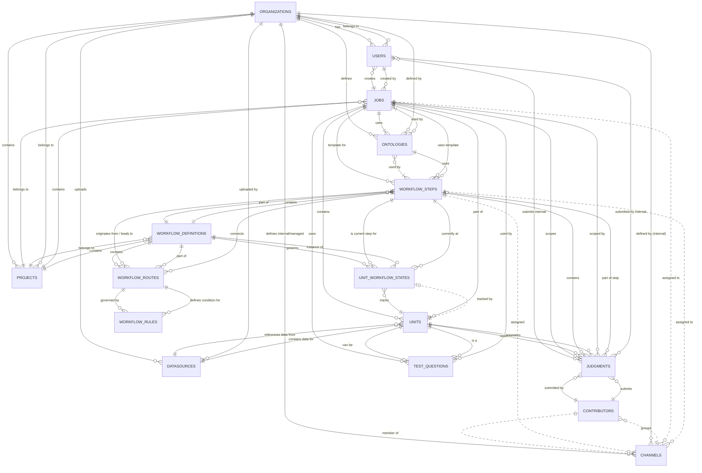
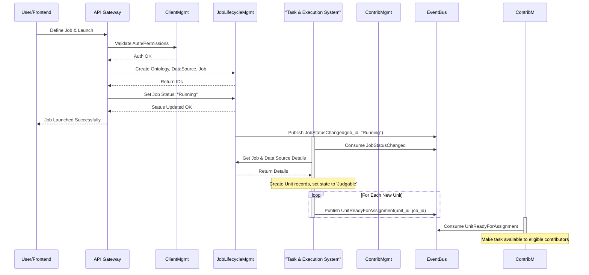
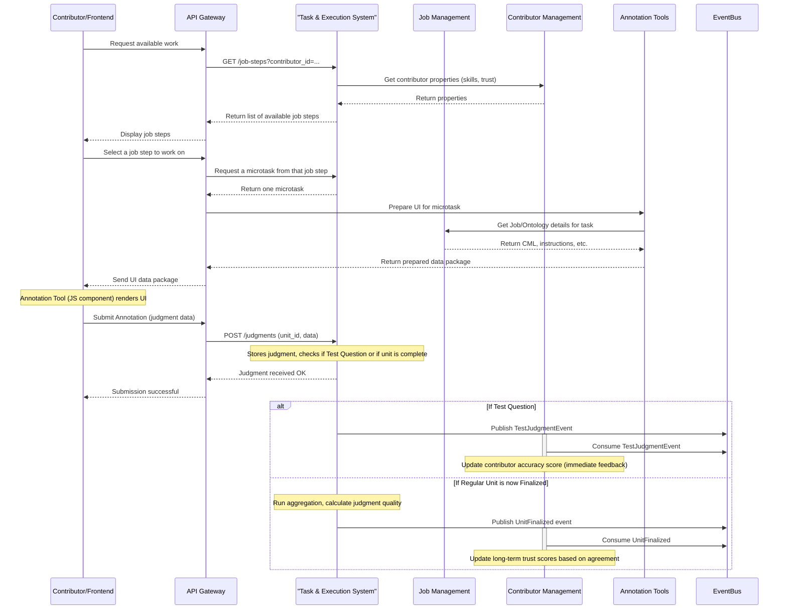
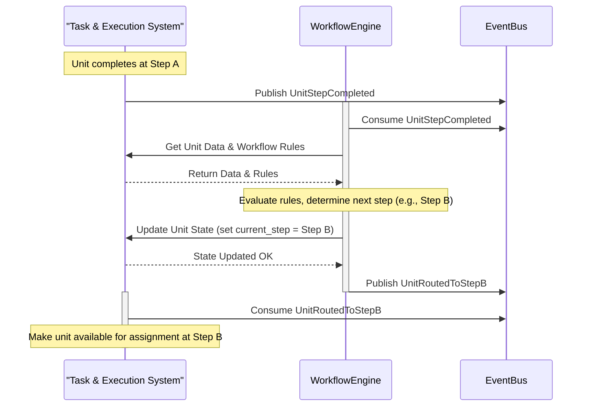

# ADAP High-level Architecture

This document outlines a conceptual architecture for the Appen Data Annotation Platform (ADAP), breaking it down into key subsystems, their data ownership, responsibilities, interfaces, and interactions.

- [ADAP High-level Architecture](#adap-high-level-architecture)
  - [**1. Conceptual ADAP Data Model**](#1-conceptual-adap-data-model)
    - [**Core Entities: Organization, Users, Permissions**](#core-entities-organization-users-permissions)
    - [**Core Task Entities: Jobs, Data, Units, Judgments**](#core-task-entities-jobs-data-units-judgments)
    - [**Workflow Entities**](#workflow-entities)
    - [**Contributor \& Quality Entities**](#contributor--quality-entities)
    - [**Entity Relationship Diagram (Mermaid)**](#entity-relationship-diagram-mermaid)
  - [**2. Subsystems: Ownership, Behaviors, Interfaces**](#2-subsystems-ownership-behaviors-interfaces)
    - [**2.1. Client Management Subsystem** 🏢💰](#21-client-management-subsystem-)
    - [**2.2. Job Lifecycle Management Subsystem** 📋⏯️](#22-job-lifecycle-management-subsystem-️)
    - [**2.3. Task and Execution Subsystem (including Workflow)** 🚀⚙️](#23-task-and-execution-subsystem-including-workflow-️)
    - [**2.4. Annotation Tools Subsystem** 🎨🛠️](#24-annotation-tools-subsystem-️)
    - [**2.5. Contributor Management Subsystem** 🧑‍💻📊💸](#25-contributor-management-subsystem-)
    - [**2.6. Architectural Pattern: API Gateway as Orchestrator**](#26-architectural-pattern-api-gateway-as-orchestrator)
  - [**3. Subsystem Interactions from Use Cases**](#3-subsystem-interactions-from-use-cases)
    - [**Use Case 1: User Creates and Launches a Basic Annotation Job**](#use-case-1-user-creates-and-launches-a-basic-annotation-job)
    - [**Use Case 2: Contributor Finds and Completes a Microtask**](#use-case-2-contributor-finds-and-completes-a-microtask)
    - [**Use Case 3: Workflow Execution (Unit Routes from Step A to Step B)**](#use-case-3-workflow-execution-unit-routes-from-step-a-to-step-b)

-----
## **1. Conceptual ADAP Data Model**

### **Core Entities: Organization, Users, Permissions**

1.  **Organizations / Teams**

      * **Semantics:** Represents a customer account or a distinct group using the platform. It's the top-level container for users, jobs, data, and billing.
      * `organization_id` (UUID, PK): *Unique identifier for the organization.*
      * `name` (TEXT): *Human-readable name of the organization.*
      * `billing_info` (JSONB): *Stores billing address, payment methods, subscription details.*
      * `created_at` (TIMESTAMP): *Timestamp when the organization was created.*
      * `updated_at` (TIMESTAMP): *Timestamp when the organization was last updated.*
      * *Relationships:*
          * **Has many Users:** An organization contains multiple user accounts.
          * **Has many Jobs:** Jobs are created within the context of an organization.

2.  **Users**

      * **Semantics:** Represents an individual person interacting with the platform, belonging to an organization. Stores credentials, roles, and links activity.
      * `user_id` (UUID, PK): *Unique identifier for the user.*
      * `organization_id` (UUID, FK to Organizations): *Links the user to their organization.*
      * `email` (TEXT, UNIQUE): *User's login email and primary contact.*
      * `hashed_password` (TEXT): *Stored password hash for authentication.*
      * `role` (ENUM: 'Admin', 'ProjectManager', 'Annotator', 'ReadOnly', etc.): *Defines the user's permissions level.*
      * `is_active` (BOOLEAN): *Indicates if the user account is currently active.*
      * `created_at` (TIMESTAMP): *Timestamp when the user account was created.*
      * `last_login` (TIMESTAMP): *Timestamp of the user's last login.*
      * *Relationships:*
          * **Belongs to Organization:** Each user is part of one organization.
          * **Associated with Judgments:** Tracks which user submitted or reviewed annotations.

3.  **Projects**

      * **Semantics:** An organizational container within an `Organization` used to group related work. A project can contain one or more `Jobs` or `WorkflowDefinitions`. This allows for better management and tracking of initiatives (e.g., "Translate all product descriptions to Spanish").
      * `project_id` (UUID, PK): *Unique identifier for the project.*
      * `organization_id` (UUID, FK to Organizations): *Links the project to the parent organization.*
      * `name` (TEXT): *Human-readable name of the project.*
      * `description` (TEXT): *A brief description of the project's goals.*
      * `created_at` (TIMESTAMP): *Timestamp when the project was created.*
      * `updated_at` (TIMESTAMP): *Timestamp when the project was last updated.*
      * *Relationships:*
          * **Belongs to Organization:** Each project is part of one organization.
          * **Has many Jobs:** A project can contain multiple job blueprints.
          * **Has many WorkflowDefinitions:** A project can contain multiple workflow definitions.

-----

### **Core Task Entities: Jobs, Data, Units, Judgments**

4.  **Jobs** (`JobDefinition`)

      * **Semantics:** A reusable blueprint for a specific annotation task (e.g., "do NER," "classify an image"). This blueprint is designed to be instantiated as one or more steps within a `WorkflowDefinition`. For simple, single-step tasks, it can be used directly within a `Project`.
      * `job_id` (UUID, PK): *Unique identifier for the job definition.*
      * `project_id` (UUID, FK to Projects): *Links the job to the parent project.*
      * `organization_id` (UUID, FK to Organizations): *Links the job to the owning organization.*
      * `title` (TEXT): *Human-readable name of the job.*
      * `cml_content` (TEXT/JSONB): *Stores the Custom Markup Language defining the annotation interface.*
      * `instructions` (TEXT): *Guidance provided to contributors working on the job.*
      * `ontology_id` (UUID, FK to Ontologies): *Specifies the labeling schema to be used.*
      * `settings` (JSONB): *Configuration parameters like judgments per unit, payment, quality thresholds, assigned contributor channels.*
      * `status` (ENUM: 'Draft', 'Running', 'Paused', 'Completed', 'Archived'): *Current lifecycle state of the job.*
      * `created_by_user_id` (UUID, FK to Users): *Identifies the user who created the job.*
      * `created_at` (TIMESTAMP): *Timestamp when the job was created.*
      * `updated_at` (TIMESTAMP): *Timestamp when the job definition was last modified.*
      * *Relationships:*
          * **Belongs to Organization/Project:** Owned by an organization, potentially part of a project.
          * **Has one Ontology:** Uses a specific labeling schema.
          * **Has many Units:** The job is executed on multiple data units.
          * **Has many TestQuestions:** Uses specific golden units for quality control.

5.  **Ontologies**

      * **Semantics:** Defines the labeling schema: the set of labels (classes), their hierarchy, attributes, colors, and rules (like relationship restrictions). Ensures consistent labeling.
      * `ontology_id` (UUID, PK): *Unique identifier for the ontology.*
      * `organization_id` (UUID, FK to Organizations): *Links the ontology to the owning organization.*
      * `name` (TEXT): *Human-readable name for the ontology.*
      * `definition` (JSONB): *Stores the detailed schema definition (classes, attributes, nesting, relationships).*
      * `version` (INTEGER): *Version number for tracking changes.*
      * `created_at` (TIMESTAMP): *Timestamp when the ontology was created.*
      * `updated_at` (TIMESTAMP): *Timestamp when the ontology was last updated.*
      * *Relationships:*
          * **Used by many Jobs/WorkflowSteps:** Provides the valid labels for annotation tasks.

6.  **DataSources / Datasets**

      * **Semantics:** Represents the raw input data uploaded by the client. Tracks location and basic metadata.
      * `datasource_id` (UUID, PK): *Unique identifier for the uploaded dataset.*
      * `organization_id` (UUID, FK to Organizations): *Links the data source to the owning organization.*
      * `name` (TEXT): *User-defined name for the data source.*
      * `storage_location` (TEXT): *Reference (e.g., S3 URI, URL list) to where the actual data file(s) are stored.*
      * `original_filename` (TEXT): *The original name of the uploaded file.*
      * `schema_info` (JSONB): *Metadata about the data structure (e.g., CSV column headers).*
      * `row_count` (INTEGER): *Number of rows/items in the data source.*
      * `created_at` (TIMESTAMP): *Timestamp when the data source was registered.*
      * *Relationships:*
          * **Has many Units:** Each item in the data source typically becomes one or more units.

7.  **Units**

      * **Semantics:** The smallest individual piece of work (microtask), usually one item from the `DataSource`. Tracks its processing state and links source data to results.
      * `unit_id` (UUID, PK): *Unique identifier for the microtask.*
      * `job_id` (UUID, FK to Jobs): *Links the unit to the job it belongs to.*
      * `datasource_id` (UUID, FK to DataSources): *Links the unit back to its raw data origin.*
      * `source_data_reference` (JSONB/TEXT): *Pointer (e.g., row number, URL, or small data payload) to the specific raw data for this unit.*
      * `state` (ENUM: 'New', 'Judgable', 'Paused', 'Finalized', 'Golden', 'Canceled'): *Current processing status within a simple job context (workflows use `UnitWorkflowStates`).*
      * `judgment_count` (INTEGER): *Number of judgments received for the current processing step.*
      * `created_at` (TIMESTAMP): *Timestamp when the unit was created.*
      * `updated_at` (TIMESTAMP): *Timestamp when the unit's state or data was last updated.*
      * `finalized_at` (TIMESTAMP, nullable): *Timestamp when the unit completed processing.*
      * `aggregated_result` (JSONB, nullable): *Stores the final consensus annotation result after aggregation.*
      * `confidence_score` (DECIMAL, nullable): *Numerical score indicating confidence in the aggregated result.*
      * *Relationships:*
          * **Belongs to Job:** Part of a specific job.
          * **Belongs to DataSource:** Originates from a specific dataset.
          * **Has many Judgments:** Receives annotations from multiple contributors.
          * **May track workflow state via `UnitWorkflowState`:** If part of a workflow, its detailed state is in another table.

8.  **Judgments / Annotations**

      * **Semantics:** The output submitted by one contributor for one unit/microtask. Contains the actual annotation data and metadata about its creation.
      * `judgment_id` (UUID, PK): *Unique identifier for this specific annotation submission.*
      * `unit_id` (UUID, FK to Units): *Links the judgment to the unit being annotated.*
      * `job_id` (UUID, FK to Jobs): *Links the judgment to the overall job configuration.*
      * `workflow_step_id` (UUID, FK to WorkflowSteps, nullable): *If part of a workflow, indicates which step this judgment belongs to.*
      * `contributor_id` (UUID, FK to Contributors): *Identifies the contributor who submitted this judgment.*
      * `worker_trust` (DECIMAL): *Snapshot of the contributor's trust score when they submitted this judgment.*
      * `data` (JSONB): *The core annotation payload (e.g., selected labels, drawn shapes, transcribed text) in a format specific to the annotation tool used.*
      * `started_at` (TIMESTAMP): *Timestamp when the contributor started working on this microtask.*
      * `submitted_at` (TIMESTAMP): *Timestamp when the contributor submitted the judgment.*
      * `is_tainted` (BOOLEAN): *Flag indicating if this judgment is considered unreliable (e.g., due to poor performance on test questions).*
      * `on_test_question` (BOOLEAN): *Indicates if this judgment was submitted for a Test Question unit.*
      * `test_question_correct` (BOOLEAN, nullable): *Result of evaluating this judgment against the known correct answer (if `on_test_question` is true).*
      * *Relationships:*
          * **Belongs to Unit:** Annotation *of* a specific unit.
          * **Belongs to Job:** Submitted within the context of a job.
          * **Belongs to Contributor:** Created *by* a specific contributor.

-----

### **Workflow Entities**

9.  **WorkflowDefinitions**

      * **Semantics:** Defines the structure (sequence/graph of steps) and logic for a multi-stage annotation job. It orchestrates how different `JobDefinition` blueprints are used in a sequence.
      * `workflow_definition_id` (UUID, PK): *Unique identifier for the workflow blueprint.*
      * `project_id` (UUID, FK to Projects): *Links the workflow to the parent project.*
      * `organization_id` (UUID, FK to Organizations): *Links the workflow definition to the owning organization.*
      * `name` (TEXT): *Human-readable name for the workflow.*
      * `description` (TEXT): *Explanation of the workflow's purpose.*
      * `created_at` (TIMESTAMP): *Timestamp of creation.*
      * `updated_at` (TIMESTAMP): *Timestamp of last update.*
      * *Relationships:*
          * **Has many WorkflowSteps:** Composed of multiple stages.
          * **Has many WorkflowRoutes:** Defines paths between steps.

10. **WorkflowSteps**

      * **Semantics:** Represents a single processing stage within a workflow, referencing a specific task design (like an NER job template) and its configuration.
      * `workflow_step_id` (UUID, PK): *Unique identifier for this step within a workflow definition.*
      * `workflow_definition_id` (UUID, FK to WorkflowDefinitions): *Links the step back to its parent workflow.*
      * `job_design_reference_id` (UUID, FK to a Job): *Points to a `JobDefinition` used as the template for this step's task.*
      * `step_name` (TEXT): *Human-readable name for the step (e.g., "NER Annotation", "Relation Extraction").*
      * `step_order` (INTEGER, or graph linkage): *Indicates the sequence or position in the workflow.*
      * `configuration` (JSONB): *Step-specific settings overriding or augmenting the job template (e.g., channels, judgments needed for *this step*).*
      * *Relationships:*
          * **Belongs to WorkflowDefinition:** Part of a workflow.
          * **Has outgoing/incoming WorkflowRoutes:** Connected to other steps.
      * Note: ***This entity is also overloaded to represent a "Job Step", which represented a materialized job without using workflow or using a single-step workflow.***

11. **WorkflowRoutes**

      * **Semantics:** Defines a directed path a unit *can* take from a source step to a target step, contingent on associated rules.
      * `workflow_route_id` (UUID, PK): *Unique identifier for the route.*
      * `workflow_definition_id` (UUID, FK to WorkflowDefinitions): *Links the route to its parent workflow.*
      * `source_step_id` (UUID, FK to WorkflowSteps): *The step the unit must complete before this route is considered.*
      * `target_step_id` (UUID, FK to WorkflowSteps, nullable): *The destination step if the route's rules are met (null if it's an end/finalization route).*
      * `priority` (INTEGER): *Order in which routes originating from the same source step are evaluated.*
      * *Relationships:*
          * **Belongs to WorkflowDefinition:** Part of a workflow.
          * **Connects two WorkflowSteps:** Defines a transition.
          * **Has many WorkflowRules:** Contains the conditions for taking this route.

12. **WorkflowRules**

      * **Semantics:** Encapsulates the specific conditional logic evaluated on a unit's data/judgments after completing a step to determine if a route should be taken.
      * `workflow_rule_id` (UUID, PK): *Unique identifier for the rule.*
      * `workflow_route_id` (UUID, FK to WorkflowRoutes): *Links the rule to the specific route it guards.*
      * `condition` (JSONB/TEXT): *The actual logic (e.g., check judgment value, check consensus score, check completion status).*
      * *Relationships:*
          * **Belongs to a WorkflowRoute:** Defines the condition for that path.

13. **UnitWorkflowStates**

      * **Semantics:** Tracks the *runtime state* of a specific unit as it moves through a workflow. Records where it is, its status, and its history. Crucial for the workflow engine's operation.
      * `unit_workflow_state_id` (UUID, PK): *Unique identifier for the state record.*
      * `unit_id` (UUID, FK to Units, UNIQUE): *Links this state record to the specific unit.*
      * `workflow_definition_id` (UUID, FK to WorkflowDefinitions): *Indicates which workflow this unit is executing.*
      * `current_step_id` (UUID, FK to WorkflowSteps): *The step the unit is currently in or waiting for.*
      * `status` (ENUM: 'InProgress', 'PendingRouting', 'PendingAssignment', 'Completed', 'Failed'): *The unit's processing status within the current step.*
      * `history` (JSONB): *An audit log of steps visited, judgments made, and routing decisions.*
      * `last_processed_at` (TIMESTAMP): *Timestamp when the state was last updated by the engine.*
      * *Relationships:*
          * **Tracks one Unit through one WorkflowDefinition:** The dynamic link between a unit and its workflow execution.

-----

### **Contributor & Quality Entities**

14. **Contributors**

      * **Semantics:** An individual annotator (crowd or internal). Stores profile info for assignment and tracks performance.
      * `contributor_id` (UUID, PK): *Unique identifier for the contributor.*
      * `external_id` (TEXT, optional): *ID from an external crowd platform, if applicable.*
      * `profile_info` (JSONB): *Attributes like language skills, location, demographics, certifications.*
      * `performance_metrics` (JSONB): *Aggregated stats like overall trust score, accuracy, tasks completed.*
      * `status` (ENUM: 'Active', 'Flagged', 'Blocked'): *Current working status of the contributor.*
      * `last_active_at` (TIMESTAMP): *Timestamp of last activity.*
      * *Relationships:*
          * **Submits many Judgments:** Links contributor to their work output.
          * **Belongs to Channels:** Grouped for task assignment.

15. **Channels**

      * **Semantics:** A defined group or pool of contributors used for controlling task access based on specific criteria.
      * `channel_id` (UUID, PK): *Unique identifier for the channel.*
      * `organization_id` (UUID, FK to Organizations, nullable): *Links internal/managed channels to an organization.*
      * `name` (TEXT): *Human-readable name for the channel (e.g., "Internal QA Team", "Level 2 Spanish Crowd").*
      * `type` (ENUM: 'GlobalCrowd', 'Internal', 'Managed'): *Categorizes the channel type.*
      * `criteria` (JSONB): *Rules defining membership (e.g., performance thresholds, required skills, specific contributor IDs).*
      * *Relationships:*
          * **Groups Contributors:** Defines membership.
          * **Assigned to Jobs/WorkflowSteps:** Specifies which pool of workers should perform tasks for a job/step.

16. **TestQuestions** (`GoldenUnits`)

      * **Semantics:** A unit with pre-defined correct answers, used for measuring contributor accuracy and ensuring data quality.
      * `test_question_id` (UUID, PK): *Unique identifier for the test question definition.*
      * `unit_id` (UUID, FK to Units, UNIQUE): *Links this golden data back to the underlying `Unit` entity.*
      * `job_id` (UUID, FK to Jobs): *Specifies which job this test question is used in.*
      * `correct_answers` (JSONB): *The ground truth annotation data for this unit.*
      * `reasoning` (TEXT, optional): *Explanation for why the answer is correct, often shown to contributors after they answer incorrectly.*
      * `evaluation_config` (JSONB): *Settings defining how submitted judgments are compared against the `correct_answers` (e.g., exact match, IoU threshold).*
      * *Relationships:*
          * **Is a specific Unit:** Represents golden data for a unit.
          * **Used by Job for quality control:** Basis for accuracy calculations.

-----

### **Entity Relationship Diagram (Mermaid)**

This diagram shows the primary relationships. Note that not all relationships (especially those implied through JSONB content or complex logic) are easily depicted in a standard ERD.

-----

## **2. Subsystems: Ownership, Behaviors, Interfaces**

### **2.1. Client Management Subsystem** 🏢💰

  * **Purpose:** Manages customer accounts, users, permissions, and billing.
  * **Owned Data Entities:** `Organizations / Teams`, `Users`.
  * **Key Behaviors:**
      * CRUD operations for organizations and users.
      * User authentication and authorization (role enforcement).
      * Usage tracking for billing.
      * Invoice generation and payment processing.
      * API key management.
  * **High-Level Interface (Conceptual APIs):**
      * `POST /organizations`, `GET /organizations/{org_id}`
      * `POST /organizations/{org_id}/users`, `GET /users/{user_id}`, `PUT /users/{user_id}/role`
      * `POST /auth/login`
      * `GET /organizations/{org_id}/billing/usage`, `GET /organizations/{org_id}/billing/invoices`
      * `POST /users/{user_id}/apikeys`

-----

### **2.2. Job Lifecycle Management Subsystem** 📋⏯️

  * **Purpose:** Manages the definition, configuration, and overall lifecycle state of annotation jobs, associated data sources, ontologies, and test questions.
  * **Owned Data Entities:** `Jobs (JobDefinition)`, `Ontologies`, `DataSources / Datasets`, `TestQuestions (GoldenUnits)`.
  * **Key Behaviors:**
      * CRUD operations for Jobs, Ontologies, DataSources, TestQuestions.
      * Validation of job configurations (CML, settings).
      * Management of job status transitions.
      * Job copying/templating.
  * **High-Level Interface (Conceptual APIs):**
      * `POST /jobs`, `GET /jobs/{job_id}`, `PUT /jobs/{job_id}`, `POST /jobs/{job_id}/copy`
      * `POST /jobs/{job_id}/status` (e.g., set to "Running")
      * `POST /ontologies`, `GET /ontologies/{ontology_id}`, `PUT /ontologies/{ontology_id}`
      * `POST /datasources`, `GET /datasources/{datasource_id}`
      * `POST /jobs/{job_id}/testquestions`, `GET /jobs/{job_id}/testquestions`

-----

### **2.3. Task and Execution Subsystem (including Workflow)** 🚀⚙️

  * **Purpose:** Orchestrates the execution of annotation tasks, manages individual data units and judgments, runs workflows, applies quality control, and performs results aggregation.
  * **Owned Data Entities:** `Units`, `Judgments / Annotations`, `WorkflowDefinitions`, `WorkflowSteps`, `WorkflowRoutes`, `WorkflowRules`, `UnitWorkflowStates`.
  * **Key Behaviors:**
      * Unit creation based on DataSources.
      * Receiving, storing, and managing Judgments.
      * Managing Unit state (standalone or via `UnitWorkflowStates`).
      * CRUD operations for workflow definitions.
      * Executing workflow logic: evaluating rules, routing units, managing step transitions via `UnitWorkflowStates`.
      * Applying QC rules (tainting judgments based on Test Question results).
      * Running aggregation/consensus algorithms.
      * Publishing/consuming internal events for coordination.
  * **High-Level Interface (Conceptual APIs):**
      * `GET /units/{unit_id}`, `GET /units/{unit_id}/judgments`, `GET /units/{unit_id}/aggregated_result`
      * `POST /units/{unit_id}/judgments` (*Called by Annotation Tools*)
      * `POST /workflows`, `GET /workflows/{workflow_id}`
      * `POST /workflows/{workflow_id}/units` (Submit unit to workflow start)
      * `GET /units/{unit_id}/workflow_state`
      * *(Internal Interfaces):* Event listeners (`JudgmentSubmitted`), Event publishers (`UnitReadyForAssignment`, `UnitCompleted`, `UnitRouted`).

-----

### **2.4. Annotation Tools Subsystem** 🎨🛠️

  * **Purpose:** Provides the specific UI components (based on CML) and backend logic for performing various types of annotations (text, image, audio, etc.).
  * **Owned Data Entities:** None (owns rendering logic and interaction code).
  * **Key Behaviors:**
      * Renders CML components in the frontend.
      * Handles user interactions within the annotation tools (drawing boxes, selecting spans, etc.).
      * Validates annotation input against CML rules.
      * Formats annotation data into JSON for submission.
      * May perform media pre-processing.
  * **High-Level Interface (Conceptual APIs):**
      * `GET /ontologies/{ontology_id}/render` (*Called by Frontend/Core Task Mgmt*)
      * `POST /annotations/validate` (*Called by Frontend*)
      * `POST /media/preprocess`
      * *(Internal APIs/Components for Frontend Rendering)*

-----

### **2.5. Contributor Management Subsystem** 🧑‍💻📊💸

  * **Purpose:** Manages the workforce (crowd or internal), including profiles, performance, channel assignments, task eligibility, and payments.
  * **Owned Data Entities:** `Contributors`, `Channels`.
  * **Key Behaviors:**
      * CRUD operations for Contributors and Channels.
      * Calculating and updating performance metrics based on judgments.
      * Assigning contributors to channels.
      * Determining contributor eligibility for tasks based on channel criteria and job/step requirements.
      * Calculating and processing payments.
  * **High-Level Interface (Conceptual APIs):**
      * `POST /contributors`, `GET /contributors/{contributor_id}`, `PUT /contributors/{contributor_id}/status`
      * `POST /channels`, `GET /channels/{channel_id}`
      * `GET /channels/{channel_id}/eligible_contributors` (*Called by Task and Execution Subsystem*)
      * `POST /contributors/payments/calculate`, `GET /contributors/{contributor_id}/payments`
      * *(Internal Interfaces):* Event listeners (`TestJudgmentEvent`, `UnitFinalized`).

-----
### **2.6. Architectural Pattern: API Gateway as Orchestrator**

A key architectural pattern used throughout this design is the role of the **API Gateway**. In this system, the gateway is intentionally "overloaded" to serve a dual purpose:

1.  **Conventional Gateway:** It handles standard gateway responsibilities such as request routing, authentication/authorization, rate limiting, and SSL termination.
2.  **Orchestrator / Aggregator:** For many client-facing operations, the API Gateway acts as an orchestrator. It receives a single high-level request from the client (e.g., "Launch Job" or "Request a microtask") and translates it into a sequence of calls to multiple internal subsystems. It then aggregates the responses before sending a single, coherent response back to the client.

This pattern simplifies the frontend application, as it doesn't need to know about the internal microservice architecture. The orchestration logic is centralized in the gateway, making the client's interaction with the backend much cleaner.

-----

## **3. Subsystem Interactions from Use Cases**

### **Use Case 1: User Creates and Launches a Basic Annotation Job**

### **Use Case 2: Contributor Finds and Completes a Microtask**

This use case describes the end-to-end flow of a contributor finding an available task, completing the annotation, and submitting the result, including the subsequent quality feedback loops.

**Sequence of Events:**

1.  **Find & Claim Task:** The contributor finds an available `Job Step` and claims a single `Unit` (microtask) to work on, as described in the diagram flow.
2.  **Render Annotation Tool:** The `Annotation Tools` backend prepares a UI data package, which is used by a JavaScript component to render the interactive tool in the contributor's browser.
3.  **Submit Judgment:** The contributor completes the task and submits their annotation (judgment).
4.  **Initial Processing (Task & Execution System):**
    *   `POST /units/{unit_id}/judgments` is called.
    *   The system receives and stores the judgment.
    *   It then immediately checks if the `Unit` was a pre-defined **Test Question**.
5.  **Event Publishing & Quality Feedback (Two Paths):**
    *   **Path A: If it was a Test Question:**
        *   The system publishes a `TestJudgmentEvent` with a payload like `{ judgment_id, was_correct }`.
        *   The **Contributor Management** system consumes this event to provide **immediate feedback** and update the contributor's short-term accuracy metrics.
    *   **Path B: If it was a Regular Unit:**
        *   The system checks if the unit now has enough judgments to be finalized.
        *   If so, it runs an aggregation/consensus algorithm to determine the final "correct" answer.
        *   It then publishes a `UnitFinalized` event with a rich payload like `{ unit_id, final_result, judgments_quality: [...] }`.
        *   The **Contributor Management** system consumes this event to perform a **nuanced, long-term update** to the contributor's trust score based on their agreement with the consensus.

**Outcome:** The contributor submits a microtask. The system provides fast, direct feedback for test questions and slower, more comprehensive quality feedback for regular work, leading to a robust and fair contributor quality model.

### **Use Case 3: Workflow Execution (Unit Routes from Step A to Step B)**

-----

This detailed breakdown provides a clearer view of how the different parts of the system would own data, behave independently, and interact through APIs and events to deliver the functionality of ADAP.