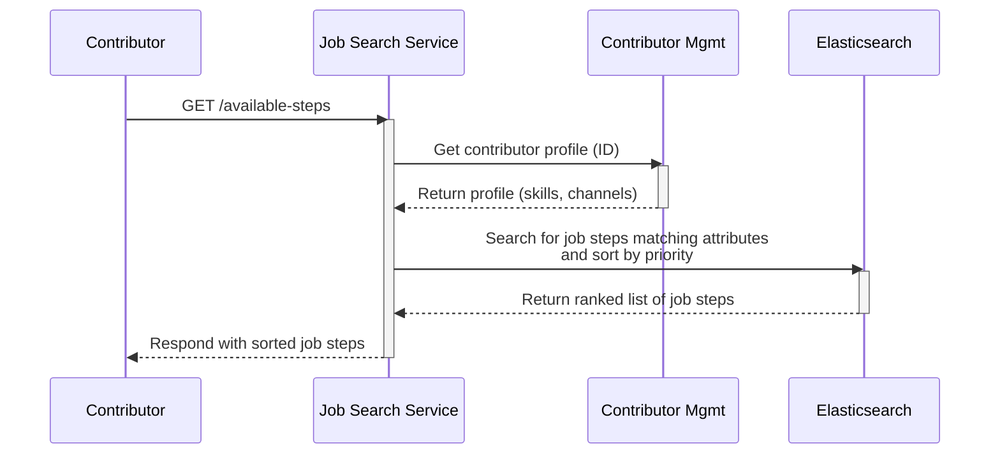
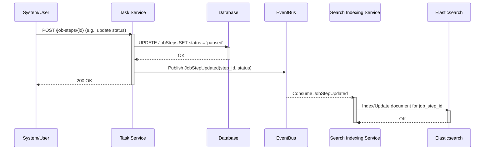
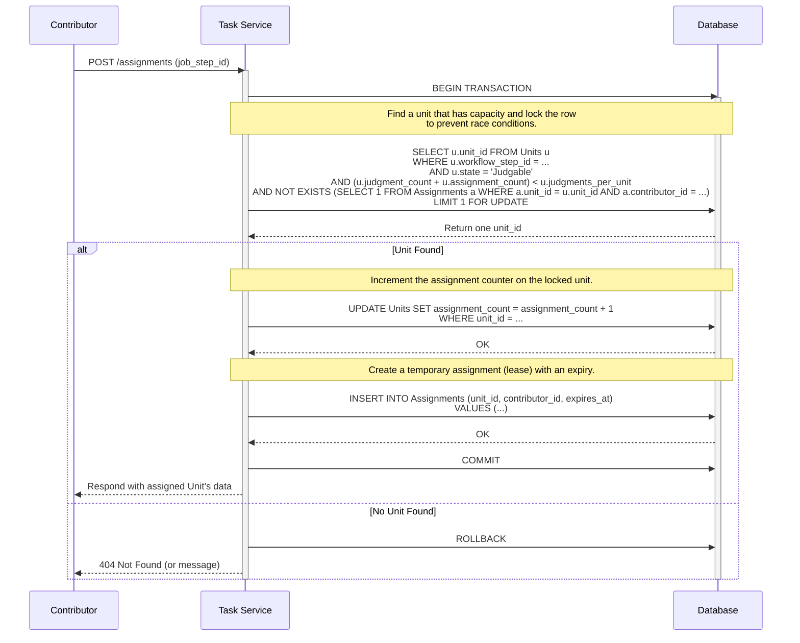
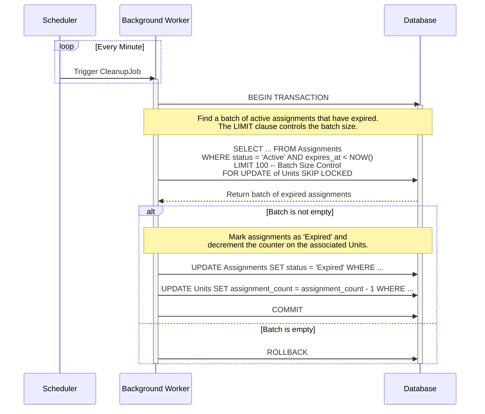
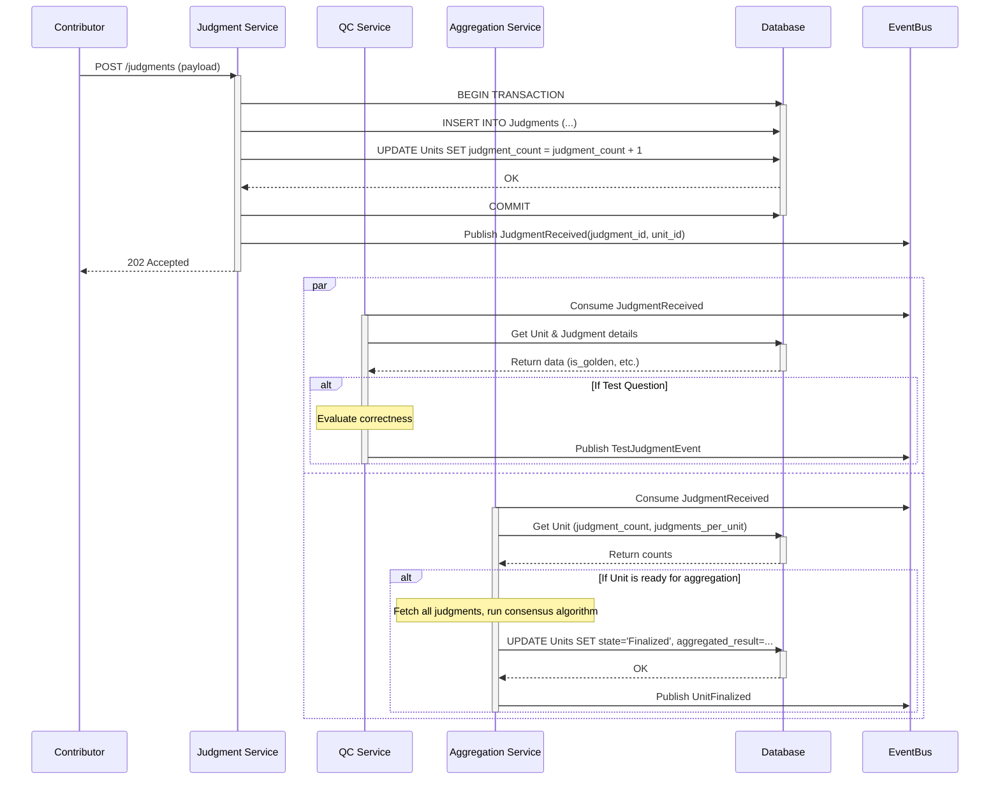
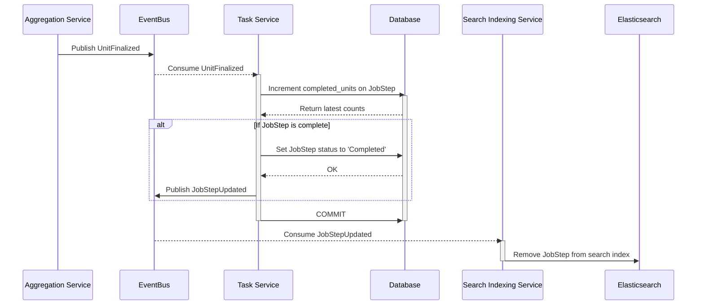

# Deep Dive: Task & Execution Subsystem

This document provides a detailed look into the architecture, components, and logic of the Task & Execution Subsystem. It expands upon the high-level design outlined in the main `architecture.md` document.

- [Deep Dive: Task \& Execution Subsystem](#deep-dive-task--execution-subsystem)
  - [**1. Core Functionality and Requirements**](#1-core-functionality-and-requirements)
    - [**1.1. Unit Management**](#11-unit-management)
    - [**1.2. Judgment Management**](#12-judgment-management)
    - [**1.3. Role in Workflow Orchestration**](#13-role-in-workflow-orchestration)
    - [**1.4. Quality Control (QC) Engine**](#14-quality-control-qc-engine)
    - [**1.5. Aggregation and Finalization**](#15-aggregation-and-finalization)
    - [**1.6. Event-Driven Communication**](#16-event-driven-communication)
  - [**2. Owned Data Models**](#2-owned-data-models)
    - [**2.1. `Units`**](#21-units)
    - [**2.2. `Judgments`**](#22-judgments)
    - [**2.3. `Assignments`**](#23-assignments)
  - [**3. Key Design Decisions**](#3-key-design-decisions)
    - [**3.1. Unified Workflow Model: All Work is a Workflow**](#31-unified-workflow-model-all-work-is-a-workflow)
    - [**3.2. Immutable Unit Chaining: A New Unit Per Step**](#32-immutable-unit-chaining-a-new-unit-per-step)
    - [**3.3. Cohesive Service with a Shared Database**](#33-cohesive-service-with-a-shared-database)
    - [**3.4. Hybrid Data Storage: Relational DB + Object Store**](#34-hybrid-data-storage-relational-db--object-store)
  - [**4. Internal Components and Services**](#4-internal-components-and-services)
    - [**4.1. Task Service**](#41-task-service)
    - [**4.2. Judgment Service**](#42-judgment-service)
    - [**4.3. Aggregation Service**](#43-aggregation-service)
    - [**4.4. Quality Control (QC) Service**](#44-quality-control-qc-service)
    - [**4.5. Workflow Engine (Orchestrator)**](#45-workflow-engine-orchestrator)
  - [**5. Key APIs and Event-Driven Interfaces**](#5-key-apis-and-event-driven-interfaces)
    - [**5.1. External APIs (via API Gateway)**](#51-external-apis-via-api-gateway)
    - [**5.2. Event Interfaces**](#52-event-interfaces)
  - [**6. Detailed Design: Search Units**](#6-detailed-design-search-units)
    - [**6.1. Scenario: Contributors find job steps to work on**](#61-scenario-contributors-find-job-steps-to-work-on)
    - [**6.2. Scenario: Maintaining the Search Index**](#62-scenario-maintaining-the-search-index)
  - [**7. Detailed Design: Unit Assignment**](#7-detailed-design-unit-assignment)
    - [**7.1. Scenario: A Contributor is Assigned a Unit**](#71-scenario-a-contributor-is-assigned-a-unit)
    - [**7.1.1. Performance Improvement: Non-Interactive Transaction**](#711-performance-improvement-non-interactive-transaction)
    - [**7.2. Scenario: Handling Assignment Timeouts**](#72-scenario-handling-assignment-timeouts)
    - [**7.2.1. Performance and Concurrency Considerations**](#721-performance-and-concurrency-considerations)
  - [**8. Detailed Design: Judgement Processing**](#8-detailed-design-judgement-processing)
    - [**8.1. Scenario: A Job Step is Completed**](#81-scenario-a-job-step-is-completed)
  - [**9. Detailed Design: Quality Control Feedback Loop**](#9-detailed-design-quality-control-feedback-loop)
  - [**10. Scalability and Performance Considerations**](#10-scalability-and-performance-considerations)
    - [**10.1. Scaling for Data Volume**](#101-scaling-for-data-volume)
      - [10.1.1. Database Sharding](#1011-database-sharding)
      - [10.1.2. Archival of Old Data](#1012-archival-of-old-data)
    - [**10.2. Handling Hotspot Jobs**](#102-handling-hotspot-jobs)
    - [**10.3. Scaling Reads: Read Replicas**](#103-scaling-reads-read-replicas)
    - [**10.4. Scaling Writes: Asynchronous Processing**](#104-scaling-writes-asynchronous-processing)
  - [**11. Handling Failures of Services in a Distributed System**](#11-handling-failures-of-services-in-a-distributed-system)
    - [**11.1. Foundational Resilience and Graceful Degradation**](#111-foundational-resilience-and-graceful-degradation)
    - [**11.2. Ensuring Atomicity of Database Writes and Event Publishing**](#112-ensuring-atomicity-of-database-writes-and-event-publishing)
      - [11.2.1. Solution 1: Transactional Outbox Pattern (Recommended)](#1121-solution-1-transactional-outbox-pattern-recommended)
      - [11.2.2. Alternative Solution: Change Data Capture (CDC)](#1122-alternative-solution-change-data-capture-cdc)
      - [11.2.3. Why Not Have Subscribers Poll the Outbox Table Directly?](#1123-why-not-have-subscribers-poll-the-outbox-table-directly)
      - [11.2.4. Alternative: The Saga Pattern](#1124-alternative-the-saga-pattern)
    - [**11.3. Ensuring Atomicity in Event Processing (Consumer-Side)**](#113-ensuring-atomicity-in-event-processing-consumer-side)
      - [11.3.1. Solution: The Transactional Inbox/Outbox Pattern](#1131-solution-the-transactional-inboxoutbox-pattern)
      - [11.3.2. Alternative: Kafka-Native Transactions](#1132-alternative-kafka-native-transactions)

---

## **1. Core Functionality and Requirements**

The Task & Execution Subsystem is the operational heart of the ADAP platform. It is responsible for the entire lifecycle of a microtask (`Unit`) from its creation to the generation of a final, high-quality result. This subsystem is designed to be highly scalable, configurable, and robust, ensuring the integrity and efficiency of the annotation process.

### **1.1. Unit Management**

The subsystem must manage the state and lifecycle of all individual units of work.

*   **Creation:** Ingests data from `DataSources` (triggered by events from the Job Lifecycle subsystem) and creates corresponding `Unit` records.
*   **State Tracking:** Manages the state of each unit (`New`, `Judgable`, `Paused`, `Finalized`, `Golden`).
*   **Availability:** Makes units available for work based on their state and the job's requirements (e.g., which contributor channels are assigned).
*   **Lifecycle Control:** Provides mechanisms to pause, resume, or cancel units as needed.

### **1.2. Judgment Management**

The subsystem is the primary entry point for all annotations submitted by contributors.

*   **Ingestion:** Provides a high-throughput API endpoint (`POST /judgments`) to receive and store annotation data.
*   **Validation:** Performs initial validation on incoming judgments to ensure they conform to the expected data schema for the given task.
*   **Association:** Correctly associates each `Judgment` with its corresponding `Unit`, `Job`, and `Contributor`.
*   **Metadata Capture:** Records critical metadata with each judgment, such as submission timestamps and a snapshot of the contributor's trust score at the time of submission.

### **1.3. Role in Workflow Orchestration**

While the detailed orchestration logic resides in a dedicated `Workflow Engine` (see `workflow_orchestration.md`), this subsystem plays a critical role as the executor for each individual step within a workflow.

*   **Executor of a Single Step:** The Task & Execution Subsystem is responsible for the complete lifecycle of a `Unit` *within a single workflow step*. It manages the collection of judgments, runs quality control, and produces a final, aggregated result for that specific task.
*   **Trigger for Orchestration:** The final action of this subsystem on a unit is to publish a `UnitFinalized` event. This event acts as a signal to the `Workflow Engine`, informing it that a piece of work is complete.
*   **Decoupled Interaction:** The `Workflow Engine` consumes this `UnitFinalized` event and, based on the workflow's definition, decides what to do next. This event-driven communication keeps the two components cleanly decoupled; this subsystem does not need to know what the next step is, or if one even exists.

### **1.4. Quality Control (QC) Engine**

This is a critical set of functionalities for ensuring the integrity of the collected data.

*   **Test Question Management:**
    *   **Identification:** Identifies when a submitted judgment is for a `TestQuestion` (golden unit).
    *   **Evaluation:** Compares the submitted annotation against the known correct answer.
    *   **Immediate Feedback Loop:** Publishes a `TestJudgmentEvent` with the result (`{ judgment_id, was_correct }`) to provide immediate feedback to the Contributor Management subsystem.
*   **Manual Review via Workflow (QA Step):**
    *   **Concept:** Incorporates a dedicated "QA Review" step into a `WorkflowDefinition`. After initial annotation, units can be routed to a special channel of trusted experts or project managers for review. This is not an ad-hoc process but a formal, configurable part of a job's lifecycle.
    *   **Reviewer Actions:** The reviewer is presented with the original annotation and has several options, which are configured as `WorkflowRoutes`:
        *   **Approve:** The original judgment is accepted as correct. The unit proceeds to the next step or is finalized.
        *   **Correct:** The reviewer directly modifies or overrides the original annotation. This corrected version becomes the authoritative judgment for that step.
        *   **Reject:** The original judgment is discarded. The `WorkflowEngine` then routes the unit back to the initial annotation step to be redone by a different contributor.
    *   **Targeted Review:** Routing rules can be configured to send only a subset of units to the QA step, such as those from new contributors, units with low consensus, or a random statistical sample.
*   **Consensus-Based Quality:**
    *   **Disagreement Monitoring:** Tracks the level of disagreement between contributors on regular (non-golden) units. High disagreement can be a signal of an ambiguous task or low-quality work.
    *   **Agreement Scoring:** After a unit is finalized, it evaluates each judgment's agreement with the final consensus answer. This data is used for long-term updates to contributor trust scores via the `UnitFinalized` event.
*   **Behavioral Monitoring:**
    *   **Velocity Tracking:** Monitors the time taken to submit judgments to flag contributors who are working too fast (potential spam) or too slow (potential difficulty).
    *   **Pattern Detection:** Implements logic to detect suspicious patterns, such as a contributor always choosing the first option or submitting identical annotations for every task.
*   **Automated Actions:**
    *   **Tainting:** Flags individual judgments as "tainted" if they are deemed unreliable (e.g., from a contributor who failed too many recent test questions). Tainted judgments are excluded from aggregation.
    *   **Contributor Flagging:** Emits events that signal to the Contributor Management subsystem when a contributor's performance drops below a critical threshold, potentially triggering warnings or removal from a job.

### **1.5. Aggregation and Finalization**

Once a unit has received the required number of judgments, the subsystem is responsible for producing a single, authoritative result.

*   **Triggering:** Determines when a unit is ready for aggregation (e.g., `judgment_count` >= `judgments_per_unit`).
*   **Algorithm Execution:** Implements and applies various configurable aggregation algorithms:
    *   **Majority Vote:** The most common answer is chosen.
    *   **Confidence-Weighted Voting:** Each vote is weighted by the trust score of the contributor who cast it.
    *   **Probabilistic Models:** More advanced models (e.g., Dawid-Skene) that simultaneously estimate the correct answer and each contributor's error rates.
*   **Result Storage:** Stores the final `aggregated_result` and a `confidence_score` on the `Unit` record.
*   **Finalization:** Transitions the unit's state to `Finalized`, removing it from the active work pool and triggering the `UnitFinalized` event.

### **1.6. Event-Driven Communication**

The subsystem is a central hub in the platform's event-driven architecture, both consuming and producing events to ensure loose coupling and scalability.

*   **Consumed Events:**
    *   `JobStatusChanged`: Listens for this event from the Job Lifecycle subsystem to know when to begin creating units for a newly launched job.
*   **Published Events:**
    *   `UnitReadyForAssignment`: Notifies the system that a new unit is available to be worked on.
    *   `TestJudgmentEvent`: Provides real-time, low-latency feedback on test question performance.
    *   `UnitFinalized`: A rich event published after aggregation, containing the final result and a quality analysis of each judgment. This is used for long-term contributor performance tracking and as the primary trigger for the Workflow Engine.

---

## **2. Owned Data Models**
This subsystem has direct ownership and control over the most dynamic data in the platform. Based on our design decisions, these models are structured to support a simple, traceable, and robust execution loop for each step in a workflow.

### **2.1. `Units`**

The `Unit` is the atomic piece of work that is processed within a single workflow step. Following the "Immutable Unit Chaining" principle, a new `Unit` is created for each step of a workflow, forming a traceable pipeline.

*   **Purpose:** To encapsulate the data, state, and results for one microtask at one specific stage of a workflow.

*   **Key Fields:**
    *   `unit_id` (UUID, PK): The unique identifier for this specific unit of work.
    *   `root_data_id` (UUID): A common identifier that links all `Units` originating from the same initial piece of source data. This is crucial for end-to-end traceability across a multi-step workflow.
    *   `parent_unit_id` (UUID, nullable): A foreign key to the `Unit` from the previous workflow step, forming a direct chain. This is `null` for the first unit in a chain.
    *   `workflow_step_id` (UUID, FK): Identifies which `WorkflowStep` (and thus which "Task Template") this unit belongs to.
    *   `input_data` (JSONB): The specific data payload required for this step. For the first unit in a chain, this contains the source data. For subsequent units, it contains the source data *plus* the `aggregated_result` from the parent unit.
    *   `state` (ENUM: 'New', 'Judgable', 'Paused', 'Finalized', 'Golden', 'Canceled'): The current processing status of this unit.
    *   `judgment_count` (INTEGER): A counter for the number of judgments received.
    *   `judgments_per_unit` (INTEGER): The target number of judgments required for this unit.
    *   `assignment_count` (INTEGER): A counter for the number of currently active (unexpired) assignments.
    *   `aggregated_result` (JSONB, nullable): Stores the final consensus annotation result for this unit after aggregation.
    *   `confidence_score` (DECIMAL, nullable): A numerical score indicating confidence in the `aggregated_result`.

### **2.2. `Judgments`**

The `Judgment` represents the output submitted by one contributor for one `Unit`. It is the raw record of work performed.

*   **Purpose:** To store the annotation data from a single contributor for a single microtask, along with critical metadata for quality control and performance tracking.

*   **Key Fields:**
    *   `judgment_id` (UUID, PK): The unique identifier for this specific annotation submission.
    *   `unit_id` (UUID, FK to Units): Links the judgment to the unit that was annotated.
    *   `contributor_id` (UUID, FK to Contributors): Identifies the contributor who submitted this judgment.
    *   `data` (JSONB): The core annotation payload (e.g., selected labels, drawn shapes, transcribed text). The structure is defined by the CML of the task.
    *   `worker_trust_snapshot` (DECIMAL): A snapshot of the contributor's trust score at the moment they submitted this judgment. Storing this prevents historical analysis from being skewed by future performance changes.
    *   `started_at` / `submitted_at` (TIMESTAMP): Timestamps that allow for calculating task duration, which is used for behavioral monitoring.
    *   `is_tainted` (BOOLEAN): A flag set by the QC Engine indicating that this judgment is considered unreliable and should be excluded from aggregation.
    *   `on_test_question` (BOOLEAN): Indicates if this judgment was submitted for a Test Question unit.
    *   `test_question_correct` (BOOLEAN, nullable): If `on_test_question` is true, this stores the result of the evaluation against the known correct answer.

### **2.3. `Assignments`**

The `Assignment` represents a temporary "lease" of a `Unit` to a `Contributor`. It is a short-lived record that prevents other contributors from being assigned the same unit while it is being worked on and handles cases where a contributor abandons the task.

*   **Purpose:** To track which contributor is working on which unit and for how long.

*   **Key Fields:**
    *   `assignment_id` (UUID, PK): The unique identifier for this lease.
    *   `unit_id` (UUID, FK to Units): The unit being worked on.
    *   `contributor_id` (UUID, FK to Contributors): The contributor who has been assigned the unit.
    *   `created_at` (TIMESTAMP): When the assignment was created.
    *   `expires_at` (TIMESTAMP): The time at which this assignment is considered abandoned and the "slot" is freed up.
    *   `status` (ENUM: 'Active', 'Submitted', 'Expired'): The state of the assignment.

---

## **3. Key Design Decisions**

This section captures the core architectural principles that govern the design of the Task & Execution Subsystem and its interaction with the wider platform.

### **3.1. Unified Workflow Model: All Work is a Workflow**

To eliminate complexity and dual execution paths, we have adopted a unifying principle: **every task run on the platform is a workflow.**

*   **Concept:** A simple "job" is treated as a single-step workflow. This removes the distinction between "jobs" and "workflows" at the execution level.
*   **Implication:** The `WorkflowEngine` is the sole mechanism for task execution. The concept of a `JobDefinition` is simplified to that of a reusable **"Task Template"** which is instantiated by a `WorkflowStep`.
*   **Benefit:** This provides a single, consistent model for all work, simplifies the execution engine, and allows users to seamlessly scale a simple task into a multi-step process without migration.

### **3.2. Immutable Unit Chaining: A New Unit Per Step**

To simplify state management and create a clear data pipeline, a new `Unit` is instantiated for each step in a workflow.

*   **Concept:** When a `Unit` is completed at `Step A`, the `WorkflowEngine` creates a *new* `Unit` for `Step B`. This forms a chain of units linked by a common identifier (e.g., `root_unit_id` or `source_data_id`).
*   **Implication:** This model eliminates the need for a complex, centralized `UnitWorkflowState` entity. Each `Unit` has a simple, self-contained lifecycle. The output of one unit (its `aggregated_result`) becomes part of the input for the next unit in the chain.
*   **Benefit:** Greatly simplifies state management, promotes data isolation between steps, and creates a clear, traceable "input/output" data flow that is easy to reason about and debug.

### **3.3. Cohesive Service with a Shared Database**

The Task & Execution Subsystem is designed as a single, cohesive service, not a collection of distributed microservices. Its internal components (`Unit Service`, `Judgment Service`, `Workflow Engine`, etc.) are logical modules within this single service.

*   **Concept:** All logical components within this subsystem share a single, common database for their core transactional data.
*   **Logical Separation:** While they share a database, components like the `Workflow Engine` are logically distinct. The engine's responsibility (orchestration) is different from the core execution loop (judgment collection, QC). This logical separation, and the engine's complexity, is why its detailed design is maintained in a separate document (`workflow_orchestration.md`) for clarity.
*   **Benefit:** This approach guarantees data consistency and transactional integrity, maximizes performance by avoiding slow network calls between components, and simplifies deployment. It provides the benefits of a monolithic service for performance and consistency, while allowing for modular design and documentation.

### **3.4. Hybrid Data Storage: Relational DB + Object Store**

To optimize for performance, cost, and scalability, we will use a hybrid data storage model.

*   **Concept:** Use the right tool for the job. Structured, transactional metadata will live in a relational database, while large, unstructured data blobs will live in an object store.
*   **Relational Database (e.g., PostgreSQL):** Used for the core `Units` and `Judgments` tables, storing IDs, states, timestamps, foreign keys, and other structured metadata. This is essential for fast queries, joins, and maintaining transactional integrity.
*   **Object Store (e.g., S3, MinIO):** Used for storing large data payloads that are written once and read, but not queried directly. This includes:
    *   The actual source data (images, audio files, large documents). The `Unit.input_data` field would store a URI pointing to the object in the store.
    *   The detailed JSON payload from `Judgment.data`, which can be large and complex.
*   **Benefit:** This keeps the primary relational database lean, fast, and cost-effective. It leverages the virtually infinite scalability and low cost of object storage for bulk data, preventing database bloat and performance degradation.

---

## **4. Internal Components and Services**
The subsystem is logically divided into several internal services, each with a distinct responsibility.

### **4.1. Task Service**
This is the core service responsible for managing the lifecycle of work itself. It owns the `JobStep`, `Unit`, and `Assignment` entities. Its responsibilities include:
*   Creating and managing `JobSteps` based on directives from the `Workflow Engine`.
*   Managing the state and data of individual `Units`.
*   Creating and tracking `Assignments`, including handling expirations.

### **4.2. Judgment Service**
Handles the ingestion, initial validation, and storage of contributor submissions. This is the primary write-heavy entry point.

### **4.3. Aggregation Service**
Implements various consensus algorithms (e.g., majority vote, weighted voting based on trust scores) to produce the final `aggregated_result` for a unit.

### **4.4. Quality Control (QC) Service**
Works in tandem with the Judgment Service to identify submissions for `TestQuestions`, compare them against the ground truth, and trigger the appropriate events.

### **4.5. Workflow Engine (Orchestrator)**
The `Workflow Engine` is the component responsible for orchestrating the movement of work between different steps. Due to its specialized, stateful, and complex nature (handling data-aware routing, branching, and batching logic), its detailed design has been separated into its own document to maintain clarity.

*   **Reason for Separation:** Separating the documents allows this document to focus on the core "single-task" execution loop (collecting judgments, QC, aggregation), while the workflow document can focus exclusively on the "meta-task" of orchestration.
*   **Reference:** For a complete deep-dive into its architecture, execution modes, and data models, **see `workflow_orchestration.md`**.

---

## **5. Key APIs and Event-Driven Interfaces**

### **5.1. External APIs (via API Gateway)**
- **`POST /judgments`:** The primary endpoint for submitting work.
- **`GET /job-steps?contributor_id={id}`:** How contributors discover available tasks.
- **`GET /units/{id}/result`:** How clients retrieve final, aggregated annotations.

### **5.2. Event Interfaces**
- **Published Events:** Detailed schemas for `TestJudgmentEvent` and `UnitFinalized`.
- **Consumed Events:** How `JobStatusChanged` from the Job Lifecycle subsystem triggers the creation of units.

---
***The follow sections of detailed designs provide a detailed, low-level view of the most common operations within the Task & Execution subsystem, focusing on the interactions between its internal components.***

---

## **6. Detailed Design: Search Units**

Before a contributor can work, they need to see what tasks are available to them. The original design of querying the main database directly is inefficient. A scalable solution uses a dedicated search index (like Elasticsearch) to handle this complex query load.

### **6.1. Scenario: Contributors find job steps to work on**

**Narrative:**
1.  A `Job Search Service` receives the request from the contributor.
2.  It first calls the `Contributor Management` subsystem to get the contributor's profile (e.g., their skills, certifications, and channel memberships).
3.  The service then constructs a query for Elasticsearch. This query includes both the *filtering* criteria (matching contributor attributes) and *sorting* criteria (e.g., by job priority).
4.  Elasticsearch uses its inverted index to rapidly find all matching job steps, sorts them by priority, and returns a ranked list. This entire operation is handled within the search index for maximum efficiency.

**Data Synchronization Note:** For this to work, any data needed for filtering or ranking (like `job_priority`) must be denormalized and included in the Elasticsearch document for the job step. When a job's priority is updated, an event must be published to trigger an update to the corresponding documents in the search index.

**Why Use a Search Index?**
*   **Query Complexity:** Finding eligible work involves filtering on multiple, often unrelated, contributor attributes (skills, location, trust score) and job properties. In a relational database, this requires complex joins and `WHERE` clauses that are notoriously slow and difficult to index effectively.
*   **Performance Isolation:** Heavy, complex search queries can put significant strain on the primary transactional database, slowing down critical write operations like submitting judgments. A dedicated search index isolates this read-heavy workload.
*   **Inverted Index Advantage:** Search engines use an inverted index, which maps terms (like a skill `ner` or a channel `level-2-spanish`) directly to the documents (job steps) that contain them. This makes finding all documents that match a set of criteria extremely fast, which is exactly what this use case requires.



### **6.2. Scenario: Maintaining the Search Index**

The search index must be kept synchronized with the primary database to ensure that contributors are always shown an accurate and correctly ranked list of available work. This is achieved asynchronously through an event-driven process triggered by changes to a `JobStep`.

**Narrative:**
1.  An event from the `Workflow Engine` or a direct user action triggers a change to a `JobStep`. This could be an update to its status (e.g., 'launching', 'pausing'), configuration, or associated channels.
2.  The `Task Service` processes this change in the main database.
3.  Upon successful commit, it publishes a `JobStepUpdated` event. This event contains all the data required for indexing, such as its status, requirements, and priority.
4.  A dedicated `Search Indexing Service` consumes this event.
5.  The service transforms the event data into the correct document format for Elasticsearch.
6.  It then issues an `index` or `update` command to Elasticsearch, which upserts the document. This ensures the search index reflects the latest state of the job step, making it discoverable (or not) by contributors.



---

## **7. Detailed Design: Unit Assignment**

### **7.1. Scenario: A Contributor is Assigned a Unit**

Once the contributor selects a job step, the system must assign them a single `Unit` to work on. This process must be fair, efficient, and robust against race conditions. To prevent two contributors from being assigned the same unit simultaneously, the transaction locks the selected `Unit` row using `FOR UPDATE`. A temporary, time-limited `Assignment` record is then created to track the "lease."



### **7.1.1. Performance Improvement: Non-Interactive Transaction**

While the interactive transaction in the main scenario is clear and explicit, an alternative, more performant approach exists for databases that support data-modifying Common Table Expressions (CTEs), such as **PostgreSQL**. This method combines the finding, locking, updating, and inserting steps into a single atomic SQL statement, which can significantly reduce lock contention and improve throughput under high load.

**Narrative:**
The `Task Service` executes a single SQL query that internally performs the entire assignment logic:
1.  **CTE 1: `find_unit`**: The first CTE finds an available `Unit` using the same criteria, applies a `FOR UPDATE` lock, and returns its `unit_id`. The `SKIP LOCKED` option is crucial for concurrency, allowing the query to skip over any rows that are already locked by another transaction, preventing it from waiting.
2.  **CTE 2: `update_unit`**: The second CTE uses the `unit_id` from `find_unit` to `UPDATE` the `assignment_count` on the `Units` table.
3.  **Final Statement: `INSERT ... RETURNING`**: The main part of the query then `INSERT`s a new record into the `Assignments` table, using the `unit_id` from `find_unit`. The `RETURNING` clause is used to send the `unit_id` back to the application.

The entire operation is atomic. It minimizes network round-trips between the service and the database and holds the row lock for the shortest possible duration—only the time it takes for the single query to execute.

**Example: PostgreSQL Data-Modifying CTE**
```sql
WITH find_unit AS (
    -- Find the first available unit that isn't locked by another transaction
    SELECT unit_id
    FROM Units
    WHERE workflow_step_id = :workflow_step_id
      AND state = 'Judgable'
      AND (judgment_count + assignment_count) < judgments_per_unit
      AND NOT EXISTS (
          SELECT 1 FROM Assignments
          WHERE unit_id = Units.unit_id AND contributor_id = :contributor_id
      )
    ORDER BY created_at
    LIMIT 1
    FOR UPDATE SKIP LOCKED
),
update_unit AS (
    -- Increment the assignment counter on the locked unit
    UPDATE Units
    SET assignment_count = assignment_count + 1
    WHERE unit_id = (SELECT unit_id FROM find_unit)
)
-- Create the assignment and return the unit_id to the application
INSERT INTO Assignments (unit_id, contributor_id, expires_at)
SELECT unit_id, :contributor_id, NOW() + INTERVAL '15 minutes'
FROM find_unit
RETURNING unit_id;
```

Alternatively, stored procedure can be used to achieve the same non-interactive query and it is the only option for MySQL.

### **7.2. Scenario: Handling Assignment Timeouts**

When a contributor is assigned a unit, the `Assignment` is given an `expires_at` timestamp. If the contributor does not submit a judgment within this time, the assignment is considered abandoned, and the unit must be returned to the pool for another contributor. This is handled by a background process to avoid impacting the performance of the main application threads.

**Narrative:**
1.  **Scheduled Job:** A cron job or a scheduled task runs periodically (e.g., every minute) to trigger a cleanup process.
2.  **Find Expired Assignments:** A background worker queries the `Assignments` table for records where `status` is 'Active' and `expires_at` is in the past. The query uses a `LIMIT` clause to control the batch size.
3.  **Process in Batches:** To handle a high volume of expirations and to avoid long-running transactions, the worker processes these expired assignments in batches. For each batch, it performs the following steps in a single transaction.
4.  **Update Records:**
    *   The status of the found `Assignment` records is changed from 'Active' to 'Expired'.
    *   The `assignment_count` on the corresponding `Units` is decremented, making the "slot" on each unit available again.
5.  **Commit:** The transaction is committed, atomically updating all records for the batch.

This ensures that units are not held indefinitely by inactive contributors and are efficiently recycled back into the work pool.



### **7.2.1. Performance and Concurrency Considerations**

The design of the timeout handler involves a critical performance trade-off between transactional overhead and lock contention.

*   **Why Batching?**: Processing each expired assignment in its own individual transaction would be extremely inefficient. The overhead of network round-trips and starting/committing thousands of separate transactions would create significant load and make the cleanup process very slow. Batching (e.g., 100 records at a time) drastically reduces this overhead by bundling the work into a single, efficient operation per batch.

*   **Locking and Atomicity**: The transaction holds locks on the batched `Assignment` and `Unit` rows for its entire duration. This is necessary to guarantee atomicity—ensuring that an assignment is marked 'Expired' *and* the unit's counter is decremented together.

*   **The Role of `SKIP LOCKED`**: This clause is vital for concurrency between multiple instances of the background worker. If two workers run at the same time, `SKIP LOCKED` ensures they don't try to process the same batch of expired assignments. The first worker to query the rows will lock them, and the second worker's query will simply skip those locked rows and move on to the next available batch, preventing them from blocking each other.

*   **Minimizing Lock Duration**: While locks are held, the impact is minimal. Each transaction is very fast because the batch size is kept small and predictable. This ensures that locks are held for milliseconds, not seconds, preventing significant conflicts with other system processes. Running this logic in a background worker also isolates it from the user-facing, latency-sensitive parts of the application.

In summary, batching provides the optimal balance between the efficiency of processing records in bulk and the concurrency requirement of keeping transactions short-lived to minimize lock contention.

---

## **8. Detailed Design: Judgement Processing**

After the contributor completes the annotation, they submit a `Judgment`. The initial reception is synchronous and fast, acknowledging the submission immediately. The more complex post-processing (quality checks, aggregation triggers) is handled asynchronously to ensure the API remains responsive.



### **8.1. Scenario: A Job Step is Completed**

When the last `Unit` in a `JobStep` is finalized, the `JobStep` itself must be marked as complete to prevent it from being offered to contributors. This is crucial for keeping the search index of available work accurate. This process is triggered by the `UnitFinalized` event and relies on maintaining completion counters on the `JobStep` entity.

**Narrative:**
1.  The `Aggregation Service` finalizes a `Unit` and publishes a `UnitFinalized` event.
2.  The `Task Service` consumes this event. To efficiently check if the `JobStep` is complete, it maintains counters on the `JobStep` record itself (e.g., `total_units` and `completed_units`).
3.  The service begins a transaction and increments the `completed_units` counter for the parent `JobStep`.
4.  It then checks if `completed_units` is now equal to `total_units`.
5.  If it is, the service updates the `JobStep`'s status to `Completed`.
6.  After committing the transaction, it publishes a `JobStepUpdated` event with the new status.
7.  The `Search Indexing Service` (as described in Section 6.2) consumes this event and updates the corresponding document in Elasticsearch, which effectively removes the `JobStep` from the pool of available work for contributors.



---

## **9. Detailed Design: Quality Control Feedback Loop**
*(A diagram and explanation of the end-to-end flow for a `TestQuestion` judgment.)*

---

## **10. Scalability and Performance Considerations**

Most application services within this subsystem are designed to be stateless, allowing them to be scaled horizontally with ease. The true scalability and performance challenges, therefore, lie in managing the underlying stateful data layer and ensuring the system remains responsive under heavy write loads. This section outlines the key strategies for achieving this, from handling high data volumes and mitigating write contention, to scaling read performance and using asynchronous processing to maintain a fast, resilient, and responsive user experience.

### **10.1. Scaling for Data Volume**

As the platform grows, the sheer volume of data, particularly in the `Judgments` and `Units` tables, will become the primary bottleneck. A single database instance will eventually fail to handle the write throughput and storage requirements. To address this, a horizontal sharding strategy is essential. The core principle is to co-locate all data related to a single task to ensure that our high-frequency transactions remain on a single shard, avoiding the complexity and performance penalty of distributed transactions.

#### 10.1.1. Database Sharding

To guarantee transactional integrity, the `Units`, `Judgments`, and `Assignments` tables will all be sharded by the same key: `workflow_step_id`.

*   **Why this key?** The `workflow_step_id` represents a single, discrete task. All core operations—assigning a unit, submitting a judgment, and processing a timeout—happen within the context of a specific step. By sharding on this key, we ensure that a unit, all of its judgments, and all of its assignments reside on the same physical database shard.

*   **Benefits:**
    *   **Single-Shard Transactions:** All primary OLTP operations (Unit Assignment, Judgment Processing, Timeout Handling) become fast, atomic, single-shard transactions. This is the most significant advantage, as it preserves performance and simplicity.
    *   **Efficient Aggregation:** The aggregation process, which reads all judgments for a unit, is also a highly efficient single-shard query.
    *   **Distributed Write Scalability:** The write load from new judgments is spread across all shards as different job steps are worked on simultaneously.

#### 10.1.2. Archival of Old Data

A key trade-off of sharding by `workflow_step_id` is that we can no longer simply archive old data by dropping a time-based shard, as data for old and new jobs will coexist on the same shard. This problem is magnified by the fact that workflows are designed to be long-running. The platform's APIs allow for new data to be continuously added to existing jobs and workflows. This results in `workflow_step_id`s that can remain active for months or even years, all while accumulating a vast number of historical `Units` and `Judgments` that are long since finalized. Without a proactive archival strategy, the database shards for these active workflows would grow indefinitely, leading to performance degradation and increased storage costs. Therefore, a dedicated strategy for data lifecycle management is not just a trade-off, but a critical necessity.

*   **Asynchronous Archival Process:** A background process will be responsible for managing the data lifecycle. This process must periodically scan shards for `Units` that have been in a `Finalized` state for a specified period (e.g., 90 days), regardless of whether the parent `JobStep` is still active.
*   **Archival and Deletion:** It will move this historical data (the finalized `Unit` and its associated `Judgments`) from the primary OLTP database to a cheaper, long-term archival store (such as a data warehouse like BigQuery or an object store like S3 with a queryable layer like Athena). Once the data is safely archived, the corresponding rows are deleted from the production database.
*   **Off-Peak Execution:** This cleanup task should be scheduled during off-peak hours to minimize its impact on the performance of the production database.

### **10.2. Handling Hotspot Jobs**

A "hotspot" is a critical risk in our sharding strategy. It occurs when one `workflow_step_id` becomes extremely popular (e.g., a high-priority, high-volume task is launched), causing all traffic for that task to concentrate on a single database shard.

**The Core Problem: Write-Lock Contention**

The primary bottleneck is not simple read traffic, but intense contention for write locks during the unit assignment process. The most problematic query is:

```sql
SELECT unit_id FROM Units WHERE workflow_step_id = ? ... FOR UPDATE SKIP LOCKED;
```

Under heavy load, thousands of concurrent transactions execute this query. Even with a perfect index, these transactions all compete to lock the first few available rows. Since database rows are stored on physical "pages," this concentrates all the locking activity on a very small set of data pages. While the entire index isn't locked, the intense competition for these few pages creates a processing queue, and the database's ability to grant locks becomes the bottleneck. This leads to timeouts and poor performance for the hot job and any other jobs on that shard.

To address this, we will use a phased approach, starting with simple, database-native solutions and escalating to more complex ones only if necessary.

---

**Phase 1: Database-Native Optimizations (Default Strategy)**

For the vast majority of cases, the most effective solutions are those that work within the database itself. These should be the default implementation.

**1. Simplified Counter and Composite Index**

First, we simplify the `Units` table by replacing `judgment_count` and `assignment_count` with a single `slots_taken` integer. This counter is incremented on assignment and decremented only on timeout. Then, we create a composite index to optimize the selection query:

```sql
CREATE INDEX idx_units_availability 
ON Units (workflow_step_id, state, slots_taken);
```

This allows the database to very quickly find the pool of available units. However, it doesn't prevent all transactions from targeting the first rows in the index, which can still lead to page-level contention.

**2. Introducing Randomness to Distribute Load**

To directly combat page-level contention, we can introduce randomness into the selection query. This prevents every transaction from competing for the same initial set of rows.

```sql
-- Example for PostgreSQL
SELECT unit_id FROM Units
WHERE workflow_step_id = :workflow_step_id
  AND state = 'Judgable'
  AND slots_taken < judgments_per_unit
ORDER BY RANDOM() -- This is the key change
LIMIT 1
FOR UPDATE SKIP LOCKED;
```

*   **Pro:** By selecting a random available row, we distribute lock requests across different data pages, significantly reducing the chance of a contention bottleneck.
*   **Con:** This approach can be slower on very large tables, as the database can no longer perform a simple ordered index scan. However, a slightly slower query is often better than a theoretically faster query that gets stuck in a contention queue.

For most hotspot scenarios, a combination of a good index and query randomization is the simplest and most effective solution.

---

**Phase 2: Escalation Path for Extreme Hotspots**

If monitoring reveals that even with database-native optimizations, a shard is overwhelmed, we can escalate to more complex solutions.

**Cache-Assisted Unit Selection**

This strategy offloads the work of *finding* a unit to an external cache, reducing read I/O and index contention on the primary database.

*   **Mechanism:** For a hot `workflow_step_id`, a background process queries for available `unit_id`s and populates an in-memory cache using a **Redis Set**. Using a Set is idempotent, so adding existing IDs has no effect, making the process simple and resilient.

*   **Assignment Flow:**
    1.  The service uses a command like `SPOP` to **atomically and randomly** pop a `unit_id` from the Redis Set. The key benefit here is randomness: by providing each concurrent transaction with a different, random `unit_id` to attempt to lock, we distribute the load across many different database rows and pages. This directly mitigates the row and page lock contention in the database, which is the primary bottleneck.
    2.  It then executes a **single, non-interactive CTE transaction** to perform the lock, update, and insert in one atomic database operation. This minimizes network round-trips.
        ```sql
        -- This single query attempts to lock the specific unit from the cache,
        -- update it, and create an assignment, all atomically.
        WITH lock_unit AS (
            -- Attempt to lock the specific unit_id obtained from the cache.
            SELECT unit_id
            FROM Units
            WHERE unit_id = :cached_unit_id
              AND state = 'Judgable'
              AND slots_taken < judgments_per_unit
            FOR UPDATE SKIP LOCKED
        ),
        update_unit AS (
            -- If the lock was successful, increment the counter.
            UPDATE Units
            SET slots_taken = slots_taken + 1
            WHERE unit_id = (SELECT unit_id FROM lock_unit)
            RETURNING unit_id
        )
        -- If both previous CTEs succeeded, create the assignment and
        -- return the unit_id to the application to confirm success.
        INSERT INTO Assignments (unit_id, contributor_id, expires_at)
        SELECT unit_id, :contributor_id, NOW() + INTERVAL '15 minutes'
        FROM update_unit
        RETURNING unit_id;
        ```
    3.  The application checks the return value of the query. If it returns a `unit_id`, the assignment was successful. If it returns no rows, it means the lock failed (the unit was taken by another process), and the application should immediately try again with the next random `unit_id` from the cache.
*   **Benefit:** This avoids expensive index scans on the primary database during peak load.
*   **Complexity:** This is a significant increase in complexity. It requires new infrastructure (Redis), a background worker process to populate the cache, and careful monitoring. The cache will have stale data, but this is acceptable as the database remains the final arbiter of truth. This complexity is only justified for the most extreme and persistent hotspot scenarios.

**Maintaining the Cache**

The integrity and freshness of the Redis cache are maintained by a dedicated background worker process. This process is critical for ensuring the cache-assisted selection mechanism has a steady supply of valid `unit_id`s to draw from.

*   **Population:**
    *   The worker periodically queries the database for `unit_id`s that are in a `Judgable` state and have available capacity (`slots_taken < judgments_per_unit`) for a given hot `workflow_step_id`.
    *   It then adds these `unit_id`s to the corresponding Redis Set using the `SADD` command. `SADD` is idempotent, so adding existing IDs has no effect, making the process simple and resilient.

*   **Stale Data Handling:**
    *   The cache will inevitably contain stale data—`unit_id`s that were available when cached but have since been assigned. This is an acceptable and expected part of the design.
    *   The atomicity of the `SPOP` command from Redis and the `FOR UPDATE SKIP LOCKED` clause in the database transaction form the core of the consistency model. If the application pops a stale `unit_id` from the cache, the database query will simply fail to acquire a lock and return zero rows. The application logic then immediately retries with the next random `unit_id` from the cache. This makes the system self-correcting.

*   **Cleanup (Optional):**
    *   While the system is designed to tolerate stale data, an optional cleanup process can be implemented. For example, the worker could periodically remove `unit_id`s from the Set if their corresponding units in the database are no longer in a `Judgable` state (e.g., they have been `Finalized` or `Canceled`). This can help keep the cache size manageable for very long-running hot jobs.

**Phase 3: Final Safeguard: Rate Limiting and Graceful Degradation**

This is the ultimate safety net to protect the stability of the entire platform.

*   **Mechanism:** Implement rate limiting at the application level, specifically for the `POST /assignments` endpoint for the hot `workflow_step_id`.
*   **Behavior:** When the rate of assignment requests exceeds a safe threshold, the service starts returning a `429 Too Many Requests` status code or a user-friendly message like "This task is currently experiencing very high demand. Please try again in a few moments."
*   **Benefit:** This prevents the database shard from being completely overwhelmed. It's a crucial trade-off, sacrificing the availability of a single hot job to preserve the stability and performance of the entire platform.

### **10.3. Scaling Reads: Read Replicas**

Many read queries in the system do not need to be executed against the absolute latest, up-to-the-millisecond version of the data. These queries are excellent candidates to be offloaded from the primary write database to one or more **read replicas**. A read replica is a continuously updated copy of the primary database that can serve read-only traffic.

**Candidate Queries for Read Replicas:**

*   **Dashboards and Analytics:** Queries that power internal dashboards for monitoring job progress, contributor performance, or overall system health. A few seconds or even a minute of data lag is perfectly acceptable for these use cases.
*   **Reporting:** Generating reports on historical data.
*   **Data Export:** Large data export tasks that read a significant volume of historical `Units` and `Judgments`.
*   **Non-critical UI Elements:** Parts of the user interface that display secondary information, such as historical activity feeds or summary statistics.

**Queries That MUST Use the Primary Database:**

Any read that is part of a read-write transaction or requires the absolute latest state of the data must go to the primary database. This includes:
*   The `SELECT ... FOR UPDATE` query used in the unit assignment process.
*   Checks that happen within a transaction, such as the `Aggregation Service` checking the current `judgment_count` before deciding to finalize a unit.

**Implementation:**

The application will be configured with two separate database connection pools:
1.  **Primary Connection Pool:** Used for all write operations and any read operations that require strict consistency.
2.  **Replica Connection Pool:** Used for all read-only queries that can tolerate minor data staleness.

The application's data access layer will be responsible for routing queries to the appropriate connection pool based on the nature of the operation.

**Benefits:**

*   **Reduced Load on Primary:** Offloading read traffic significantly reduces the CPU, memory, and I/O load on the primary database, freeing up its resources to handle the critical write workload (e.g., `INSERT`ing judgments). This improves the performance and stability of the entire system.
*   **Read Scalability:** You can scale read capacity horizontally by simply adding more read replicas as read traffic grows, without impacting the write performance of the primary.

**Trade-offs:**

*   **Replication Lag:** The primary trade-off is **replication lag**. There will always be a small delay (from milliseconds to seconds) between when data is written to the primary and when it becomes visible on the replica. The application must be designed to tolerate this staleness for the queries it sends to the replicas.
*   **Increased Infrastructure Cost:** Maintaining one or more replica servers adds to the operational and hosting costs.

### **10.4. Scaling Writes: Asynchronous Processing**

To ensure the platform remains responsive and scalable, particularly under heavy write loads, it is critical to distinguish between operations that must be handled immediately (synchronously) and those that can be processed in the background (asynchronously). The `POST /judgments` endpoint is the highest-volume write operation in the system, and its performance directly impacts the user experience. A slow response from this endpoint can lead to timeouts and a frustrating experience for contributors.

The core strategy is to use a message queue (referred to as the `EventBus` throughout this document) to decouple time-consuming tasks from the initial judgment submission flow.

**The Synchronous Path (The "Fast Path")**

When a contributor submits a judgment, the API endpoint performs only the absolute minimum work required to accept and durably store the submission:

1.  **Initial Validation:** Perform basic validation on the incoming payload (e.g., check for required fields, correct data types).
2.  **Database Write:** Execute a quick, single transaction to:
    *   `INSERT` the new record into the `Judgments` table.
    *   `UPDATE` the `judgment_count` on the parent `Unit`.
3.  **Publish Event:** Publish a `JudgmentReceived` event to the `EventBus`. This event contains the `judgment_id` and `unit_id`.
4.  **Return Response:** Immediately return a `202 Accepted` status to the contributor, confirming that their submission has been received and will be processed.

This entire synchronous process is designed to be completed in milliseconds, ensuring the API remains highly available and responsive.

**The Asynchronous Path (Background Processing)**

Once the `JudgmentReceived` event is published, several independent background services (workers) consume this event to perform the more complex and time-consuming post-processing tasks.

*   **Aggregation Service:**
    *   Consumes the event and checks if the associated `Unit` has now received enough judgments to be finalized.
    *   If it has, this service runs the potentially slow consensus and aggregation algorithms.
    *   It then updates the `Unit` with the `aggregated_result` and publishes the `UnitFinalized` event.

*   **Quality Control (QC) Service:**
    *   Consumes the event to check if the judgment was for a `TestQuestion`.
    *   If so, it evaluates the submission against the known correct answer and publishes a `TestJudgmentEvent` for real-time contributor feedback.

*   **Other Potential Workers:**
    *   A worker could update contributor statistics or perform fraud detection analysis.
    *   Another worker could be responsible for triggering external webhooks or notifications.

**Benefits of this Approach:**

*   **Responsiveness:** The user-facing API is never blocked by slow downstream processes like aggregation or complex quality checks.
*   **Scalability:** The number of background workers can be scaled independently of the API servers. If the aggregation queue is growing, we can add more `Aggregation Service` instances without touching the front-end fleet.
*   **Resilience and Durability:** If a background worker fails while processing an event (e.g., the `Aggregation Service` crashes), the `JudgmentReceived` event remains in the message queue. It can be automatically retried, preventing data loss. This ensures that a failure in a non-critical background process does not impact the core functionality of accepting new work.
*   **Decoupling:** The `Judgment Service` does not need to know about the existence of the `Aggregation Service` or `QC Service`. This loose coupling makes the system easier to maintain, test, and extend with new functionality in the future.

---

## **11. Handling Failures of Services in a Distributed System**

This chapter outlines the strategies and patterns for building resilient services within the Task & Execution Subsystem. It focuses on handling the types of failures inherent in a distributed architecture to ensure data integrity, high availability, and operational continuity.

### **11.1. Foundational Resilience and Graceful Degradation**

The first layer of resilience relies on standard, robust infrastructure practices and designing services to be individually stateless and disposable.

*   **Stateless Services:** All core application components (`Task Service`, `Judgment Service`, `Aggregation Service`, etc.) are designed to be stateless. They do not hold any session-specific data in memory that cannot be rebuilt. This allows them to be managed by an orchestration system like Kubernetes. If a service instance crashes, the orchestrator automatically terminates it and spins up a new, healthy replacement, while a load balancer directs traffic away from the failing instance, ensuring no downtime for the end-user.

*   **High Availability (HA) of Infrastructure:** The subsystem's resilience is critically dependent on the high availability of its underlying stateful infrastructure.
    *   **Database (DB):** The database is expected to run in a primary-replica configuration with automated failover. If a primary shard instance fails, the system will automatically promote a replica to become the new primary. Application services will experience temporary connection errors during the failover window but will recover by reconnecting to the new primary.
    *   **Event Bus & Cache (Redis):** Similarly, the message queue and Redis cache are expected to be deployed in clustered, HA configurations. A failure of a single node in these clusters should not result in a loss of service.

*   **Graceful Degradation:** The system is designed to degrade gracefully when non-essential dependencies fail, rather than failing completely. This prioritizes core functionality over enhanced features.
    *   **Cache Failure:** If the Redis cache used for hotspot mitigation (Phase 2) becomes unavailable, the `Task Service` is designed to detect this and automatically fall back to the database-native (Phase 1) strategy of using `ORDER BY RANDOM()`. The assignment of hot tasks may become slower, but the core functionality remains available.
    *   **Search Index Failure:** If the Elasticsearch cluster is down, the `Job Search Service` will be unable to return available tasks to contributors. This is a significant degradation of the user experience, but it does not impact the processing of already assigned work or the submission of new judgments. The rest of the system continues to function.

### **11.2. Ensuring Atomicity of Database Writes and Event Publishing**

A major challenge in any event-driven architecture is ensuring that a database transaction and the publishing of its resulting event happen atomically. A failure between these two steps can leave the system in an inconsistent state. This is often called the "dual-write problem."

**The Scenario:** Consider the `POST /judgments` flow:
1.  The service begins a database transaction.
2.  It `INSERT`s a row into the `Judgments` table.
3.  It `COMMIT`s the transaction.
4.  **-- CRASH! --** The service fails here, before it can publish the `JudgmentReceived` event.

The result is a "ghost judgment": a judgment exists in the database, but no downstream services (`Aggregation`, `QC`) will ever be notified of it, and the `Unit` may never be finalized. The following sections describe two patterns to solve this problem.

#### 11.2.1. Solution 1: Transactional Outbox Pattern (Recommended)

This pattern guarantees that an event is eventually published if, and only if, the database transaction that created it was successful. It is the recommended approach for this subsystem.

1.  **Create an `Outbox` Table:** A new table, `Outbox`, is created in the *same database* (and same shard) as the business tables (`Units`, `Judgments`). This table will store the events that need to be published.
    *   `outbox_id` (PK)
    *   `event_type` (e.g., 'JudgmentReceived')
    *   `payload` (JSONB containing the event data)
    *   `status` (ENUM: 'Unpublished', 'Published')

2.  **Atomic Write to Business Table and Outbox:** The application logic is changed to perform both the business operation and the event creation within the same, single database transaction.
    ```sql
    BEGIN;

    -- 1. The original business logic
    INSERT INTO Judgments (...) VALUES (...);
    UPDATE Units SET judgment_count = judgment_count + 1 WHERE ...;

    -- 2. Insert the event into the outbox table
    INSERT INTO Outbox (event_type, payload)
    VALUES ('JudgmentReceived', '{ "judgment_id": ..., "unit_id": ... }');

    COMMIT;
    ```
    Because this is a single atomic transaction, it is now impossible for the judgment to be created without its corresponding event also being created in the `Outbox` table.

3.  **Asynchronous Event Relay:** A separate, reliable background process (a "Relay" or "Message Poller") is responsible for moving events from the `Outbox` table to the actual `EventBus`.
    *   The Relay periodically polls the `Outbox` table for rows with `status = 'Unpublished'`.
    *   For each row, it publishes the event to the `EventBus`.
    *   Upon successful publication, it updates the row's `status` to `'Published'`.

This pattern effectively breaks the "dual-write" problem into two smaller, more reliable steps. It leverages the atomicity of the database to ensure consistency and creates a durable, reliable mechanism for ensuring side effects (like events) are always processed.

#### 11.2.2. Alternative Solution: Change Data Capture (CDC)

An increasingly popular alternative is Change Data Capture (CDC). Instead of relying on the application to write to an `Outbox` table, CDC involves an external process that tails the database's transaction log (or write-ahead log). This log is an immutable, ordered record of every change that occurs in the database. A CDC tool (like Debezium) reads this log, transforms the log entries into events, and publishes them to a message broker.

**Comparison of Approaches:**

| Feature | Transactional Outbox (Recommended) | Change Data Capture (CDC) |
| :--- | :--- | :--- |
| **Performance** | Adds a write to every transaction. Polling adds read load. Can be a bottleneck if the outbox table gets very large. | **Minimal impact on the source database.** The application transaction is unaffected. The load is shifted to the log-reading process. |
| **Implementation** | **Application-level pattern.** Requires adding an `Outbox` table and a poller service. No special database permissions or infrastructure needed. | **Infrastructure-level pattern.** Requires a CDC platform (e.g., Debezium, Kafka Connect) and privileged access to the database's transaction logs. |
| **Intrusiveness** | **Less intrusive to the DB.** It's just another table from the DBA's perspective. The logic is contained within the application. | **More intrusive to the DB.** Requires configuration changes and permissions that DBAs may be hesitant to grant. |
| **Event Schema** | **Full control over event schema.** The application can create a clean, decoupled event payload, completely independent of the database table's structure. This is a major advantage for public-facing events. | **Coupled to the DB schema.** Events represent raw row changes (`before`/`after` images). Creating a clean "business event" often requires a separate downstream transformation/enrichment step. |
| **Operational Cost** | The `Outbox` table itself needs to be managed (pruning, indexing). The poller is another application service to maintain. | **Higher operational complexity.** The CDC platform is a complex, stateful piece of infrastructure that must be deployed, monitored, and managed. |

**Conclusion:**

*   The **Transactional Outbox** pattern is the best choice for **domain eventing** in this system. It is simpler to implement from an infrastructure perspective and, most importantly, it allows the application to have full control over the shape and content of the events being published. This decoupling of the event schema from the database schema is critical for long-term maintainability.

*   **Change Data Capture (CDC)** is an extremely powerful pattern, but it excels at different use cases, such as **data replication** (e.g., streaming a database to a data warehouse or search index) or when you need to integrate with legacy systems where you cannot modify the application code.

#### 11.2.3. Why Not Have Subscribers Poll the Outbox Table Directly?

A valid question is why the `Outbox` pattern requires a Relay process to publish to an `EventBus` at all. Why can't subscriber services simply query the `Outbox` table directly? While this would eliminate the `EventBus` and the Relay, it leads to several major architectural problems:

1.  **Tight Coupling:** If every subscriber queries the database directly, they become tightly coupled to the producer's internal data schema.
    *   **Schema Changes:** Any change to the `Outbox` table schema (e.g., adding a column) could break all subscriber services.
    *   **Domain Boundaries:** It violates the principle of domain-driven design. A service's database is its private implementation detail. Its public contract should be its API and the events it emits. Exposing the database to external services creates a leaky abstraction that is difficult to maintain.

2.  **Performance and Scalability Bottlenecks:**
    *   **Polling Storm:** Imagine having dozens of different subscriber services, each polling the `Outbox` table every few seconds. This would create a massive and uncoordinated read load ("polling storm") on the primary transactional database, which could severely impact the performance of core business operations.
    *   **Inefficient Processing:** Each subscriber would have to implement its own logic to track which events it has already processed (e.g., storing the last `outbox_id` it saw). This is complex, error-prone, and duplicates logic across many services.

3.  **Loss of Message Broker Features:** A dedicated message broker (like RabbitMQ, Kafka, or AWS SQS/SNS) provides critical features that are difficult and expensive to replicate manually:
    *   **Pub/Sub (Fan-Out):** A message bus can easily deliver a single event to multiple, independent subscribers. With direct polling, you would have to build complex logic to know when an event has been processed by *all* subscribers before it can be marked as complete.
    *   **Retry Logic and Dead-Letter Queues (DLQs):** When a subscriber fails to process a message, the broker can automatically retry it and, after several failures, move it to a Dead-Letter Queue for manual inspection. This prevents a single failing subscriber from halting the entire system.
    *   **Load Balancing:** A message bus can distribute the load of a high-volume event stream across a pool of identical subscribers.

**Conclusion:**

The Relay + `EventBus` model is superior because it creates a **decoupled, scalable, and resilient architecture**. The `EventBus` acts as a clean, well-defined interface between services, hiding the implementation details of the producer's database and providing essential messaging features that would otherwise need to be rebuilt from scratch in every subscriber.

#### 11.2.4. Alternative: The Saga Pattern

The Saga pattern is a higher-level architectural pattern that can also solve the dual-write problem, but it does so by focusing on the consistency of the entire business process rather than the atomicity of a single event publication.

*   **How it Works:** A Saga manages a sequence of transactions as a single business workflow. Instead of guaranteeing the initial event publication, a Saga orchestrator would ensure the entire workflow reaches a terminal state (either completed or compensated).
    *   **Recovery via Reconciliation:** In this model, a separate "auditor" or "reconciliation" process, managed by a Saga orchestrator (like our `Workflow Engine`), would periodically check for inconsistencies. For example, it could scan for `Judgments` that were created more than a few minutes ago but have not yet been processed by the `Aggregation` or `QC` services.
    *   **Healing the Process:** If the auditor finds a "stuck" judgment, it would re-trigger the next step of the workflow, effectively healing the process that was interrupted by the service crash.

*   **Trade-offs and Overhead:**
    *   **Level of Abstraction:** Saga is a business process pattern, whereas Outbox is a technical reliability pattern.
    *   **Infrastructure Overhead:** A reliable Saga implementation requires a stateful **Saga Orchestrator** (a workflow engine) to track the state of every business process. This is a significant piece of infrastructure with its own logic and database, representing a much higher operational cost than the simple `Outbox` table and poller.
    *   **Recovery Time:** Recovery is typically slower, as it depends on a periodic reconciliation job to detect and fix inconsistencies, whereas the Outbox relay is designed for near-real-time event forwarding.

**Conclusion:** While the Saga pattern is essential for managing complex, multi-step business workflows (like `Annotation -> QA Review -> Finalization`), using it solely to solve the dual-write problem for every single transaction is overkill. The **Transactional Outbox** is the more direct, efficient, and appropriate pattern for guaranteeing the reliable publication of events that initiate these sagas.

---

### **11.3. Ensuring Atomicity in Event Processing (Consumer-Side)**

The challenge of atomicity doesn't just apply to the initial creation of an event; it's equally critical for services that *consume* events. An event-driven workflow is a chain of consumers, where each consumer processes an event, updates its own state, and often becomes a producer by publishing a new event to trigger the next step. A failure during this "consume-process-publish" sequence can break the entire workflow chain.

**The Scenario:** Consider the `Aggregation Service` consuming a `JudgmentReceived` event.
1.  The service consumes the `JudgmentReceived` message from the event bus.
2.  It checks the `Unit` and determines it now has enough judgments to be finalized.
3.  It begins a transaction, runs the aggregation algorithm, and `UPDATE`s the `Unit` record with the `aggregated_result` and sets its state to `Finalized`.
4.  It commits the transaction.
5.  **-- CRASH! --** The service fails here, before it can publish the `UnitFinalized` event.

The result is a "stalled workflow." The `Unit` is correctly finalized in the database, but the `Workflow Engine` is never notified, so the next step in the workflow (e.g., sending the result to the customer) is never triggered.

#### 11.3.1. Solution: The Transactional Inbox/Outbox Pattern

To solve this, we extend the Transactional Outbox pattern to the consumer side. This involves adding an `Inbox` table to handle duplicate message processing without requiring application logic to be idempotent, combined with the `Outbox` table for reliable publishing.

1.  **Create an `Inbox` Table:** A new table, `Inbox`, is created in the consumer's database. Its purpose is to track the IDs of messages that have already been processed, which prevents duplicate processing if the same message is redelivered by the event bus.
    *   `message_id` (PK): The unique identifier of the incoming event.
    *   `processed_at` (Timestamp): When the message was processed.

2.  **Combined Atomic Operation:** The consumer's logic is modified to perform all its work within a single, atomic database transaction.

    *   **Step A: Consume Message:** The service receives a message from the event bus.
    *   **Step B: Start Transaction and Check Inbox:** The service starts a database transaction. Its first action is to try to `INSERT` the incoming `message_id` into the `Inbox` table.
        *   If the `INSERT` succeeds, the message is new, and processing continues.
        *   If the `INSERT` fails due to a primary key violation, it means this `message_id` has been seen before. The message is a duplicate and can be safely ignored. The service acknowledges the message to the broker and stops processing.
    *   **Step C: Execute Business Logic:** The service performs its core work (e.g., running the aggregation algorithm and updating the `Unit` table). **Crucially, because the `Inbox` check has already filtered out duplicates, this business logic does not need to be idempotent itself.** The pattern provides idempotency at the boundary.
    *   **Step D: Write to Outbox:** The service creates the new outgoing event (e.g., `UnitFinalized`) and `INSERT`s it into the `Outbox` table.
    *   **Step E: Commit Transaction:** The transaction is committed. This atomically saves the fact that the message was processed (`Inbox`), the result of the business logic (`Units` table update), and the intent to publish the next event (`Outbox`).
    *   **Step F: Acknowledge Message:** After the transaction is successfully committed, the service sends an acknowledgment back to the event bus, confirming that the message has been durably processed.

3.  **Relay Publishes Event:** The same `Outbox` Relay process described in section 11.2.1 will eventually pick up the `UnitFinalized` event from the `Outbox` table and reliably publish it for the `Workflow Engine` to consume.

This pattern provides end-to-end guarantees. The `Inbox` ensures that redelivered messages don't cause duplicate processing (idempotency), while the `Outbox` ensures that the subsequent event is reliably published if and only if the business logic was successfully committed.

#### 11.3.2. Alternative: Kafka-Native Transactions

For systems that are deeply integrated with Apache Kafka, an alternative exists that leverages Kafka's own transactional capabilities to link a consumed message with a produced message. This is often referred to as the "consume-process-produce" or "read-process-write" pattern.

**How it Works:**

If a service's sole purpose is to consume a message from one Kafka topic, transform it, and produce a new message to another Kafka topic, it can wrap this entire sequence in a single Kafka transaction.

1.  **Start Transaction:** The consumer starts a Kafka transaction.
2.  **Consume Message:** It reads a message from an input topic (e.g., `JudgmentReceived`).
3.  **Process Message:** It performs its business logic.
4.  **Produce Message:** It sends the resulting message to an output topic (e.g., `UnitFinalized`).
5.  **Commit Transaction:** The consumer commits the Kafka transaction.

This atomically commits the consumer's current offset (marking the input message as "read") and the produced message. If the process crashes at any point, the transaction is aborted. The input message will not be marked as read, and the output message will not be visible to downstream consumers. The process will restart and try again, guaranteeing that the transformation happens exactly once.

**Trade-offs and Limitations**

While powerful, this pattern has one critical limitation for our architecture: **the transaction is confined to Kafka.** It cannot atomically include operations on external systems, like our primary PostgreSQL database. It can only guarantee "at-least once" for those operations between consuming a message and publishing another message. Hence ***those operations are required to be idempotent***.

This approach also tightly couples the service's logic to Kafka's specific transactional API. It makes it very difficult to ever replace Kafka with another message broker (e.g., RabbitMQ, cloud-native queues) without a complete rewrite of the service's reliability model.

**Conclusion:**

Kafka-native transactions are an excellent fit for **pure stream-processing applications** where state is managed primarily within Kafka itself (e.g., using Kafka Streams).

However, for general-purpose microservices like ours that manage their primary state in an external database, the **Transactional Inbox/Outbox pattern remains the superior choice**. It is broker-agnostic and correctly co-locates the transaction with the state it is trying to protect—the database. It guarantees exact-once on message processing as a database transaction.
