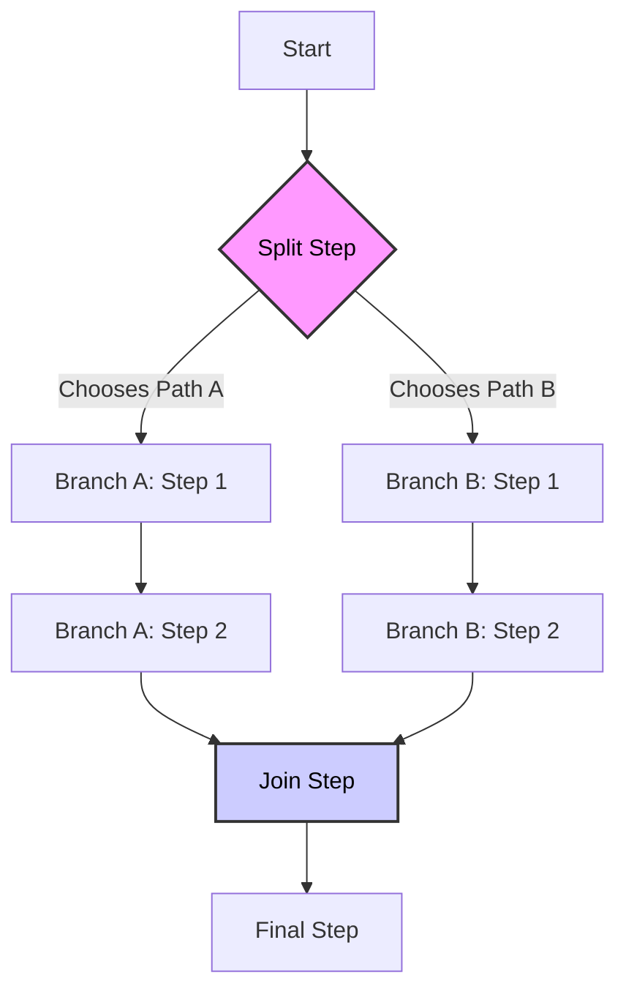
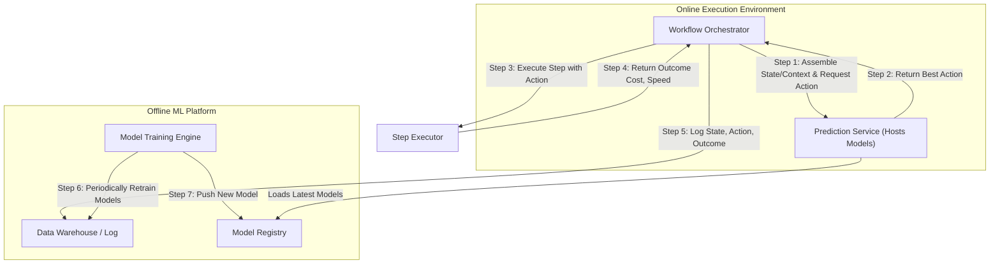

# Optimizing Hiring Workflows with Reinforcement Learning

**Disclaimer:**

This document describes a hypothetical setup to illustrate how Reinforcement Learning can be applied to optimize a traditional business workflow. Such a hiring workflow in real world may lack the volume of data required for Reinforcement Learning or other machine learning solutions to be effective.

- [Optimizing Hiring Workflows with Machine Learning](#optimizing-hiring-workflows-with-machine-learning)
  - [The Problem](#the-problem)
  - [Abstraction as a Workflow DAG](#abstraction-as-a-workflow-dag)
    - [Branching](#branching)
  - [Solution 1: Contextual Multi-Armed Bandits (Local Optimization)](#solution-1-contextual-multi-armed-bandits-local-optimization)
    - [Framing the Problem](#framing-the-problem)
    - [Solution using Contexual MAB](#solution-using-contexual-mab)
    - [The CMAB Predictive Model](#the-cmab-predictive-model)
      - [Model Implementation](#model-implementation)
      - [Model Input and Output](#model-input-and-output)
  - [Solution 2: Q-Learning (Global Optimization)](#solution-2-q-learning-global-optimization)
    - [Framing the Problem](#framing-the-problem-1)
    - [Overview of the Q-Learning Solution](#overview-of-the-q-learning-solution)
    - [Model Implementation: Deep Q-Network](#model-implementation-deep-q-network)
      - [Model Input: The State Vector ($S$)](#model-input-the-state-vector-s)
      - [Model Output: Predicted Q-Values](#model-output-predicted-q-values)
  - [Note on the Cold Start Problem: Bootstrapping the RL](#note-on-the-cold-start-problem-bootstrapping-the-rl)
    - [1. Expert-Defined Policies](#1-expert-defined-policies)
    - [2. Pre-training on Proxy Data](#2-pre-training-on-proxy-data)
    - [3. Aggressive Exploration Initially](#3-aggressive-exploration-initially)
  - [Overview of System Architecture](#overview-of-system-architecture)
    - [Core Components](#core-components)
    - [The Execution Flow for a Single Step in a workflow](#the-execution-flow-for-a-single-step-in-a-workflow)

## The Problem

**HiringPro** is a hypothetical SaaS platform designed to automate and manage the entire lifecycle of the hiring process, from candidate outreach, screening, interviews, all the way to making offers. A key challenge for HiringPro is that the "optimal" hiring workflow varies significantly based on the role, industry, and specific business objectives. For instance, hiring for a high-demand software engineering role might prioritize **speed**, while hiring for an executive role might prioritize **thoroughness** (and thus tolerate higher cost and longer timelines).

The core business problem is to create a system that can **automatically learn and configure the most effective hiring workflow** for any given role, dynamically balancing the competing metrics of hiring speed, financial cost, and ultimate success (making a good hire). 

To enable the system to learn effectively, this business objective must be formally modeled into a single, quantifiable objective function. This function serves as the north star for the learning algorithm, combining all three metrics into a unified score that the system aims to optimize. For simplicity, we can model it as an aggregation function of those metrics with parameters specific to a hiring role (such as engineer vs. executive). This system should adapt and improve over time by learning from the outcomes of every real-world hiring process it executes. 

The rest of this document will detail proposed solutions. We will first model the hiring process as a workflow DAG with a configurable topology at execution time. We will then frame the optimization of the business objective using two classic reinforcement learning approaches: Contextual Multi-Armed Bandits and Q-learning. Finally, we will present a high-level system architecture for implementation.

## Abstraction as a Workflow DAG
To tackle this problem systematically, we can model the hiring process as a **Directed Acyclic Graph (DAG)**.

* **Vertices (Nodes):** Each vertex represents a distinct step or phase in the hiring process, such as "Candidate Sourcing," "Technical Screening," or "Background Check."
* **Edges (Arrows):** An edge from step A to step B (A → B) signifies a dependency, meaning step A must be completed before step B can begin.
* **Configurations (Actions):** Each vertex has a set of configurable parameters that define how the step is executed. These are the "levers" our learning system can pull. For example, a "Background Check" step could have parameters for choosing between different vendors (`Vendor A`, `Vendor B`).
* **Topological Variations as Parameters:** Crucially, even changes to the workflow's structure can be modeled as parameters. For instance, a "Technical Screening" step could have a parameter like `{"screening_count": [1, 2]}`. Similarly, a "Reference Check" step could have a parameter like `{"enabled": [true, false]}` to decide whether to perform that step at all.
* **State:** The state of the workflow at any given time is the collection of all information gathered and outcomes observed from the previously completed steps.

### Branching
The **DAG represents the static blueprint of all *possible* dependencies**, while the workflow engine at runtime may only need to follow one **active branch** out of multiple alternatives. This structural pattern is modeled as "Split" and "Join"

**Split: starts the branches**

The first step of each potential branch has a direct dependency on the completion of the router step. The outcome of the router step decides which one is the active branch for the current execution.

  * `Router_Step` → `Start_of_Branch_A`
  * `Router_Step` → `Start_of_Branch_B`

**Join: ends the branches**

After the divergent branches are complete, they must reconverge into a `Merge` node before the main workflow continues. The  `Merge_Step` only depends on the completion of the active branch out of all incoming branches.

  * `End_of_Branch_A` → `Merge_Step`
  * `End_of_Branch_B` → `Merge_Step`

Each branch can still be modeled as a regular sub workflow. For example, its internal parallel steps only need to be executed after its step of `Start_of_Branch_A`.

And this `Split_Join` pattern also supports nested branching.



****

**The introduction of both `Topological Variations as Parameters` and `branching` approach allows the system to control the workflow's behavior including its topology condioned on the states of the current execution, while still operating on an underlying **fixed DAG topology**. This avoids the immense complexity of dynamically generating or modifying the graph structure itself.**

****

## Solution 1: Contextual Multi-Armed Bandits (Local Optimization)

We first look at a very simplified version of the problem with the following assumptions:
* No dynamic topological variations and branching.
* The objective only include the metrics of speed and cost.
  
The above simplification results in a simplified objective of optimizing **a weighted sum of cost and speed at each individual step**.  

### Framing the Problem

We treat each configurable step in the DAG as a separate **Multi-Armed Bandit (MAB)** problem.

* **Bandit:** Each configurable step (e.g., "Background Check").
* **Arms:** The different choices available for that step (e.g., `Vendor A`, `Vendor B`).
* **Context:** A set of features describing the specific hiring situation. This includes the role's objective function (e.g., `w_speed=0.8, w_cost=0.2`) and other relevant data like seniority, department, and location.
* **Reward:** A score calculated after a step is completed. Since the goal is to minimize the objective, the reward is its negative value: `Reward = - (w_speed * step_speed + w_cost * step_cost)`. This reward serves as the **label** for offline training.

### Solution using Contexual MAB

The system works in a continuous loop:

1.  **Prediction:** When a workflow reaches a configurable step, it queries the corresponding model with the current context. The model predicts the expected reward for each possible arm (action).
2.  **Action Selection:** Using an **Epsilon-Greedy** strategy, the system usually picks the arm with the highest predicted reward (**exploitation**) but occasionally picks a random arm to gather new data (**exploration**). This is critical for avoiding local optima and addressing the initial data sparsity problem.
3.  **Execution & Logging:** The chosen action is executed, and the resulting `step_speed` and `step_cost` are logged.
4.  **Continuous Learning:** A periodic offline training job uses this newly logged data to retrain and improve the models, which are then deployed to replace the old ones. This creates a self-improving flywheel.

-----

### The CMAB Predictive Model

The engine behind the CMAB solution is a predictive model that learns the relationship between the context of a hiring step and the likely outcome of each possible action.

#### Model Implementation

For each configurable step (e.g., "Background Check," "Technical Screening"), we train a separate machine learning model. Good implementation choices include:

  * **Gradient Boosted Trees (e.g., LightGBM, XGBoost):** These are highly effective for the kind of tabular data this system generates. They are excellent at finding complex patterns and interactions between different features.
  * **Simpler Linear Models (e.g., Logistic/Linear Regression):** These are great starting points, especially for the bootstrap model when data is sparse. They are more stable and less prone to overfitting on small datasets. Note that categorical features will need to be encoded numerically here, such as using one-hot encoding.

The choice of model can evolve as more data is collected.

#### Model Input and Output

The model's function is to take a detailed description of the current situation and predict the outcome for every available option of action.

**Input: The Context Vector**
The model's input is a single feature vector that numerically represents the current situation. This **Context Vector** is created by the workflow orchestrator and combines role characteristics with the role's specific objectives.

  * **Example Scenario:** A workflow reaches the "Background Check" step for a **Senior Backend Engineer** role in the **US-West** region. This role has been configured to prioritize speed over cost.

  * **Input Vector Sent to Model:**

    ```json
    {
      "seniority_level": 5,
      "department_eng": 1,
      "department_sales": 0,
      "geo_us_west": 1,
      "geo_eu": 0,
      "w_speed": 0.8,
      "w_cost": 0.2
    }
    ```

**Output: Predicted Reward Scores**
The model processes the input vector and returns a set of scores, one for each possible action (e.g., each vendor). This score is the model's prediction of the reward that will be achieved by taking that action.

  * **Example Scenario (continued):** The "Background Check" model returns the predicted reward for each available vendor.

  * **Output Scores Received from Model:**

    ```json
    {
      "action_vendor_A": -95.5,
      "action_vendor_B": -112.0,
      "action_vendor_C": -105.3
    }
    ```

Based on this output, the orchestrator identifies **Vendor A** as the optimal choice because its predicted reward (`-95.5`) is the highest (the least negative). This decision is then passed to the exploration/exploitation logic.  

In the above, the model input includes the weights. Alternatively, we can have the model predicts both speed and cost separately and apply the weighted sum after the model outputs.


## Solution 2: Q-Learning (Global Optimization)

In the above framing of MAB for each single step, the reward of the whole workflow execution is simply a sum of those of its fixed set of steps, because:
* The steps and their orders in each execution of an workflow does not depend on any intermediate state of the execution.
* The final reward of the execution does not depend on any intermediate state of the execution.
  
Now let us model the original problem in a more general framework of reinforcement learning, with all 3 business metrics in the objective.
*  `overall_cost` and `overall_speed` are sum of those of actually selected and executed steps of a workflow execution.
*  `good_hire` is the final outcome of the whole workflow execution. For simplicity, we use `decide_to_hire` to represent it, which is usually the outcome of a final step that evaluates all intermediate states of the execution, sometimes combined with participation of human decisions in some workflow steps.


### Framing the Problem

This frames the problem in a full **Reinforcement Learning (RL)** context. The key challenge is **sparse and delayed reward**—we only know how good a workflow was at the very end.

* **State (S):** The current status of the workflow, including the initial context and the history of all actions taken and outcomes observed so far.
* **Action (A):** The specific choice made at a configurable step.
* **Reward (R):** A single score calculated only at the end of the entire workflow. A potential formula is: `Reward = (w_hire * decide_to_hire) - (w_cost * overall_cost) - (w_speed * overall_speed)`. The `w_hire` weight must be large enough to properly represent the business value of a successful hire. *The weights (w_hire, w_cost, w_speed) are defined per role and reflect the unique business priorities for that specific hire. For example, w_hire will be significantly higher for a high-impact executive role.*
* **Policy (π(S)):** The model, or "brain," that learns the optimal action to take in any given state to maximize the final reward.

### Overview of the Q-Learning Solution

Q-learning is a classic RL algorithm well-suited for this problem. The goal is to learn a function, `Q(s, a)`, which predicts the "quality" of taking action `a` in state `s`. In this context, this quality is the **expected total reward of the entire workflow execution** from the current point onward.

This marks two critical differences from the Contextual MAB model:

1.  Instead of a separate model for each step, Q-learning typically uses a **single, unified model** to make decisions throughout the workflow.
2.  The identity of the current step (e.g., "Technical Screening") is no longer used to select which model to call. Instead, it becomes a **feature within the state `s`** that is fed into the unified Q-learning model.

The overall steps of the solution:
1.  **The Q-Table/Function/Model:** Design an algorithm for learning `Q(s, a)`. In a simple case, this can be a lookup table; for complex problems, it's a neural network (a Deep Q-Network, or DQN).
2.  **Learning from Trajectories:** The model is trained on thousands of completed workflows (trajectories). It uses the final reward to solve the **credit assignment problem**, propagating the final outcome backward to assign value to the early actions that led to it. It might learn, for instance, that a costly early screening (low immediate reward) is highly correlated with successful hires (high final reward).
3.  **The Learning Loop:** The process is similar to the CMAB loop. The live model (the policy) is used to make decisions using an **exploit & exploration strategy like Epsilon-Greedy**. Most of the time, the system will **exploit** its knowledge by choosing the action with the highest predicted Q-Value from the model. However, it will occasionally **explore** by choosing a random action to discover new, potentially better strategies. These complete workflows are logged and used to periodically retrain and improve the Q-function, allowing the policy to make increasingly intelligent, long-term decisions.

-----

### Model Implementation: Deep Q-Network

The standard and most effective model for this type of complex Q-learning problem is a **Deep Q-Network (DQN)**. This approach uses a Deep Neural Network (DNN) to approximate the Q-function, which is necessary because the number of possible states is far too large for a simple table. A **DQN** acts as a universal function approximator, capable of learning the non-linear relationships between the state of a hiring process and the expected long-term reward of taking a certain action.

The network is trained on thousands of completed workflow "trajectories" to learn which sequences of actions lead to the best final outcomes.

-----

#### Model Input: The State Vector ($S$)

Unlike the CMAB model, the DQN's input is not just the context of the current step but a representation of the **entire workflow history up to that point**. This **State Vector** is composed of two parts:

1.  **Static Context:** Information that remains constant, such as role details and the role-specific objective weights (`w_hire`, `w_cost`, `w_speed`).
2.  **Dynamic History:** A summary of the actions taken and outcomes observed in all previous steps.

<!-- end list -->

  * **Example Scenario:** The workflow for a Senior Engineer is now at the "On-site Interview" step, having already completed "Sourcing" and "Technical Screen".

  * **Input State Vector Sent to Model:**

    ```json
    {
      "static_context": {
        "role_id": "senior-eng",
        "seniority": 5,
        "w_hire": 10000,
        "w_cost": 1.0,
        "w_speed": 0.5
      },
      "dynamic_history": {
        "sourcing_action": "internal_recruiter",
        "sourcing_cost": 550,
        "sourcing_speed": 120,
        "tech_screen_action": "live_coding_call",
        "tech_screen_cost": 300,
        "tech_screen_speed": 48
      }
    }
    ```

#### Model Output: Predicted Q-Values

The network takes the entire State Vector as input and produces an output score for each possible action available at the *current* step. This score is the **Q-Value**.

The Q-Value represents the model's prediction of the **total cumulative reward** from this point until the end of the workflow, assuming the best actions are taken from here on out.

  * **Example Scenario (continued):** The DQN model for the "On-site Interview" step processes the state vector and returns the predicted Q-Values for the available interview formats.

  * **Output Q-Values Received from Model:**

    ```json
    {
      "action_full_day_panel": 8560.5,
      "action_half_day_sequential": 9120.3,
      "action_remote_panel": 7800.0
    }
    ```

The workflow orchestrator receives these Q-Values and sees that `action_half_day_sequential` has the highest predicted long-term reward. It will therefore select this action to maximize the chance of a successful final outcome.

-----

## Note on the Cold Start Problem: Bootstrapping the RL

Bootstrapping is the process of creating an initial "V0" model to solve the **cold start problem** — the challenge of making decisions when no operational data is available. This is a critical step for both the CMAB and Q-learning solutions. The goal is not to be perfect but to provide a reasonable baseline to kickstart the data collection flywheel.

The primary strategies are as follows:

---
### 1. Expert-Defined Policies
This is the most common and practical approach. The initial model is not a machine learning model at all but rather a coded version of human expertise.

* **For the CMAB Solution:** This involves setting a default "best" action for **each individual step**. For example, a rule might be "For the Background Check step for engineer role, always use Vendor A."
* **For the Q-Learning Solution:** This is more comprehensive, defining a full, end-to-end policy. The rulebook would specify the best action for every step to create a complete, default workflow path.

---
### 2. Pre-training on Proxy Data
If historical data exists in other similar systems or the legacy version of the system, it can be used to pre-train the first model. By analyzing past workflows and their outcomes, the model can start with initial estimates that are far better than a simple guess. This one-time pre-training on "proxy data" can significantly accelerate the learning process for both CMAB and Q-learning.

---
### 3. Aggressive Exploration Initially
This strategy prioritizes data collection over immediate optimization. The system's exploration rate (epsilon) is set to a very high value (e.g., 50%) for the first several interations of learning. This forces the system to try a wide variety of actions, quickly building a diverse dataset from which the first true data-driven model can be trained. This is often used in conjunction with an expert-defined policy to rapidly test the initial assumptions. The practice is similar to gradually reducing epsilon through learning iterations.

----

## Overview of System Architecture

The entire learning system is built around a central **Workflow Orchestrator**. This engine is responsible for managing the state of all active hiring processes and executing them according to the predefined DAG. Its interaction with the machine learning components enables dynamic, intelligent decision-making.

### Core Components

1.  **Workflow Orchestrator:** The brain of the system. For each active hire, it keeps track of the current state, including which step is next. It is responsible for calling the Prediction Service and executing steps.
2.  **Prediction Service:** A dedicated microservice that hosts the trained CMAB or RL models. It exposes a simple API that the Orchestrator calls to get a decision. This decouples the live application logic from the ML model logic.
3.  **Data Warehouse / Log:** A central repository where the `(State, Action, Outcome)` of every single executed step is logged. This becomes the source of truth for all offline model training.
4.  **Offline ML Platform:** The environment where new models are periodically trained on the data from the warehouse. Once a new model is trained and validated, it is pushed to a **Model Registry**, making it available for the Prediction Service to load.



-----

### The Execution Flow for a Single Step in a workflow

The system operates in a continuous loop for each active workflow. Here's how a single configurable step is processed:

1.  **State Assembly:** The Workflow Orchestrator identifies the current step. It assembles the required input for the model—either the **Context Vector** (for CMAB) or the full **State Vector** (for Q-learning), which includes the workflow's history.
2.  **Request Decision:** The Orchestrator sends this vector in an API call to the Prediction Service, asking for the best action.
3.  **Model Inference:** The Prediction Service uses the appropriate trained model to predict the scores for all possible actions and identifies the optimal one.
4.  **Receive Action:** The Prediction Service returns the single best action (e.g., `{"action": "Vendor B"}`) to the Orchestrator.
5.  **Execute Step:** The Orchestrator executes the step using the specified configuration (e.g., it makes an API call to Vendor B).
6.  **Log Outcome:** Once the step is complete and the results (`cost`, `speed`, etc.) are known, the Orchestrator logs the entire event to the Data Warehouse.
7.  **Advance Workflow:** The Orchestrator consults the DAG to determine the next step, and the process repeats.

This architecture creates a robust feedback loop where the system is constantly making decisions online while its intelligence is continuously being upgraded offline.

