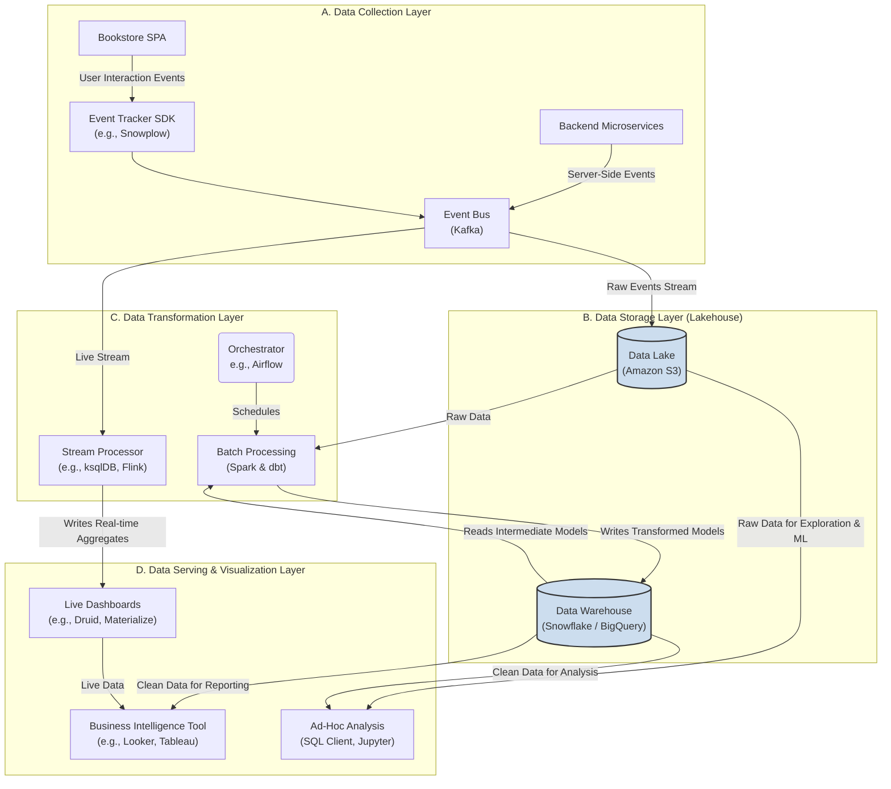
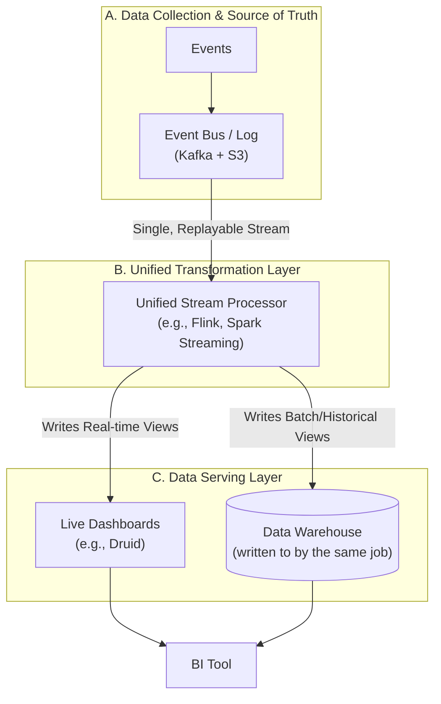
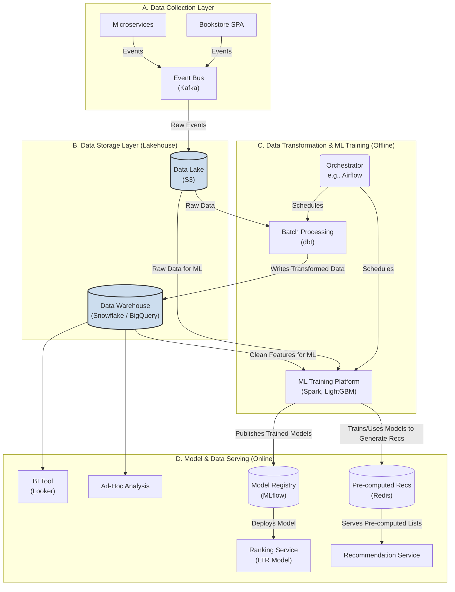

# Analytics of the Bookstore
Moving on to analytics is the critical next step that justifies and informs all the complex systems we've designed. An analytics framework allows us to measure the impact of our work and make data-driven decisions.

- [Analytics of the Bookstore](#analytics-of-the-bookstore)
  - [Analytics Requirements for the Bookstore](#analytics-requirements-for-the-bookstore)
    - [Part 1: Dashboard Reporting (Ongoing KPI Monitoring)](#part-1-dashboard-reporting-ongoing-kpi-monitoring)
      - [**A. Overall Business Health KPIs**](#a-overall-business-health-kpis)
      - [**B. Customer Acquisition \& Behavior Funnel**](#b-customer-acquisition--behavior-funnel)
      - [**C. Product (Book) Performance**](#c-product-book-performance)
      - [**D. Site Feature Engagement \& Effectiveness**](#d-site-feature-engagement--effectiveness)
    - [Part 2: Ad-Hoc Analytics (Deep-Dive Questions)](#part-2-ad-hoc-analytics-deep-dive-questions)
      - [**A. Customer Segmentation \& Behavior Analysis**](#a-customer-segmentation--behavior-analysis)
      - [**B. Pathing and Funnel Analysis**](#b-pathing-and-funnel-analysis)
      - [**C. Product Affinity \& Cross-Sell Analysis (Analyzing Books)**](#c-product-affinity--cross-sell-analysis-analyzing-books)
      - [**D. Feature Impact \& Causal Analysis**](#d-feature-impact--causal-analysis)
  - [High-Level Analytics Architecture](#high-level-analytics-architecture)
    - [Component Breakdown](#component-breakdown)
      - [1. Data Collection Layer](#1-data-collection-layer)
      - [2. Data Storage Layer (The Lakehouse)](#2-data-storage-layer-the-lakehouse)
      - [3. Data Transformation Layer](#3-data-transformation-layer)
      - [4. Data Serving \& Visualization Layer](#4-data-serving--visualization-layer)
  - [Use Case Example: Metrics of Hourly Gross Merchandise Value (GMV)](#use-case-example-metrics-of-hourly-gross-merchandise-value-gmv)
    - [The Data Source: The `OrderPlaced` Event](#the-data-source-the-orderplaced-event)
    - [Path 1: The Streaming Flow (For the "Live" Metric)](#path-1-the-streaming-flow-for-the-live-metric)
    - [Path 2: The Batch Flow (For the "Source of Truth")](#path-2-the-batch-flow-for-the-source-of-truth)
    - [Putting It All Together: The BI Tool (Looker/Tableau)](#putting-it-all-together-the-bi-tool-lookertableau)
  - [Lambda vs. Kappa Architecture](#lambda-vs-kappa-architecture)
    - [The Implications of a Dual-Codebase Architecture](#the-implications-of-a-dual-codebase-architecture)
    - [The Remediation: The Kappa Architecture (Unified Logic)](#the-remediation-the-kappa-architecture-unified-logic)
  - [Fit ML Workloads into the Architecture](#fit-ml-workloads-into-the-architecture)
    - [**Phase 1: Offline Model Training**](#phase-1-offline-model-training)
    - [**Phase 2: Online Model Serving**](#phase-2-online-model-serving)
    - [Updated Architecture Diagram with ML Workloads](#updated-architecture-diagram-with-ml-workloads)

---

## Analytics Requirements for the Bookstore

The overarching goal is to transform raw user interaction data into actionable business insights that help us understand and optimize the customer journey, feature effectiveness, and product performance.

### Part 1: Dashboard Reporting (Ongoing KPI Monitoring)

This category includes the key performance indicators (KPIs) and metrics that should be tracked continuously (daily/weekly) to monitor the overall health and performance of the business. These are typically displayed on dashboards for different teams (e.g., leadership, marketing, product).

#### **A. Overall Business Health KPIs**
These are the top-line metrics that measure the commercial success of the bookstore.
* **Gross Merchandise Value (GMV):** The total value of all books sold before deducting fees. This is the primary measure of growth.
* **Revenue:** GMV after costs and fees.
* **Average Order Value (AOV):** `GMV / Total Number of Orders`. This tells us if customers are buying more or less per transaction.
* **Overall Conversion Rate (CVR):** The percentage of user sessions that result in a purchase. This is the single best measure of the site's overall effectiveness.
* **Customer Lifetime Value (CLV):** The total predicted revenue a single customer will generate over their entire relationship with the store.
* **Customer Acquisition Cost (CAC):** The average cost to acquire a new customer. (Comparing CLV to CAC is fundamental to long-term profitability).

#### **B. Customer Acquisition & Behavior Funnel**
These metrics track how users arrive at the site and navigate towards a purchase.
* **Sessions & Users:** The total volume of traffic, broken down by new vs. returning users.
* **Traffic Sources:** Where are users coming from? (e.g., Organic Search, Paid Ads, Social Media, Direct).
* **Bounce Rate / Engagement Rate:** What percentage of users leave after viewing only one page? Are users interacting with the site?
* **Core Funnel Conversion Rates:** Tracking the drop-off rate at each key step:
    1.  Landed on Site → Viewed a Product Page
    2.  Viewed a Product Page → Added to Cart
    3.  Added to Cart → Started Checkout
    4.  Started Checkout → Completed Purchase

#### **C. Product (Book) Performance**
These metrics focus on the performance of the books in our catalog.
* **Top Selling Books:** Leaderboards by units sold and by GMV.
* **Product View to Add-to-Cart Rate:** For a given book, what percentage of its page views result in an "add to cart"? High rates indicate a compelling product and page.
* **Cart Abandonment Rate:** What percentage of users who create a cart leave without purchasing?
* **Most Viewed Books:** Which books are getting the most attention, even if they aren't the top sellers?

#### **D. Site Feature Engagement & Effectiveness**
This directly addresses your goal of analyzing the impact of site features.
* **Search Usage:** What percentage of sessions involve using the search bar?
* **Search Effectiveness:**
    * **Search Conversion Rate:** The CVR for sessions that used search vs. those that did not.
    * **"No Results" Rate:** The percentage of searches that return zero results (a key user frustration point).
* **Recommendations Engagement:**
    * **Click-Through Rate (CTR) on Recommendation Modules:** When a recommendation module is shown, what percentage of the time do users click on an item in it?
    * **Recommendation-Driven Revenue:** What is the total GMV from purchases where the user clicked on a recommendation during their journey?

### Part 2: Ad-Hoc Analytics (Deep-Dive Questions)

This category includes deeper, more exploratory questions that a data analyst would investigate to uncover strategic insights. These are typically one-off projects rather than daily dashboard metrics.

#### **A. Customer Segmentation & Behavior Analysis**
* "Can we cluster our users into meaningful segments like 'Fantasy Fans,' 'History Buffs,' 'Bargain Hunters,' or 'High-Spenders'? What are the purchasing patterns and CLV of each group?"
* "What are the characteristics and behaviors of our top 10% of customers?"
* "What is the typical time between a user's first visit, first purchase, and second purchase?"

#### **B. Pathing and Funnel Analysis**
* "What are the most common paths (sequence of pages) that high-converting users take versus low-converting users?"
* "When users abandon their cart, what is the most common action they take next? (e.g., start a new search, leave the site)."
* "How does user behavior differ between mobile and desktop users?"

#### **C. Product Affinity & Cross-Sell Analysis (Analyzing Books)**
This directly addresses your goal of finding books with similar effects.
* **Market Basket Analysis:** "What books are most frequently purchased together in the same transaction? This informs our 'Frequently Bought Together' model."
* **"Gateway Book" Analysis:** "Are there specific 'gateway' books that, when purchased first, significantly increase a user's future lifetime value? For example, do users who buy Book 1 of a popular series become more loyal customers?"
* **Sequential Pattern Mining:** "After purchasing Book A, what book (or genre) is a user most likely to purchase in their *next* session?"

#### **D. Feature Impact & Causal Analysis**
This directly addresses your goal of finding important site features.
* "What is the incremental revenue lift from users who interact with our recommendation modules vs. those who don't, controlling for other factors?"
* "How does the conversion rate differ for users who read customer reviews versus those who don't on a product page?"
* "What is the measurable impact on conversion rate from our LTR search model compared to the baseline BM25 search? (Analysis of our A/B test results)."
* "If we run a promotion (e.g., 10% off), what is the actual incremental lift in sales, and did it cannibalize other sales?"

This comprehensive list of metrics and questions provides a solid foundation for what we need to measure. The next step would be to design the technical architecture to collect, store, and process the data needed to answer them.

---

## High-Level Analytics Architecture

This design is based on the principles of the **Modern Data Stack**, which emphasizes a modular, cloud-native, and scalable approach. It separates the collection, storage, transformation, and visualization of data into distinct, best-in-class components. The architecture will support both our batch processing needs (for deep, ad-hoc analysis) and our real-time needs (for live dashboards). 

The architecture also follows a "Lakehouse" paradigm, combining the scalability and low cost of a Data Lake for raw storage with the high performance and ease of use of a Data Warehouse for analysis.



### Component Breakdown

#### 1\. Data Collection Layer

The goal is to capture rich, structured event data from all user touchpoints.

  * **Event Tracker SDK (e.g., Snowplow):** Instead of ad-hoc logging, we'll integrate a dedicated event tracking SDK into our Single Page App (SPA). This allows us to capture detailed behavioral data with a predefined, validated schema (e.g., `page_view`, `product_view`, `add_to_cart`, `search_performed`). This ensures data quality from the start.
  * **Backend Events:** Our microservices (e.g., `Order Service`) will also publish critical business events (`order_placed`, `payment_successful`) to our existing **Event Bus (Kafka)**.
  * **Transport:** All events, whether from the client-side tracker or backend services, are funneled through our central Event Bus.

#### 2\. Data Storage Layer (The Lakehouse)

This layer provides both raw storage and high-performance querying.

  * **Data Lake (e.g., Amazon S3, Google Cloud Storage):** The Event Bus streams all raw event data into the Data Lake. This is our permanent, immutable, low-cost "single source of truth." Storing the raw events allows us to reprocess our entire history if we discover a bug in our logic or want to build a completely new model in the future.
  * **Data Warehouse (e.g., Snowflake, BigQuery, Redshift):** This is the high-performance analytical database that will power our dashboards and ad-hoc queries. It stores the *cleaned, transformed, and aggregated* data from the transformation layer. Modern data warehouses can also directly query data stored in the Data Lake, blurring the lines and creating the "Lakehouse" concept.

#### 3\. Data Transformation Layer

This is where the raw data is turned into valuable, query-able information models.

  * **Batch Processing (Spark & dbt):** This is the workhorse for our deep analytics.
      * **Spark:** Used for heavy-duty, complex transformations that may be difficult in pure SQL. Its primary role here would be **sessionization**—processing the raw event stream from the Data Lake to group events into distinct user sessions.
      * **dbt (data build tool):** This is the core of our transformation logic. Analysts and engineers write simple SQL `SELECT` statements to build a dependency graph of data models. `dbt` transforms the raw data in the warehouse into clean, reliable tables. For example: `raw_events` → `stg_page_views` → `fct_sessions` → `agg_daily_kpis`. This supports version control, testing, and documentation for all our business logic.
  * **Stream Processor (e.g., ksqlDB, Apache Flink):** For real-time needs, a stream processor taps directly into the Kafka event stream. It can perform simple, on-the-fly aggregations (like counting page views per minute) and write them to a low-latency database for live dashboards.
  * **Orchestrator (e.g., Apache Airflow):** This tool manages the entire batch pipeline. It schedules and monitors the jobs, ensuring that the Spark sessionization job runs before the `dbt` models, for example. It's the conductor of the offline data orchestra.

#### 4\. Data Serving & Visualization Layer

This is how business users and analysts interact with the data.

  * **Business Intelligence (BI) Tool (e.g., Looker, Tableau, Power BI):** This is the primary tool for our **Dashboard Reporting** requirements. It connects directly to the Data Warehouse and allows users to build interactive dashboards, visualizations, and reports for all the KPIs we defined (GMV, CVR, Funnel Analysis, etc.).
  * **Ad-Hoc Analysis (SQL Client, Jupyter Notebooks):** For the deep-dive questions, data analysts and data scientists connect directly to the **Data Warehouse** with their preferred tools. They can write complex SQL or use Python with notebooks to conduct customer segmentation, pathing analysis, and investigate the impact of different features.
  * **Live Dashboards (e.g., powered by Apache Druid, Materialize):** The results from the stream processor feed into a specialized real-time database that can power dashboards showing "what's happening right now."

This architecture provides a robust, scalable, and modern foundation to answer every analytical question we outlined, from high-level daily KPIs to deep, exploratory research into user behavior and feature impact.

---

## Use Case Example: Metrics of Hourly Gross Merchandise Value (GMV)

Let's choose a core business metric and trace its journey through both the streaming and batch paths of our analytics architecture, from creation to its final presentation in a dashboard.

**Chosen Metric: Hourly Gross Merchandise Value (GMV)** is a perfect example because business leaders want to see it in near real-time to monitor daily performance, but the finance team needs a 100% accurate, reconciled version for official reporting.

**The Goal:** To create a dashboard in our BI tool that shows a bar chart of GMV for each of the last 24 hours. The bar for the *current hour* should update live, while the bars for all *previous hours* should show the final, accurate numbers.

-----

### The Data Source: The `OrderPlaced` Event

Everything starts when a user successfully checks out. Our `Order Service` publishes an `OrderPlaced` event to the central **Event Bus (Kafka)**. This event is the single source of truth for both our real-time and batch pipelines.

A simplified event looks like this:

```json
{
  "event_id": "evt_abc123",
  "event_timestamp": "2025-10-01T07:32:45.123Z",
  "order_id": "ord_def456",
  "user_id": "usr_ghi789",
  "total_price": 49.98
}
```

### Path 1: The Streaming Flow (For the "Live" Metric)

**Objective:** To provide a fast, continuously updating view of GMV for the current hour. This is optimized for speed over perfect accuracy (e.g., it won't account for an order that is cancelled 5 seconds after being placed).

1.  **Ingestion (Kafka):** The `OrderPlaced` event is already on our Kafka topic.

2.  **Transformation (Stream Processor - ksqlDB/Flink):**

      * A **Stream Processor** subscribes to the `OrderPlaced` Kafka topic.
      * It runs a continuous query that groups events into one-hour "tumbling windows" based on their timestamp.
      * For each window (i.e., the current hour), it continuously calculates the `SUM(total_price)`.
      * Every few seconds, it emits the latest calculated sum.

3.  **Serving (Real-time Database - Druid):**

      * The aggregated results from the Stream Processor are written into a **Druid** table (our "Live Dashboards" store).
      * The table is very simple, containing just two columns: `hour_timestamp` and `gmv_realtime`. The value in this table is constantly being overwritten with the latest sum for the current hour.

**Result:** At any given moment, our Druid database has a very fresh, but potentially provisional, GMV number for the current hour.

### Path 2: The Batch Flow (For the "Source of Truth")

**Objective:** To produce the 100% accurate, final, reconciled GMV for all completed hours. This process runs on a schedule and can handle complex logic like deduplication, fraud checks, and returns.

1.  **Storage (Data Lake - S3):** A tool like Kafka Connect continuously archives every raw event from the `OrderPlaced` topic into our **Data Lake (S3)**, partitioned by date and hour. This is our permanent, immutable record.

2.  **Orchestration (Airflow):** A few minutes after each hour completes (e.g., at 8:05 AM for the 7:00-8:00 AM window), our **Orchestrator** triggers the hourly batch job.

3.  **Transformation (Batch Processing - dbt/Spark):**

      * The **dbt** or **Spark** job reads the raw `OrderPlaced` files for that specific hour from the Data Lake.
      * It performs its logic:
          * **Cleansing & Deduplication:** Filters out any test orders or duplicate events.
          * **Reconciliation:** It might join the order data with data from a `Returns` table to calculate the *net* GMV, ensuring accuracy.
          * **Aggregation:** It calculates the final, authoritative `SUM(net_price)` and `COUNT(order_id)`.
      * The job then writes this final, aggregated result into our **Data Warehouse (Snowflake/BigQuery)**.

**Result:** At around 8:05 AM, our Data Warehouse now contains the permanent, source-of-truth GMV for the 7 AM hour.

### Putting It All Together: The BI Tool (Looker/Tableau)

This is where the two paths converge to create a seamless experience for the business user.

1.  **The Data Model:** In the BI tool, an analyst defines a "virtual" data model that intelligently queries both sources.

2.  **The Unified Query:** When a user loads the "Hourly GMV" dashboard, the BI tool executes a query that is effectively a `UNION` of two separate queries:

      * **Query 1 (for historical data):**
        `SELECT hour_timestamp, gmv_final FROM data_warehouse.hourly_kpis WHERE hour_timestamp < 'current_hour_start'`
      * **Query 2 (for real-time data):**
        `SELECT hour_timestamp, gmv_realtime FROM druid.live_kpis WHERE hour_timestamp = 'current_hour_start'`

3.  **The Presentation:**

      * The BI tool combines the results and displays a single, unified bar chart.
      * The 23 bars for past hours are populated with the static, 100% accurate data from the **Data Warehouse**.
      * The 1 bar for the current, ongoing hour is populated with the live data from **Druid**.
      * The dashboard can be set to auto-refresh every minute. When it does, only the query to Druid is re-run, and the user sees the bar for the current hour grow in near real-time, providing an immediate pulse on the business.

This hybrid architecture provides the best of both worlds: rock-solid, accurate historical reporting combined with a live, dynamic view of current performance.

---

## Lambda vs. Kappa Architecture

You might have noticed that we have two independent implementations of computing the metrics between streaming and batch. This is a very sharp observation. And this is the single biggest criticism and operational challenge of the classic Lambda Architecture. 

Let's break down the implications of this dual-codebase problem and then discuss the modern remediation.

### The Implications of a Dual-Codebase Architecture

Maintaining two separate systems (one for batch, one for streaming) to calculate the same business logic has several serious negative consequences:

1.  **Increased Development and Maintenance Overhead:** This is the most immediate pain point. Every time a business rule changes, you have to implement, test, and deploy that change in two different systems.

      * **Different Frameworks:** The logic for the batch job (e.g., written in Python/Spark or SQL/dbt) is completely separate from the logic for the stream processor (e.g., written in Java/Flink or ksqlDB).
      * **Double the Work:** This doubles the engineering effort, doubles the number of places bugs can hide, and significantly slows down your ability to introduce new metrics or modify existing ones.

2.  **Risk of Data Inconsistency ("Lambda Skew"):** This is the most dangerous implication. It's extremely difficult to guarantee that two different codebases, running on different engines with different nuances, will produce the *exact same result* for the same input data.

      * **Example:** Your streaming job might handle late-arriving events slightly differently than your batch job. Your batch job might have access to a `Returns` table that the streaming job doesn't.
      * **The Result:** This leads to a situation where the real-time dashboard and the batch-reconciled reports never quite match. At 7:59 AM, your live dashboard might show **$10,500** in GMV for the hour, but at 8:05 AM, the final batch report for that same hour comes in at **$10,480**. This discrepancy, known as "lambda skew," forces analysts to constantly explain why the numbers don't match, which erodes business users' trust in the data.

3.  **Complex Reconciliation:** The final `UNION` step in the BI tool is designed to create a seamless hand-off from the real-time data to the batch data. When the numbers don't perfectly align, this hand-off can be jarring, showing a "jump" in the data when the hour ticks over.

-----

### The Remediation: The Kappa Architecture (Unified Logic)

The modern solution to this problem is to move towards a **Kappa Architecture**. The core principle of the Kappa Architecture is to **handle everything—both real-time and batch processing—in a single, unified stream processing pipeline.**

**How It Works:**

1.  **Single Source of Truth:** The immutable event log (our **Kafka** topic, backed by the **Data Lake**) is treated as the one and only source of truth.
2.  **Single Codebase:** You write your business logic (e.g., calculating Hourly GMV) **once** in a single, powerful stream processing framework like **Apache Flink** or **Spark Structured Streaming**.
3.  **Unified Processing:**
      * For **real-time analytics**, this single job runs continuously, processing events as they arrive and feeding the results to our "Live Dashboards" (Druid).
      * For **batch analytics or historical reprocessing**, you don't use a separate system. You simply run the *exact same* stream processing job, but you instruct it to start reading from an earlier point in the event log (e.g., "reprocess all events from the beginning of time" or "reprocess the last 30 days").

**What Makes This Possible?**

This architecture has become feasible due to advancements in key technologies:

  * **Scalable, Replayable Logs:** Systems like Kafka and AWS Kinesis can store massive amounts of data for long durations and allow for extremely high-throughput "re-reading" of the entire log history.
  * **Advanced Stream Processing Engines:** Modern Flink and Spark have become incredibly sophisticated. They have robust state management and are fast enough to reprocess terabytes of historical data from the event log in a reasonable amount of time, effectively replacing the need for a separate batch engine like traditional MapReduce.

**The Result:**

By adopting a Kappa-style architecture, you get a much simpler system:



This approach completely eliminates the problem of dual codebases and lambda skew. You write your logic once, and you trust that the result will be consistent whether it was calculated in real-time or through a historical reprocessing run.

---

## Fit ML Workloads into the Architecture

The analytics architecture we've designed is the essential foundation for all machine learning workloads as well. ML models are not separate from this system; they are premier "customers" of the high-quality data it produces.

Let's illustrate how our two main ML workloads—**Learning to Rank (LTR)** for search and the **Recommendation Models**—fit into this architecture. We can think of the ML lifecycle in two distinct phases: **Offline Model Training** and **Online Model Serving**.

### **Phase 1: Offline Model Training**

This is where our models are built and learn from historical data. This phase plugs directly into the **Batch Processing** layer of our analytics platform.

1.  **Sourcing Training Data:**

      * **Primary Source (Data Lake):** The ML training jobs need the most granular data possible. They will primarily read from the raw, unprocessed event logs in the **Data Lake (S3)**. This provides the rich interaction data (clicks, views, purchases, search queries) needed to create our relevance labels and interaction features.
      * **Secondary Source (Data Warehouse):** The training jobs also read from the clean, structured tables in the **Data Warehouse (Snowflake/BigQuery)** to enrich the training data. For example, they join the raw clickstream data with dimension tables like `dim_books` to get features like `publication_year` and `average_rating`, or `dim_users` to get user-specific features.

2.  **The ML Training Environment:**

      * The training process itself is a sophisticated batch job, orchestrated by **Airflow** just like our other data transformations.
      * This job runs in a dedicated **Machine Learning Platform** (e.g., Databricks, Amazon SageMaker, or a custom environment with Spark MLlib and Python libraries like LightGBM/XGBoost).
      * It executes the "Feature Generation & Labeling" and "Model Training & Evaluation" steps we defined for our LTR and Recommendation models.

3.  **Storing the Model:**

      * The output of a successful training run is a versioned **model artifact** (the trained model file).
      * This artifact is stored in a **Model Registry** (like MLflow or a cloud-native registry). The registry acts as a central repository for all our production-ready models.

### **Phase 2: Online Model Serving**

This is how the trained models are used to make predictions for live users. The method of serving depends on the use case.

1.  **Serving the LTR Model (Real-time Inference):**

      * Our LTR model is used for real-time re-ranking.
      * The model artifact from the Model Registry is deployed to our **`Ranking Service`** microservice.
      * As we designed, when a user searches, the `Search Service` gets initial candidates from Elasticsearch and then makes a synchronous API call to the `Ranking Service`. The `Ranking Service` uses the deployed model to score the candidates and returns the final, re-ranked list.

2.  **Serving the Recommendation Models (Offline Pre-computation):**

      * Our primary recommendation strategy relies on pre-calculating recommendations to ensure low latency.
      * In this case, the trained recommendation models (Collaborative Filtering, etc.) are used within the **Offline Processing Pipeline** itself.
      * After training, another Spark job uses the model to generate the top N recommendations for every user and every item.
      * These final, pre-computed recommendation lists are then loaded into the **Pre-computed Recommendations Store (Redis)**.
      * The live **`Recommendation Service`** then simply fetches these cached lists, rather than performing real-time model inference.

### Updated Architecture Diagram with ML Workloads

This updated diagram shows how the Machine Learning components are integrated into the overall data platform.



In this integrated view:

  * The **Analytics Architecture** is responsible for producing high-quality data assets (in the Lake and Warehouse).
  * The **Machine Learning Platform** consumes these data assets to produce trained model assets.
  * The **Online Microservices** (`Ranking Service`, `Recommendation Service`) consume these model assets to deliver intelligent features to the end-user.