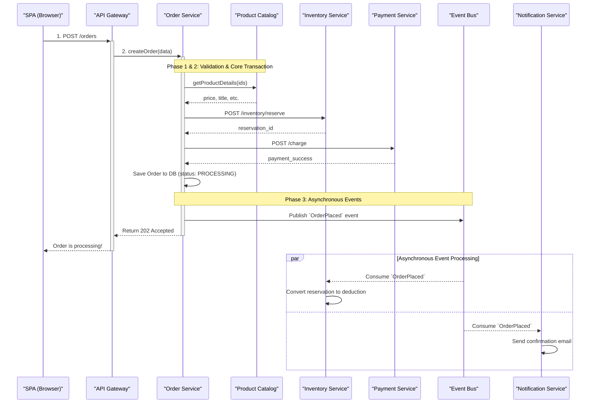

# Design of Checkout

- [Design of Checkout](#design-of-checkout)
  - [Checkout Requirements and User Flow](#checkout-requirements-and-user-flow)
  - [Alternative Design: Distributed Transactions](#alternative-design-distributed-transactions)
    - [How Two-Phase Commit (2PC) Would Work](#how-two-phase-commit-2pc-would-work)
    - [Major Drawbacks of Distributed Transactions](#major-drawbacks-of-distributed-transactions)
  - [SAGA-based Design](#saga-based-design)
    - [1. The Successful Checkout Flow ("Happy Path")](#1-the-successful-checkout-flow-happy-path)
    - [2. Failure Scenario: Out of Stock](#2-failure-scenario-out-of-stock)
    - [3. Failure Scenario: Payment Failed](#3-failure-scenario-payment-failed)
  - [Failure Recovery of SAGA](#failure-recovery-of-saga)
    - [1. The Core Principle: Persist the Saga State](#1-the-core-principle-persist-the-saga-state)
    - [2. The Resilient Workflow with State Persistence](#2-the-resilient-workflow-with-state-persistence)
    - [3. The Recovery Mechanism](#3-the-recovery-mechanism)
    - [4. The Critical Prerequisite: Idempotency](#4-the-critical-prerequisite-idempotency)
  - [The Asynchronous Checkout Flow](#the-asynchronous-checkout-flow)
    - [Sequence Diagram: Asynchronous Checkout](#sequence-diagram-asynchronous-checkout)

## Checkout Requirements and User Flow

The checkout process is designed to be a secure, seamless, and user-friendly multi-step flow that guides the user from their shopping cart to a confirmed purchase.

From the user's perspective, the flow consists of the following steps:

1.  **Initiation:** The user begins the checkout process from their shopping cart page.

2.  **Shipping Information:**
    * The system pre-fills the user's default shipping address if they are a returning, logged-in customer. They can easily select another saved address or add a new one.
    * This step is skipped if the cart contains only digital items (ebooks).

3.  **Payment Information:**
    * For returning customers, the system displays their saved payment methods (e.g., "Visa ending in 4242") for quick selection.
    * Users can add a new payment method via a secure, embedded form provided by the payment gateway.
    * An option to "Save this card for future purchases" is provided to first-time buyers or when adding a new card.

4.  **Order Review & Confirmation:**
    * Before finalizing the purchase, the user is presented with a complete summary of their order, including items, quantities, shipping details, taxes, and the total cost.
    * A final, explicit action (e.g., clicking a "Place Your Order" button) is required to authorize the payment and complete the transaction.

5.  **Post-Purchase Experience:**
    * Upon successful payment, the user is redirected to an order confirmation page that displays their order number and a thank you message.
        * This page should show the live progress of the order, which may initially appear as "In Process" and then update in real-time to "Confirmed" as the backend transaction completes. This fulfills the general requirement for users to be able to track their order status.
    * An order confirmation email is sent immediately to the user's registered address.
    * For any purchased ebooks, access is granted instantly in the user's "Digital Library" section of their account.
---
The following technical design focuses specifically on the backend processes that are triggered after the user clicks the final "Place Your Order" button (Step 4 in the user flow above). This is the most critical and complex part of the transaction, requiring coordination across multiple services.

To better motivate the choice of the Saga pattern, it's an excellent idea to first describe the seemingly simpler alternative of using distributed transactions and explain its significant drawbacks. This provides strong justification for the subsequent, more resilient design.

-----

## Alternative Design: Distributed Transactions

Before detailing the chosen architecture, it's useful to consider a more traditional approach to maintaining consistency across services: a **distributed transaction**. The goal of a distributed transaction is to ensure that an operation spanning multiple services is **atomic**—either all services successfully complete their part, or all of them roll back, leaving no service in a partially completed state.

The classic algorithm for this is the **Two-Phase Commit (2PC)** protocol.

### How Two-Phase Commit (2PC) Would Work

In this model, the `Order Service` would act as a **Transaction Coordinator**. The `Inventory Service` and `Payment Service` would be **Participants**.

1.  **Phase 1: Prepare (Voting Phase):** The `Order Service` sends a "prepare" message to all participants. Each service must then lock the resources it needs (the `Inventory Service` locks the book's stock record) and confirm that it *can* perform the action. It then votes "Yes" or "No".
2.  **Phase 2: Commit (or Abort) Phase:**
      * If **all** participants vote "Yes," the `Order Service` sends a "commit" message to all of them. They make their changes permanent and release their locks.
      * If **any** participant votes "No" or fails to respond, the `Order Service` sends an "abort" message to everyone, and they all roll back their changes and release their locks.

### Major Drawbacks of Distributed Transactions

While this guarantees consistency, the 2PC protocol is generally considered an **anti-pattern** in modern microservices architectures for several critical reasons:

1.  **Tight Coupling:** All participating services are tightly coupled to the coordinator and to the transaction protocol itself. The `Inventory Service` and `Payment Service` can no longer have simple, independent APIs; they must expose a complex `prepare/commit/abort` interface. A change in the transaction logic could require changes in all services.

2.  **Synchronous Blocking (Reduced Performance & Availability):** Those are the most significant drawbacks. During Phase 1, each service must hold a **database lock** on its resources and wait for the final command from the coordinator. The `Inventory Service` would have to lock the stock for a book, preventing anyone else from buying it. If the `Payment Service` is slow, that lock is held for a long time. The prolonged locking duration causes higher lock contentions and thus decreases the throughput of transaction processing, especially for checking out some popular items. Further, if the `Order Service` (the coordinator) crashes after the "prepare" phase, these locks could be held **indefinitely**, bringing parts of the system to a halt until a manual or external intervention occurs. This drastically reduces the availability and performance of the entire system.

3.  **Poor Scalability:** Due to the synchronous and chatty nature of the protocol, distributed transactions do not scale well under high load. The overhead of coordinating, waiting, and locking becomes a major bottleneck.

4.  **Limited Technology Support:** Many modern, scalable technologies—including NoSQL databases, messaging queues like Kafka, and the HTTP protocol itself—do not have native support for 2PC. Implementing it correctly and reliably on top of these tools is extremely complex and fraught with risk.

Due to these significant drawbacks—especially the tight coupling and reduced availability—the distributed transaction model is generally avoided for high-throughput, scalable web applications. This leads us to a more resilient, albeit logically more complex, pattern that prioritizes service autonomy and availability.

-----

## SAGA-based Design

This process is best described as an **Orchestration-based Saga**. The `Order Service` acts as the central orchestrator, coordinating a sequence of transactions across multiple services. If any step fails, the orchestrator is responsible for triggering compensating transactions to undo the previous steps, ensuring data consistency.

The flow can be broken into three phases: synchronous validation, the core transaction with compensation logic, and asynchronous post-commit events.

---
**Phase 1: Synchronous Validation**
This phase happens before any money is moved or inventory is reserved. The orchestrator (`Order Service`) gathers and validates all necessary information.

1.  **Client Request:** The user clicks "Place Order" in the Single Page App (SPA). The SPA sends a single request to the API Gateway containing the cart details (list of `book_format_id` and quantity), the chosen `address_id`, and the secure `payment_token` from Stripe.
2.  **Data Aggregation:** The `Order Service` receives the request. To prevent relying on potentially stale client-side data, it makes synchronous, internal API calls to:
      * The **Product Catalog Service** to fetch the current, authoritative price and title for each `book_format_id`.
      * The **User Service** to validate that the `address_id` belongs to the authenticated user.

**Phase 2: The Core Transaction (Orchestration with Compensation)**
This is the critical, all-or-nothing part of the process.

3.  **Reserve Inventory:** The `Order Service` calls the **Inventory Service** to temporarily reserve the stock. This is a crucial step that places a short-lived hold on the items, preventing another customer from buying them while payment is being processed. If inventory is insufficient, the entire process fails here and the user is notified.
4.  **Process Payment:** The `Order Service` then calls the **Payment Service** to execute the charge using the payment token.
5.  **Failure Handling (Compensation):**
      * If payment fails, the `Order Service` immediately performs a **compensating transaction**: it calls the **Inventory Service** again to **release the reservation**, putting the items back into the available stock pool. The user is then notified that their payment failed.
6.  **Persist Order:** If payment succeeds, the `Order Service` immediately saves the order to its own database with a status of `PROCESSING`. It "snapshots" the critical data, like `price_at_purchase` and `title_at_purchase`, into the `OrderItems` table for historical accuracy.

**Phase 3: Asynchronous Post-Transaction Events**
Once the core transaction is successful, the user gets an immediate response. The remaining work happens reliably in the background, decoupled via the Event Bus.

7.  **Publish Event:** The `Order Service` publishes a detailed `OrderPlaced` event to the Event Bus (e.g., Kafka).
8.  **Return Fast Response:** The `Order Service` immediately returns a `202 Accepted` response to the user's browser, which can now display a "Success\! Your order is being processed" message.
9.  **Event Consumption:** Multiple services are listening for the `OrderPlaced` event:
      * The **Inventory Service** consumes the event, converts the temporary inventory reservation into a permanent stock deduction, and creates a record in its `InventoryLedger`.
      * The **Notification Service** consumes the event and sends the order confirmation email to the user.
      * Other services, like a shipping or analytics service, could also consume this same event without any changes to the other services.

-----

### 1\. The Successful Checkout Flow ("Happy Path")

This diagram shows the sequence of events when everything works correctly, without the complexity of the failure paths.

-----

### 2\. Failure Scenario: Out of Stock

This diagram shows what happens when the `Inventory Service` reports that a book is not available.

-----

### 3\. Failure Scenario: Payment Failed

This diagram shows the critical flow where inventory is successfully reserved, but payment fails. It explicitly shows the **compensating transaction** to release the inventory.

-----

## Failure Recovery of SAGA

In a microservices saga, the orchestrator itself can fail, leaving the entire workflow in a dangerously inconsistent state.

The solution is to design the `Order Service` not as a transient process, but as a durable **State Machine Orchestrator** that persists the state of every saga at every step.

Here’s how a partially executed saga workflow can continue or revert when the `Order Service` instance fails.

### 1\. The Core Principle: Persist the Saga State

The orchestrator cannot keep the state of a saga in memory. The current step of every in-progress order checkout must be persisted to the `Order Service`'s own database. We can model the saga as a state machine, and the `Order` entity itself can hold the current `saga_state`.

A typical checkout saga state machine would look like this:

### 2\. The Resilient Workflow with State Persistence

Here is how the checkout flow works with this model. Every state change is a write to the `Orders` table in the `Order Service` database *before* the next action is taken.

1.  **Request Received:** An API call to create an order arrives. The `Order Service` immediately creates an `Order` record in its database with `saga_state = 'STARTING'`.
2.  **Reserve Inventory:**
      * **Before:** It updates the order record: `saga_state = 'RESERVING_INVENTORY'`.
      * **Action:** It calls the `Inventory Service`'s `reserve` endpoint.
      * **After Success:** It updates the order record: `saga_state = 'INVENTORY_RESERVED'`.
      * ***CRASH SCENARIO A:*** If the service crashes now, the state is safely persisted as `INVENTORY_RESERVED`.
3.  **Process Payment:**
      * **Before:** It updates the order record: `saga_state = 'PROCESSING_PAYMENT'`.
      * **Action:** It calls the `Payment Service`'s `charge` endpoint.
      * **After Success:** It updates the order record: `saga_state = 'PAYMENT_SUCCESSFUL'`. The saga is now considered complete. The `OrderPlaced` event is published.
      * ***CRASH SCENARIO B:*** If the service crashes now, the state is persisted as `PROCESSING_PAYMENT`. This is the most ambiguous state.
4.  **Handle Payment Failure:**
      * If payment fails, it updates the order record: `saga_state = 'PAYMENT_FAILED'`. This explicitly signals that the saga failed and needs to be rolled back.
      * ***CRASH SCENARIO C:*** If the service crashes now, the state is `PAYMENT_FAILED`.

### 3\. The Recovery Mechanism

When an `Order Service` instance crashes and a new one starts (or if a periodic recovery job runs), it can recover incomplete sagas.

  * **Recovery Process:** The service queries its own database for orders that are in an intermediate state (e.g., `RESERVING_INVENTORY`, `PROCESSING_PAYMENT`, `PAYMENT_FAILED`) and haven't been updated for a certain period (e.g., \> 1 minute) to avoid interfering with live transactions.

  * **Decision Logic (for each recovered order):**

      * **If `saga_state` is `INVENTORY_RESERVED` (Crash A):** The orchestrator knows inventory was reserved but payment was never attempted. It can safely retry the "Process Payment" step from where it left off.
      * **If `saga_state` is `PROCESSING_PAYMENT` (Crash B):** This is the most critical case. The orchestrator doesn't know if the payment actually succeeded before the crash. It must **query for status**. It calls a status-check endpoint on the `Payment Service` (e.g., `GET /payment/status/{orderId}`).
          * If payment did succeed, the orchestrator updates the state to `PAYMENT_SUCCESSFUL` and continues.
          * If payment failed or never happened, it updates the state to `PAYMENT_FAILED` and begins compensation.
      * **If `saga_state` is `PAYMENT_FAILED` (Crash C):** The orchestrator knows it must roll back. It begins the **compensation path**:
        1.  Updates state to `RELEASING_INVENTORY`.
        2.  Calls the `Inventory Service`'s `release` endpoint.
        3.  On success, updates state to `ROLLED_BACK`. The saga is now fully reverted.

### 4\. The Critical Prerequisite: Idempotency

For this recovery to work safely, all service calls that change state must be **idempotent**. This means calling the same operation multiple times has the same effect as calling it once.

  * **Example:** The `reserve` call to the `Inventory Service` should accept a unique transaction or order ID. The first time it's called, it reserves the stock. If the recovering `Order Service` calls it again for the same ID, the `Inventory Service` should simply return the original success response without reserving the stock a second time.

Executing the entire multi-step saga synchronously while the user waits is a significant performance anti-pattern. It would result in long, unpredictable wait times and a poor user experience, especially if any of the downstream services (Inventory, Payment) are slow to respond.

To solve this, we will refine the flow to be almost entirely **asynchronous from the user's perspective**. The goal is to give the user an immediate response and handle the complex, long-running orchestration in the background.

## The Asynchronous Checkout Flow

We will split the `Order Service`'s responsibility into two parts: a lightweight **API Layer** that handles the initial request, and a backend **Worker Process** that executes the saga.

**1. The "Thin" Synchronous Interaction (What the User Experiences)**

This part is designed to be extremely fast.

1.  **Accept Request:** The user submits their checkout request. The `Order Service API` receives it.
2.  **Basic Validation:** It performs only the most basic, instantaneous validation (e.g., "Is the request format valid?").
3.  **Persist Intent:** It immediately creates an `Order` record in its database with an initial status like `ACCEPTED`. This captures the user's intent to purchase and locks in an `orderId`.
4.  **Trigger Asynchronous Flow:** It publishes a lightweight event, such as `CheckoutInitiated`, to the event bus.
5.  **Return Immediately:** It instantly returns a `202 Accepted` response to the user's browser, along with the `orderId`.

The user's total wait time is just the time it takes for a single database write and publishing one event—mere milliseconds. The UI can now display a message like, "Thank you\! We've received your order and are processing it. We'll confirm it shortly."

**2. The "Thick" Asynchronous Saga (What Happens in the Background)**

A separate, non-user-facing part of the `Order Service` (a "Worker") is listening for the `CheckoutInitiated` event.

1.  **Consume Event:** The `Order Service Worker` picks up the event.
2.  **Execute Saga:** It is this worker that now executes the entire multi-step saga we previously designed:
      * It updates the order state to `RESERVING_INVENTORY`.
      * It calls the `Inventory Service` to reserve stock.
      * It updates the state to `PROCESSING_PAYMENT`.
      * It calls the `Payment Service` to process the charge.
      * It handles all failure cases and compensating transactions.
3.  **Publish Final Outcome:** Once the saga is complete (either succeeded or failed), the worker updates the order's status in the database to `CONFIRMED` or `FAILED` and publishes a definitive final event, such as `OrderConfirmed` or `OrderFailed`.

**3. Communicating the Final Result to the User**

Since the user is no longer waiting for the final result, we need a mechanism to update them when the background process finishes.

  * **Real-time UI Update (Recommended):** After receiving the initial `202 Accepted` response, the browser can use the `orderId` to subscribe to updates. A **WebSocket** connection or **Server-Sent Events (SSE)** are perfect for this. When the `Notification Service` consumes the final `OrderConfirmed` or `OrderFailed` event, it can push a message directly to the browser, allowing the UI to update in real-time from "Processing..." to "Order Confirmed\!".
  * **Polling (Simpler Alternative):** The browser could poll an endpoint like `GET /orders/{orderId}/status` every few seconds to check for a status change. This is easier to implement but less efficient.
  * **Email (The Fallback):** Regardless of the UI update, the `Notification Service` consuming the final event will also send the confirmation or failure email, ensuring the user is always notified.

### Sequence Diagram: Asynchronous Checkout

This diagram illustrates the clear separation between the user's fast, synchronous interaction and the longer-running, asynchronous backend saga.

This refined architecture ensures a fast, responsive user interface while maintaining the transactional integrity of the backend saga.