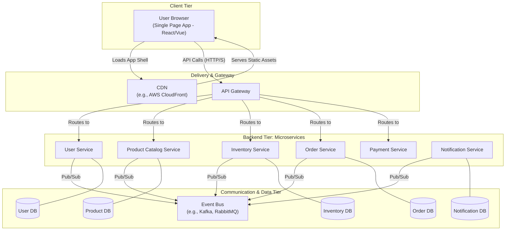
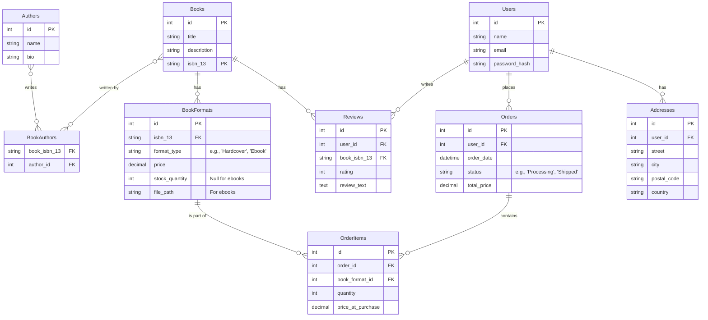
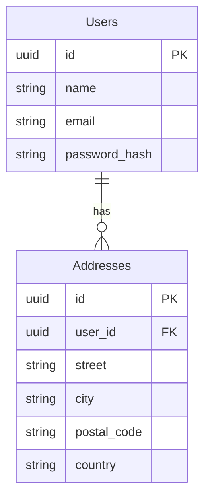
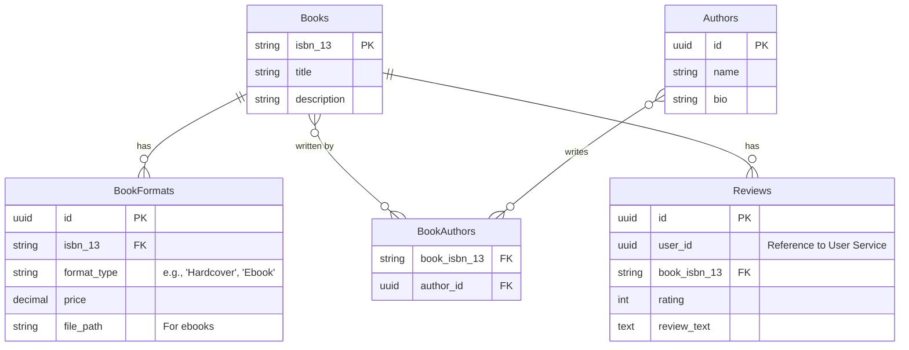
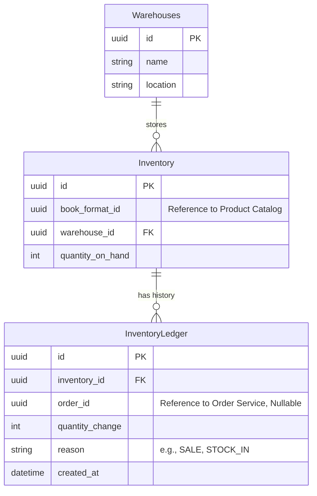
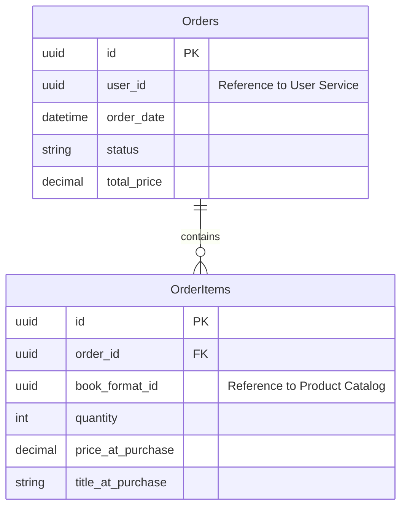

# Project: "Bibliotheca" - A Online Bookstore
- [Project: "Bibliotheca" - A Online Bookstore](#project-bibliotheca---a-online-bookstore)
  - [Core Concept](#core-concept)
  - [High-Level Requirements](#high-level-requirements)
    - [**1. Functional Requirements (What the system must do)**](#1-functional-requirements-what-the-system-must-do)
    - [**2. Non-Functional Requirements (How the system should operate)**](#2-non-functional-requirements-how-the-system-should-operate)
  - [Key Use Cases](#key-use-cases)
  - [High-Level System Design: "Bibliotheca" Bookstore (Modern Architecture)](#high-level-system-design-bibliotheca-bookstore-modern-architecture)
    - [1. System Architecture](#1-system-architecture)
    - [2. Component Breakdown](#2-component-breakdown)
    - [3. Data Management and Communication Patterns](#3-data-management-and-communication-patterns)
    - [4. Data \& Storage](#4-data--storage)
    - [5. Third-Party Services](#5-third-party-services)
    - [6. Technology Stack Recommendation](#6-technology-stack-recommendation)
    - [7. Data Model (Entity-Relationship Diagram)](#7-data-model-entity-relationship-diagram)
  - [The Deconstructed Data Model for Microservices](#the-deconstructed-data-model-for-microservices)
    - [1. User Service](#1-user-service)
    - [2. Product Catalog Service](#2-product-catalog-service)
    - [3. Inventory Service Database](#3-inventory-service-database)
    - [4. Order Service](#4-order-service)
    - [5. Handling Data and Relationships Across Services](#5-handling-data-and-relationships-across-services)

## Core Concept

To create a simple, user-friendly, and reliable online bookstore focused exclusively on selling physical books and ebooks. The design philosophy should mirror the early days of Amazon: functionality and content over complex UI, with a strong emphasis on search, product details, and a straightforward purchasing process.

## High-Level Requirements

The platform will be divided into two main areas: the **Customer-Facing Storefront** and the **Administrative Back-End**.

### **1. Functional Requirements (What the system must do)**

**A. Customer-Facing Storefront:**

* **User Accounts:**
    * Users must be able to register for a new account using an email and password.
    * Registered users must be able to log in and log out.
    * Users must be able to manage a profile, including shipping addresses and saved payment information (securely).
    * Users must be able to view their complete order history (for both physical and digital items).
* **Product Catalog & Discovery:**
    * The system must display books organized into categories/genres (e.g., Fiction, Sci-Fi, History, Technology).
    * A prominent search bar must allow users to search for books by title, author, or ISBN.
    * Search and category pages will display a list of books with key information: cover image, title, author, and price.
    * Each book will have a dedicated detail page showing comprehensive information: cover image, title, author, description/synopsis, publisher, publication date, page count, ISBN, and user reviews/ratings.
* **Product Variants (Physical vs. Ebook):**
    * On the product detail page, users must be able to clearly see and select the available formats (e.g., Hardcover, Paperback, Ebook).
    * The price must update dynamically based on the selected format.
* **Shopping Cart:**
    * Users must be able to add a book (in a specific format) to their shopping cart.
    * Users must be able to view their cart, change the quantity of physical books, and remove items.
* **Checkout & Payment:**
    * A secure, multi-step checkout process:
        1.  Enter/confirm shipping address (only for orders with physical books).
        2.  Enter/confirm payment information (e.g., credit card).
        3.  Review the final order and confirm the purchase.
    * The system must send an order confirmation email to the user upon successful purchase.
* **Order Fulfillment:**
    * **For Physical Books:** The user's order status should be trackable in their account (e.g., "Processing," "Shipped").
    * **For Ebooks:** Upon purchase, the ebook must be immediately available for download in a user's personal "Digital Library" section of their account. The system should support common ebook formats like EPUB and PDF.
* **Reviews & Ratings:**
    * Logged-in users who have purchased a book should be able to leave a star rating (1-5) and a written review on the book's detail page.

**B. Administrative Back-End:**

* **Product Management:**
    * Admins must be able to add, edit, and delete book entries in the catalog.
    * Admins must be able to upload cover images and ebook files (e.g., EPUB, PDF).
    * Admins must be able to manage inventory levels for physical books (e.g., stock count).
* **Order Management:**
    * Admins must be able to view and manage all customer orders.
    * Admins must be able to update the status of physical book orders (e.g., from "Processing" to "Shipped" and add tracking information).
* **Category Management:**
    * Admins must be able to create, edit, and delete book categories/genres.
* **User Management:**
    * Admins must be able to view a list of registered users and handle basic support requests.

### **2. Non-Functional Requirements (How the system should operate)**

* **Security:** All communication must be encrypted via HTTPS. User passwords must be hashed and salted. Payment processing must adhere to PCI compliance standards (likely by integrating a third-party payment gateway like Stripe or Braintree).
* **Performance:** The website should load quickly, even with a large catalog of books. Target page load times should be under 3 seconds.
* **Usability:** The interface must be clean, intuitive, and easy to navigate for non-technical users.
* **Reliability:** The platform should have high availability (e.g., 99.9% uptime).
* **Scalability:** The architecture should be able to handle a growing number of users, products, and orders over time.

---

## Key Use Cases

Here are the primary user stories and workflows the system must support.

| Use Case ID | Name                               | Actor(s) | Description                                                                                                                                              |
| :---------- | :--------------------------------- | :------- | :------------------------------------------------------------------------------------------------------------------------------------------------------- |
| UC-01       | User Finds and Buys a Physical Book | Customer | A customer searches for a book, adds the hardcover version to their cart, proceeds to checkout, enters their shipping and payment info, and places the order. |
| UC-02       | User Finds and Buys an Ebook       | Customer | A customer browses a category, finds a book, selects the ebook format, purchases it, and immediately finds it available for download in their account.     |
| UC-03       | User Manages Their Account         | Customer | A customer logs in, views their past orders (both physical and digital), and updates their primary shipping address.                                         |
| UC-04       | User Reviews a Book                | Customer | After reading a purchased book, the customer returns to the site, navigates to the book's page, and submits a 4-star rating with a written review.         |
| UC-05       | Admin Adds a New Book              | Admin    | An admin logs into the back-end, creates a new book entry, fills in the title, author, and description, and uploads a cover image and two formats: a paperback with a stock count of 50 and an EPUB file for the ebook version. |
| UC-06       | Admin Fulfills an Order            | Admin    | An admin views a new order for a physical book, packages the book for shipping, and updates the order status to "Shipped" with a tracking number.          |

---

Here is the complete high-level architecture design for the "Bibliotheca" bookstore, updated to reflect a modern, microservices-based, and event-driven approach with a client-side rendered frontend.

-----

## High-Level System Design: "Bibliotheca" Bookstore (Modern Architecture)

This document outlines a modern, cloud-native architecture for the web-based bookstore. The design is based on a collection of independent microservices that communicate asynchronously via an event bus, and it serves a client-side rendered Single Page Application (SPA) to the user. This approach prioritizes scalability, resilience, and development agility.

### 1\. System Architecture

The architecture decouples the client, the backend services, and the data layer. The core principles are:

  * **Client-Side Rendering:** A Single Page Application (SPA) runs in the user's browser, providing a fluid and responsive user experience.
  * **API Gateway:** A single, managed entry point for all client requests, which are then routed to the appropriate backend services.
  * **Microservices:** The backend is decomposed into small, independent services, each owning a specific business capability (e.g., product catalog, inventory, orders).
  * **Event-Driven Communication:** Services are loosely coupled and communicate asynchronously by publishing and subscribing to events on a central event bus, making the system more resilient.

<!-- end list -->

### 2\. Component Breakdown

**A. Client-Side (Single Page Application)**
The entire frontend is a standalone application built with a modern framework (e.g., React, Vue, Angular).

  * **Hosting:** The application is hosted as static assets (HTML, JS, CSS) on a Content Delivery Network (CDN), ensuring fast load times for users globally.
  * **Functionality:** It provides a rich, interactive user interface that communicates with the backend via API calls to the API Gateway. It manages UI state and renders updates without needing to reload the page.

**B. API Gateway**
This acts as a "front door" for all backend services.

  * **Responsibilities:**
      * **Routing:** Directs client requests to the correct internal microservice.
      * **Authentication:** Verifies user credentials (e.g., JWT tokens) before allowing access to services.
      * **Security:** Provides rate limiting, request validation, and protection against common threats.
      * **API Composition (BFF Pattern):** Can aggregate responses from multiple services to simplify client-side logic.

**C. Backend Microservices**
Each service is an independent application with its own database and a clearly defined business purpose.

  * **User Service:** The authority for all things related to users. Manages registration, profiles, authentication, and security credentials.
  * **Product Catalog Service:** Owns the complete book catalog, including titles, authors, descriptions, formats, pricing, and user reviews.
  * **Inventory Service:** Manages the stock levels of all physical books across one or more warehouses. It exposes an API for checking and reserving stock and listens for sales events to update quantities.
  * **Order Service:** Orchestrates the complex checkout workflow. It coordinates with the Inventory, Payment, and other services to create and manage orders.
  * **Payment Service:** A specialized, highly secure service that integrates with third-party payment gateways like Stripe. This isolates sensitive PCI DSS compliance scope.
  * **Notification Service:** A centralized service for sending all user communications (emails, push notifications). It listens to events from other services (e.g., `UserRegistered`, `OrderShipped`) to trigger notifications.

**D. Event Bus**
A message broker (e.g., Apache Kafka, RabbitMQ) that enables asynchronous communication between services. When a service performs a significant action, it publishes an event. Other interested services subscribe to these events and react accordingly, without the publishing service needing to know about them.

### 3\. Data Management and Communication Patterns

This architecture fundamentally changes how data is managed and how components interact.

**A. Database-per-Service**
This is a core principle of microservices. Each service is the sole owner of its own data and database. No other service is allowed to access another service's database directly. This ensures loose coupling and allows each service to choose the database technology best suited to its needs (e.g., PostgreSQL for orders, Elasticsearch for product search).

**B. Communication Patterns**

  * **Synchronous Communication (via API Gateway):** Used for client-initiated requests that require an immediate response. The SPA calls the API Gateway, which in turn makes a direct request to the appropriate service. This is used for actions like fetching book details or viewing an order status.
  * **Asynchronous Communication (via Event Bus):** Used for service-to-service communication that does not require an immediate response. This is the preferred method for decoupling services.
      * **Example:** When an order is successfully created by the Order Service, it publishes an `OrderCreated` event. The Inventory Service consumes this event to decrement stock, and the Notification Service consumes it to send a confirmation email. Both happen in the background without making the user wait.

This event-driven approach builds a resilient system. If the Notification Service is temporarily down, for example, `OrderCreated` events will queue up and be processed when it comes back online, without impacting the checkout process itself.

### 4\. Data & Storage

  * **Relational Database (e.g., PostgreSQL):** The primary source of truth. It stores structured, transactional data. See the data model below.
  * **Object Storage (e.g., Amazon S3, Google Cloud Storage):** Used for storing large binary files that don't fit well in a relational database:
      * Ebook files (EPUB, PDF, etc.).
      * Book cover images.
  * **Cache (e.g., Redis):** An in-memory data store used to improve performance by:
      * Storing user sessions.
      * Caching frequently accessed data, like the homepage or popular book details, to reduce database load.

### 5\. Third-Party Services

  * **Payment Gateway (e.g., Stripe):** To securely process credit card payments. This offloads the significant burden of PCI compliance from our application.
  * **Email Service (e.g., SendGrid):** For reliably sending transactional emails like order confirmations, password resets, and shipping notifications.

### 6\. Technology Stack Recommendation

This architecture allows for polyglot (multi-language and multi-technology) development.

  * **Frontend:** **React** or **Vue.js** (Hosted on a CDN like AWS CloudFront).
  * **Microservices:** Containerized with **Docker** and orchestrated with **Kubernetes (K8s)**.
      * **Languages:** Choose the best tool for the job. **Go** or **Node.js** for I/O-heavy services (API Gateway, Notification Service). **Python (FastAPI)** or **Java (Spring Boot)** for complex business logic (Order Service).
  * **API Gateway:** **Amazon API Gateway**, **Kong**, or **Apigee**.
  * **Event Bus:** **Apache Kafka** (for high-throughput, persistent event streams) or **RabbitMQ** (for flexible routing).
  * **Databases (Polyglot Persistence):**
      * **PostgreSQL:** For transactional services like Users, Orders, and Inventory.
      * **Elasticsearch** or **MongoDB:** For the Product Catalog Service to enable rich search and flexible data structures.
      * **Redis:** For caching and session management.
  * **Infrastructure:** Deployed on a major cloud provider (**AWS**, **GCP**, or **Azure**) using their managed Kubernetes, database, and messaging services.

### 7\. Data Model (Entity-Relationship Diagram)

This diagram shows the core tables in our database and how they relate to each other.

-----

## The Deconstructed Data Model for Microservices

The core principle of microservices is **loose coupling and high cohesion**. A key part of achieving this is the **Database-per-Service** pattern. Each microservice must own and control its own data and its own database. A shared database creates tight coupling, where a schema change in one service can break another, defeating the purpose of the architecture.

Therefore, we will break apart the original entity-relationship diagram (ERD) and assign ownership of each entity to the most logical service.

-----

### 1\. User Service

This service owns the core user identity and related information.

  * **Owned Entities:** `Users`, `Addresses`
  * **Description:** It is the single source of truth for who a user is. Other services will refer to a user simply by their `user_id`.

<!-- end list -->

*Note: Using a `UUID` for primary keys is a common best practice in distributed systems.*

-----

### 2\. Product Catalog Service

This service owns all descriptive information about the books for sale.

  * **Owned Entities:** `Books`, `BookFormats` (without inventory), `Authors`, `BookAuthors`, `Reviews`.
  * **Description:** It manages the entire catalog. When a new book is added or a review is submitted, this is the service that handles it. The `Reviews` table contains a `user_id` reference, but it's not a hard foreign key; it's just data.

<!-- end list -->

-----

### 3\. Inventory Service Database

This service owns the data about how many physical books are available and where they are located.

  * **Owned Entities:** `Warehouses`, `Inventory`, `InventoryLedger`
  * **Description:** It is the single source of truth for stock levels. It holds a reference to a `book_format_id` from the Product Catalog service.

<!-- end list -->

-----

### 4\. Order Service

This service owns all data related to customer orders.

  * **Owned Entities:** `Orders`, `OrderItems`
  * **Description:** This service needs information from other services (like user name and book title) but it does not own that data. It manages this through data replication and snapshotting.

<!-- end list -->

### 5\. Handling Data and Relationships Across Services

With the data split, we need new strategies to handle relationships that were previously enforced by foreign keys.

1.  **ID References Instead of Foreign Keys:** As shown in the diagrams, a service stores the ID of an entity owned by another service (e.g., `Order.user_id`). The application logic is now responsible for ensuring these IDs are valid.

2.  **Data Duplication via Events (for Resilience):** For data that is needed for business logic but doesn't change often, services can subscribe to events and keep their own local copy.

      * **Example:** The Order Service might need to validate that a `book_format_id` is valid and get its current price. Instead of calling the Product Catalog service every time (which creates tight coupling), it can subscribe to `ProductCreated` and `PriceUpdated` events and maintain its own lightweight table of valid, purchasable products.

3.  **Data Snapshotting at Transaction Time (for Accuracy):** For data related to a specific transaction, it's crucial to "snapshot" it.

      * **Example:** In the `OrderItems` table, we don't just store the `book_format_id`. We also store the `price_at_purchase` and `title_at_purchase`. This is critical because the book's price or title might change in the Product Catalog service later, but the order record must forever reflect the data as it was at the moment of the sale.

-----
