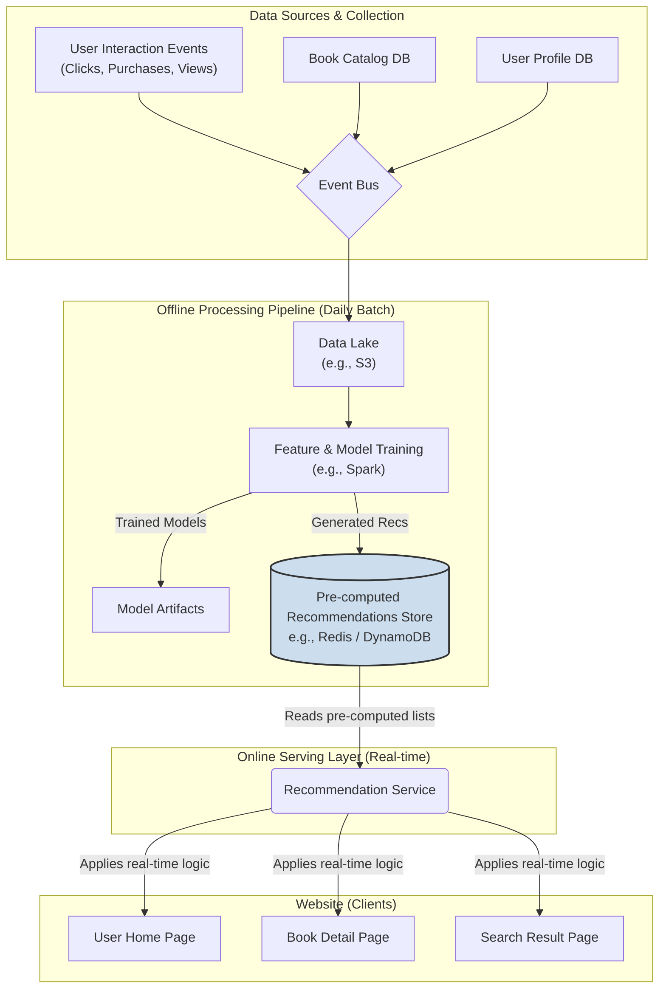
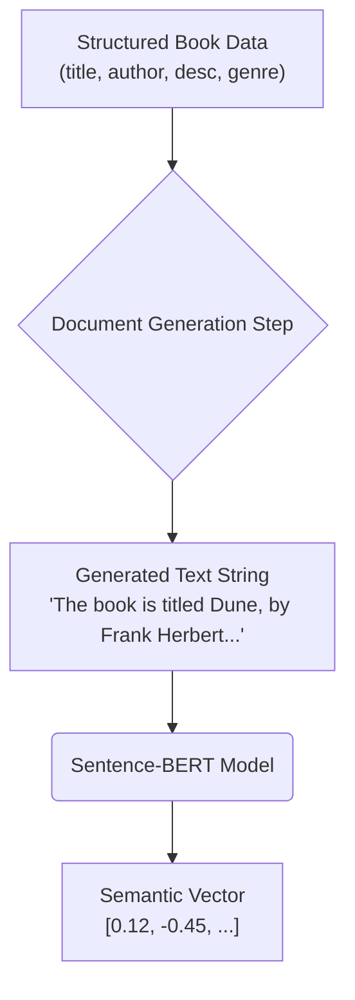

# Recommendations of Books
Product recommendations can significantly enhance user experience and drive business goals. We will start with a comprehensive set of requirements for the book recommendation system, then a high level architecture of the design, before we drive into various technical details.

- [Recommendations of Books](#recommendations-of-books)
  - [Requirements](#requirements)
      - [1. Business \& User Goals](#1-business--user-goals)
      - [2. Functional Requirements](#2-functional-requirements)
      - [3. Non-Functional Requirements](#3-non-functional-requirements)
  - [Architectural Design](#architectural-design)
    - [Architectural Philosophy](#architectural-philosophy)
    - [System Architecture Diagram](#system-architecture-diagram)
    - [Component Breakdown](#component-breakdown)
    - [How This Design Meets the Requirements](#how-this-design-meets-the-requirements)
  - [Deep Dive: Collaborative Filtering (CF)](#deep-dive-collaborative-filtering-cf)
    - [1. The Core Idea: "Wisdom of the Crowd"](#1-the-core-idea-wisdom-of-the-crowd)
    - [2. Classic Approaches to Collaborative Filtering](#2-classic-approaches-to-collaborative-filtering)
    - [3. The Modern Approach: Matrix Factorization (Model-Based CF)](#3-the-modern-approach-matrix-factorization-model-based-cf)
    - [4. Implementation in Our Architecture](#4-implementation-in-our-architecture)
  - [Deep Dive: Content-Based Filtering](#deep-dive-content-based-filtering)
    - [1. The Core Idea: "If You Liked That, You'll Like This"](#1-the-core-idea-if-you-liked-that-youll-like-this)
    - [2. How It Works: The Three Key Steps](#2-how-it-works-the-three-key-steps)
    - [3. The Modern Approach: Using Text Embeddings](#3-the-modern-approach-using-text-embeddings)
    - [4. How Book Profile is Processed](#4-how-book-profile-is-processed)
      - [1. The Traditional Approach: TF-IDF (A Flattened "Bag of Words")](#1-the-traditional-approach-tf-idf-a-flattened-bag-of-words)
      - [2. The Modern Approach: Text Embeddings (Preserving Meaning and Context)](#2-the-modern-approach-text-embeddings-preserving-meaning-and-context)
      - [Summary: TF-IDF vs. Embeddings](#summary-tf-idf-vs-embeddings)
    - [5. Implementation in Our Architecture](#5-implementation-in-our-architecture)
    - [6. Pros and Cons of Content-Based Filtering](#6-pros-and-cons-of-content-based-filtering)
  - [Deep Dive: Co-purchase Model](#deep-dive-co-purchase-model)
    - [The Relationship: General vs. Specific](#the-relationship-general-vs-specific)
    - [How a Co-purchase Model is Typically Built](#how-a-co-purchase-model-is-typically-built)
    - [Implementation in Our Architecture](#implementation-in-our-architecture)
  - [Appendix 1. Models for Embedding Contents](#appendix-1-models-for-embedding-contents)
    - [Clarifying the Training Goal](#clarifying-the-training-goal)
    - [How are these Models Trained? (The Core Idea: Contrastive Learning)](#how-are-these-models-trained-the-core-idea-contrastive-learning)
    - [The Big Question: Train from Scratch vs. Fine-tune vs. Use Off-the-Shelf](#the-big-question-train-from-scratch-vs-fine-tune-vs-use-off-the-shelf)
      - [Option 1: Use a Pre-trained, Off-the-Shelf Model (Highly Recommended)](#option-1-use-a-pre-trained-off-the-shelf-model-highly-recommended)
      - [Option 2: Fine-Tuning a Pre-trained Model (The Advanced Step)](#option-2-fine-tuning-a-pre-trained-model-the-advanced-step)
      - [Option 3: Training an Embedding Model from Scratch](#option-3-training-an-embedding-model-from-scratch)
    - [Recommended Strategy](#recommended-strategy)
  - [Appendix 2. Embedding Structured Contents](#appendix-2-embedding-structured-contents)
    - [How the Transformation Works](#how-the-transformation-works)
    - [Why This Works](#why-this-works)
    - [What about Non-Textual Data?](#what-about-non-textual-data)
    - [The Overall Flow](#the-overall-flow)

## Requirements

This document outlines the goals and requirements for a system that provides personalized and non-personalized book recommendations across the bookstore website.

#### 1. Business & User Goals

* **Business Goals:**
    * **Increase Sales:** Drive revenue through effective cross-selling ("Frequently Bought Together") and up-selling.
    * **Improve Engagement:** Increase user session duration and the number of pages viewed per session by surfacing relevant content.
    * **Boost Discoverability:** Increase the visibility and sales of "long-tail" items (less-popular books that are highly relevant to niche audiences).
    * **Enhance Customer Retention:** Create a personalized, "sticky" experience that makes users feel understood and encourages them to return.

* **User Goals:**
    * **Personalized Discovery:** To easily find new and interesting books tailored to their specific tastes.
    * **Reduced Effort:** To receive relevant suggestions that save them time browsing and searching.
    * **Contextual Relevance:** To see recommendations that make sense in the context of what they are currently doing (e.g., viewing a specific book or searching for a topic).

#### 2. Functional Requirements

**2.1 General System-Wide Requirements**

* **Personalization:** For logged-in users with a history, recommendations should be personalized based on their past purchases, viewed products, ratings, and search queries.
* **Cold-Start Handling:** The system must provide sensible, non-personalized recommendations for new or anonymous users who have no interaction history.
* **Exclusion Logic:** The system must not recommend books that a user has already purchased or has explicitly given a very low rating to (e.g., 1 star).
* **Diversity and Serendipity:** Recommendations should not be overly narrow. The system should introduce a degree of diversity (e.g., related but distinct genres) and serendipity (unexpected but pleasant discoveries) to avoid creating a "filter bubble".
* **Transparency:** Where feasible, the system should provide a simple, user-facing explanation for a recommendation (e.g., "Because you liked 'Dune'", "Trending in Science Fiction").

**2.2 Placement-Specific Requirements**

The type and logic of recommendations will differ depending on where they are displayed on the site.

* **On the User's Home Page:**
    * **Goal:** Broad, personalized discovery to engage the user at the start of their session.
    * **Modules Required:**
        * **"Recommended for You":** A highly personalized list based on the user's entire interaction history.
        * **"New Releases For You":** New books from authors or genres the user has previously shown interest in.
        * **"Because You Read [Book Title]":** A module that picks a prominent book from the user's history and recommends similar items.
        * **For New/Anonymous Users:** These personalized modules will be replaced by non-personalized ones like **"Current Bestsellers,"** **"Trending Books,"** and **"Award Winners."**

* **On a Book's Detail Page (Product Page):**
    * **Goal:** Contextual cross-selling related to the book being viewed.
    * **Modules Required:**
        * **"Customers Who Bought This Also Bought":** Item-to-item recommendations based on co-purchase patterns (e.g., people who bought Book A also frequently bought Book B).
        * **"More by This Author":** A simple module listing other works by the same author.
        * **"You Might Also Like in [Genre]":** Other popular books from the same primary genre as the book being viewed.

* **On the Search Results Page:**
    * **Goal:** To augment search results and assist users who perform broad or unsuccessful searches.
    * **Modules Required:**
        * **"Related to Your Search":** For searches with few keyword matches, this module can show semantically similar books (e.g., a search for "Mars colonization" could recommend "The Martian").
        * **Sponsored Results:** A clearly marked section for promoted books that are relevant to the user's search query.

* **In the Shopping Cart / Checkout Page:**
    * **Goal:** To encourage last-minute, relevant impulse purchases.
    * **Modules Required:**
        * **"Don't Forget These...":** Recommendations based on the specific combination of items currently in the user's cart (e.g., "Customers who bought 'Dune' and 'Hyperion' also bought 'Foundation'").

#### 3. Non-Functional Requirements

* **Performance (Latency):** Recommendations must be generated and displayed quickly to not slow down page load times. The target latency for retrieving recommendations should be **under 200ms**.
* **Scalability:** The recommendation system must scale to handle a large and growing catalog of books, millions of users, and billions of interaction events.
* **Freshness:**
    * **Model Freshness:** The underlying recommendation models must be retrained regularly (e.g., daily) to incorporate the latest user behavior and catalog changes.
    * **Real-time Adaptability:** Recommendations should be able to react to a user's actions within their current session, if possible.
* **Data Privacy:** All user data collected for personalization must be handled securely, with user consent, and in accordance with all relevant privacy regulations.
---

## Architectural Design

Based on the detailed requirements we've established, here is a high-level architectural design for the book recommendation system.

### Architectural Philosophy

The design is based on a **hybrid approach**, combining multiple recommendation strategies to serve the right suggestion in the right context. It follows a standard, scalable pattern that separates heavyweight offline computation from lightweight online serving. This ensures that recommendations are both highly relevant and can be served with very low latency.

The core of this architecture is to:

1.  **Pre-compute offline:** Perform computationally expensive tasks like model training and generating user-specific recommendations in a daily batch process.
2.  **Serve online:** Store these pre-computed results in a fast-access database, allowing a real-time service to retrieve and refine them instantly when a user visits a page.

### System Architecture Diagram

This diagram shows the main components and the flow of data from raw user interactions to the final recommendations displayed on the website.



### Component Breakdown

**1. Data Collection Pipeline**

  * This is our existing event-driven infrastructure. User interaction events (clicks, views, adds-to-cart, purchases), along with any changes to the book catalog or user profiles, are streamed via the **Event Bus** into a **Data Lake** (like Amazon S3) for durable storage.

**2. Offline Computation Pipeline (Batch Layer)**

  * This is the heavyweight data science part of the system that runs on a schedule (e.g., every 24 hours).
  * **Feature & Model Training (e.g., using Apache Spark):**
      * This job reads all the raw data from the Data Lake.
      * It trains multiple recommendation models:
          * **Collaborative Filtering Model:** An algorithm like ALS (Alternating Least Squares) is trained on user-item interaction data to find users with similar tastes.
          * **Content-Based Model:** Uses our existing text embeddings to find books that are textually similar to what a user has read.
          * **Co-purchase Model:** Analyzes transaction data to find items that are frequently bought together.
      * It then uses these models to **pre-generate recommendations** for every user and every book.
  * **Pre-computed Recommendations Store (e.g., Redis):**
      * This is a very fast key-value database that stores the results from the offline pipeline. It acts as a cache for our recommendations.
      * It would store data like:
          * **User-to-Item (U2I) Recs:** `key: user_123`, `value: [book_A, book_B, book_C, ...]` (for "Recommended for You").
          * **Item-to-Item (I2I) Recs:** `key: book_X`, `value: [book_Y, book_Z, ...]` (for "Customers who bought this also bought").
          * **Global Recs:** `key: global_bestsellers`, `value: [book_D, book_E, ...]` (for new/anonymous users).

**3. Recommendation Service (Online Serving Layer)**

  * This is a new, lightweight microservice that is the single point of contact for any part of the website that needs to display recommendations.
  * **Its job is to:**
    1.  Receive a request from a client, e.g., `GET /recommendations?user_id=123&context=homepage`.
    2.  **Fetch Candidates:** Quickly retrieve a pre-computed list of candidate book IDs from the Redis store. For example, it might get the top 200 recommendations for `user_123`.
    3.  **Apply Real-time Filtering & Business Logic:**
          * **Exclusion:** Filter out any books the user has already purchased.
          * **Diversity:** Ensure the final list isn't just from a single author or genre.
          * **Business Rules:** May strategically boost sponsored or newly released items.
          * **Session-Awareness:** Can re-rank the candidates based on what the user has clicked on in their *current* session for a more dynamic experience.
    4.  **Return the Final List:** Return a polished and finalized list of book recommendations (e.g., the top 10) to be displayed.

### How This Design Meets the Requirements

  * **Personalization on Home Page ("Recommended for You"):** The `Recommendation Service` fetches the pre-computed U2I list for the user from Redis, filters it, and serves it. This is very fast.
  * **Contextual Recs on Product Page ("Customers who..."):** The `Recommendation Service` fetches the pre-computed I2I list for the current book from Redis.
  * **Cold-Start Problem:** If a `user_id` is not found in Redis, the service has fallback logic to fetch the `global_bestsellers` list instead.
  * **Performance:** The online service is extremely fast because all the heavy computation is already done. Its job is simply to fetch a cached list and apply quick filtering logic.
  * **Freshness:** The recommendations are updated every 24 hours when the offline pipeline runs, ensuring they incorporate the latest user behavior and catalog additions.

This architecture provides a scalable and performant foundation for a rich and effective book recommendation system.

---

## Deep Dive: Collaborative Filtering (CF)

This section covers the core concept of Collaborative Filtering, the different approaches, and how the modern, scalable version would be implemented within the bookstore's architecture.

---

### 1. The Core Idea: "Wisdom of the Crowd"

Collaborative Filtering is the cornerstone of most recommendation systems. Its core idea is simple and powerful:

> It automates word-of-mouth. It works by collecting preferences (ratings, purchases, clicks) from many users ("collaboration") and uses that data to find similarities to recommend items ("filtering").

The fundamental assumption is: **"If two people agreed on which books were good in the past, they are likely to agree on other books in the future."** It doesn't need to know anything about the books themselves (no genre, no description); it relies purely on user behavior.

### 2. Classic Approaches to Collaborative Filtering

There are two classic "neighborhood" methods for CF:

**A. User-Based Collaborative Filtering**

* **Concept:** Find users who are similar to me and recommend books that they liked but I haven't read yet. It's about finding your "taste twin".
* **Process:**
    1.  Represent user preferences in a large matrix where rows are users, columns are books, and the cells contain ratings or purchase indicators.
    2.  To find recommendations for a user (say, Alice), calculate a similarity score (e.g., using Cosine Similarity) between Alice and every other user.
    3.  Identify the top 'k' most similar users (her "neighborhood").
    4.  Recommend books that this neighborhood of users loved but Alice has not yet purchased.
* **Limitation:** This is difficult to scale. Finding the most similar users in a system with millions of people is computationally expensive and slow for real-time recommendations.

**B. Item-Based Collaborative Filtering**

* **Concept:** Instead of finding similar users, find similar *books*. If I liked Book A, recommend books that are most similar to Book A.
* **Process:**
    1.  Using the same user-item matrix, calculate a similarity score between every pair of books. Two books are considered similar if they were liked by the same group of users. For example, many people who bought "Dune" also bought "Foundation," so these two books would have a high similarity score.
    2.  This creates a massive **item-to-item similarity matrix**, which can be pre-computed offline.
    3.  To get recommendations for Alice, look at her purchase history. For each book she bought, find the most similar books from the pre-computed matrix and recommend those.
* **Advantage:** This is much more scalable and is the basis for Amazon's famous "Customers who bought this also bought..." feature. The similarities between books change much less frequently than a user's neighborhood.

### 3. The Modern Approach: Matrix Factorization (Model-Based CF)

While the classic approaches are intuitive, the state-of-the-art method for CF is **Matrix Factorization**. This is a model-based approach that uncovers the hidden (latent) factors that connect users and items. This is what we would implement in our offline pipeline.

* **Concept:** We assume that both users' tastes and books' attributes can be described by a set of shared, underlying factors (e.g., preference for "epic sci-fi," affinity for "dystopian themes," interest in "complex political plots," etc.). The model's job is to *learn* these factors automatically from the data.

* **How it Works:**
    1.  We start with our massive, sparse user-item interaction matrix (`R`).
    2.  The goal of matrix factorization is to find two smaller, dense matrices—a **User-Factor Matrix (U)** and an **Item-Factor Matrix (V)**—whose product approximates the original matrix (`R ≈ U x Vᵀ`).
    3.  **User-Factor Matrix (U):** Each row is a user, and each column is a latent factor. The row for Alice becomes a vector like `[0.9, 0.1, 0.8, ...]`, representing her taste profile across these learned factors.
    4.  **Item-Factor Matrix (V):** Each row is a book, described by the *same* latent factors. The row for "Dune" might be `[0.95, 0.05, 0.85, ...]`, representing its characteristics.
    5.  **Making Predictions:** To predict how much Alice would like "Dune", we simply calculate the **dot product** of her user vector and the "Dune" item vector. If both have high values for the same factors, the dot product will be high, indicating a strong recommendation.

* **Training Algorithm (ALS):** The process of finding the optimal User and Item factor matrices is done through training. The most common and scalable algorithm for this is **Alternating Least Squares (ALS)**. It's an iterative algorithm that alternates between fixing the User matrix and solving for the best Item matrix, then fixing the Item matrix and solving for the best User matrix, until the approximation error is minimized.

### 4. Implementation in Our Architecture

This entire process is perfectly suited for our offline batch pipeline.

* **Where:** The training happens in our **"Offline Processing Pipeline,"** using an engine like **Apache Spark**, which has a highly optimized, distributed implementation of the **ALS** algorithm in its MLlib library.
* **Input:** The Spark job reads the millions of user interaction events (purchases, clicks, explicit ratings) from our **Data Lake (S3)**.
* **Process:** The ALS algorithm runs and produces the final User-Factor and Item-Factor matrices (the trained model).
* **Output (Pre-computation):**
    1.  Using the final model, we can now pre-compute the top N recommendations for **every single user**. This generates our **User-to-Item (U2I)** recommendation lists.
    2.  We can also calculate the similarity between all item vectors to pre-compute the top N similar items for **every single book**. This generates our **Item-to-Item (I2I)** lists.
    3.  These massive lists of pre-computed recommendations are then loaded into the **Pre-computed Recommendations Store (Redis)**.

When the `Recommendation Service` needs to show "Recommended for You" to Alice, it makes a single, lightning-fast call to Redis to fetch the pre-computed list for her user ID.

---

## Deep Dive: Content-Based Filtering

### 1. The Core Idea: "If You Liked That, You'll Like This"

Content-Based Filtering recommends items by matching the **attributes of an item (its "content")** with the **attributes of a user's profile**. The user's profile is built from the content of items they have liked in the past.

* **The Principle:** "If you bought a sci-fi book about space exploration, I will recommend other sci-fi books about space exploration."
* **Key Difference from CF:** This method doesn't care what other users have done. It relies solely on an analysis of the item's content and a single user's historical preferences.

### 2. How It Works: The Three Key Steps

The traditional process involves three main steps:

1.  **Item Profiling (Feature Representation):** First, we need to represent each book in a way a computer can understand. This means creating a feature vector for every item. The "content" used to build this profile can include:
    * The book's description, synopsis, and title.
    * Metadata like genre, author, and publisher.
    * Any tags or keywords associated with the book.
    Traditionally, this was done using techniques like TF-IDF, which creates a vector representing the importance of each word in the book's text.

2.  **User Profile Creation:** Next, we create a single profile vector that represents the user's taste. This is done by looking at all the books the user has positively interacted with (e.g., purchased or rated highly). The item profiles (vectors) of all these books are then aggregated, typically by taking a weighted average, to create one master "taste profile" vector for the user.

3.  **Generating Recommendations (Matching):** To find recommendations, the system compares the user's profile vector against the item profile vectors of all the books the user has *not* yet seen. A similarity score (commonly **Cosine Similarity**) is calculated for each comparison. The books with the highest similarity score to the user's profile are then presented as recommendations.

### 3. The Modern Approach: Using Text Embeddings

The traditional TF-IDF approach has a major flaw: it only understands keywords, not meaning. "Spaceship" and "starship" are treated as completely different things.

This is where our existing **Semantic Search** design gives us a massive advantage. We can replace the outdated TF-IDF vectors with the powerful **text embeddings** we are already generating.

* **The New Item Profile:** We don't need to do any extra work. The item profile for each book is simply the **`book_embedding` vector** that our `Embedding Service` generates for semantic search. This vector already captures the deep, contextual meaning of the book's title and description.
* **The New User Profile:** The process is the same, but the result is far more powerful. We take the `book_embedding` vectors of all the books a user has loved and average them. This creates a single "taste vector" for the user that represents their preferred *concepts and themes* in the same high-dimensional space as the books.
* **The New Recommendation Generation:** We can now find books whose `book_embedding` vector has the highest cosine similarity to the user's "taste vector". This will find books that are thematically and conceptually similar, even if they don't share any keywords. For example, it could learn that a user who likes books about political intrigue in historical settings might also like "Dune".

----

### 4. How Book Profile is Processed

The method used determines how a book's profile is processed. In the **traditional method**, the structure of a book profile is largely flattened into a "bag of keywords with weights." However, in the **modern embeddings approach** that we've designed, the structure is handled in a much more sophisticated way.

The two approaches are broken down below.

---

#### 1. The Traditional Approach: TF-IDF (A Flattened "Bag of Words")

Yes, in this classic method, the book's structured properties are effectively flattened.

* **How it Works:** You would typically concatenate the text from the most important fields (`title`, `description`, `genre` tags, `author` name) into a single, large block of text for each book.
* **Vectorization:** A TF-IDF (Term Frequency-Inverse Document Frequency) vectorizer is then applied to this text. This process creates a single, very long, and sparse vector for the book.
* **The "Bag of Words":** This vector represents a "bag of keywords with weights." Each dimension in the vector corresponds to a unique word in the entire library's vocabulary (e.g., 50,000+ words). The value in a dimension is the TF-IDF score for that word in that book. A high score means the word is important to that specific book but relatively rare across all other books.
* **Loss of Structure:** In this process, the information about *where* a word came from is lost. The model just knows the book contains the word "dragon" with a TF-IDF weight of `0.3`; it doesn't distinguish that this word appeared in the `title` versus the `description`.

#### 2. The Modern Approach: Text Embeddings (Preserving Meaning and Context)

This is the approach we've designed for our system, and it is fundamentally different. It does **not** create a flattened "bag of keywords."

* **How it Works:** Instead of counting words, a deep learning model (like the ones used in our `Embedding Service`) processes the sequence of words from the `title` and `description`. This model has been pre-trained on vast amounts of text and understands grammar, context, and semantic relationships.
* **The Vector (Embedding):** The output is a **dense vector** (e.g., 768 dimensions). This vector is the "Item Profile."
* **Why it's NOT a "Bag of Words":**
    * **It Represents Holistic Meaning:** The vector does not represent individual keywords. It captures the **holistic, conceptual essence** of the entire input text. Word order, sentence structure, and the context in which words appear are all crucial inputs that influence the final vector. The meaning of "king" in "the king's decree" is processed differently than in "king crab."
    * **It's Semantic, Not Lexical:** The vector for "A book about a young king who inherits the throne" will be numerically very close to the vector for "A story of a boy prince who must rule his father's kingdom." A bag-of-words approach would see these as very different because they share few keywords. An embedding model understands they are describing the same concept.

#### Summary: TF-IDF vs. Embeddings

This table summarizes the key differences in how the book's profile is created:

| Aspect | Traditional TF-IDF Approach ("Bag of Keywords") | Modern Embeddings Approach |
| :--- | :--- | :--- |
| **How Structure is Handled** | Largely **flattened**. `title` and `description` are often combined into one big text block. | **Implicitly preserved**. The model analyzes word order and sentence structure to understand context and meaning. |
| **Vector Represents** | The frequency and importance of **individual keywords**. | The **holistic meaning and concepts** of the entire text. |
| **Example** | "Spaceship" and "Starship" are two completely different, unrelated dimensions in the vector. | The vectors for "Spaceship" and "Starship" are numerically very close in the vector space. |
| **Vector Type** | **Sparse** and very high-dimensional (e.g., 50,000+ dimensions). | **Dense** and lower-dimensional (e.g., 768 dimensions). |

In our final LTR model, we get the best of both worlds. The text embedding serves as a powerful feature representing the book's *content*, and we use it *alongside* the other structured properties (like `price`, `publication_year`, `average_rating`) as separate features to give our model the most complete picture of each book.

### 5. Implementation in Our Architecture

This model fits perfectly and efficiently into the architecture we've already designed.

* **Where:** The entire process runs in our **"Offline Processing Pipeline"** using **Apache Spark**.
* **Input:** The Spark job reads two key datasets from our Data Lake and Elasticsearch:
    1.  The user interaction history (who bought what).
    2.  The `book_embedding` vector for every book in the catalog.
* **Process:**
    1.  For each user, the job finds all the books they've purchased/liked.
    2.  It fetches the embedding vectors for all those books.
    3.  It calculates the average vector to create the user's "taste vector".
    4.  It then pre-computes the top N recommendations for that user by calculating the cosine similarity between their taste vector and all other book vectors.
* **Output:** Just like with Collaborative Filtering, the final output is a set of User-to-Item (U2I) recommendation lists. These lists (`user_123 -> [book_C, book_D, ...]`) are loaded into the **Pre-computed Recommendations Store (Redis)**. The `Recommendation Service` can then serve these content-based recommendations just as it serves the CF ones.

### 6. Pros and Cons of Content-Based Filtering

* **Pros:**
    * **No Item Cold-Start Problem:** A brand new book can be recommended the moment it's added to the catalog and its content is analyzed. It doesn't need to be purchased by anyone first, which is a major advantage over CF.
    * **Personalized for Niche Tastes:** It works very well for users with unique interests, as it doesn't depend on their tastes overlapping with a larger group.
    * **Explainable:** Recommendations are easy to explain: "We're recommending this because you showed interest in books about [topic]."

* **Cons:**
    * **Creates a "Filter Bubble":** It can only recommend items that are similar to what a user has already liked. It has trouble suggesting items from new categories, limiting serendipity. A sci-fi fan will only ever be recommended more sci-fi.
    * **Still has a User Cold-Start Problem:** It cannot make personalized recommendations for a new user with no interaction history.
    * **Dependent on Content Quality:** The quality of the recommendations is only as good as the quality and richness of the text and metadata for each book.

This is why a **hybrid system**, which combines the strengths of both Content-Based and Collaborative Filtering, is the ultimate goal.

----

## Deep Dive: Co-purchase Model

In fact, a co-purchase model is often considered a **specific and direct application of Item-Based Collaborative Filtering**. However, in practice, there are key differences in the data they use, the algorithms they employ, and the specific user experience they power.

Let's break down the distinctions.

-----

### The Relationship: General vs. Specific

  * **Collaborative Filtering (CF)** is the **general category**. As we discussed, it uses a broad range of user interactions (purchases, clicks, views, 1-5 star ratings) to predict a user's *affinity* or *preference* for an item. The core question it answers is, "How much would this user *like* this item?"
  * A **Co-purchase Model** is a **specific type** of model. It focuses exclusively on one type of interaction: items that are purchased together in the same transaction. The core question it answers is, "Given that a user is buying Book A, what is the probability they will *also buy* Book B in the same transaction?"

The key differences in how they are typically implemented are highlighted in the table below:

| Aspect | **General Collaborative Filtering (e.g., Matrix Factorization)** | **Specific Co-purchase Model (e.g., Co-occurrence)** |
| :--- | :--- | :--- |
| **Core Question** | "Users who *liked* these books also *liked*..." <br>(predicts preference/affinity) | "Users who *bought* this book also *bought*..." <br>(predicts co-occurrence) |
| **Input Data** | **Broad:** All user interactions (purchases, clicks, views, ratings, etc.). | **Narrow:** Only transactional "basket" data (items in the same order). |
| **Primary Output** | Usually **User-to-Item (U2I)** recommendations. <br>(e.g., "Recommended for You") | Almost always **Item-to-Item (I2I)** recommendations. <br>(e.g., "Frequently Bought Together") |
| **Typical Algorithm** | Learns latent factors via **Matrix Factorization (e.g., ALS)**. | Often uses simpler **co-occurrence counting** or **Association Rule Mining**. |
| **Primary Use Case** | Personalized discovery on a user's home page. | Contextual cross-selling on a product page or in the shopping cart. |

-----

### How a Co-purchase Model is Typically Built

The algorithm for a co-purchase model is often more direct and interpretable than the complex latent factors learned by Matrix Factorization. A common approach is **Association Rule Mining** or simple co-occurrence counting.

Here’s a simplified process:

1.  **Analyze Purchase Baskets:** The system processes all historical order data from the Data Lake.
2.  **Count Occurrences:** It counts how many times each book has been sold (`Count(A)`) and how many times pairs of books have been sold together (`Count(A and B)`).
3.  **Calculate a Score:** It then calculates a score for each pair. A common metric is **confidence**:
      * `Confidence(A → B) = Count(A and B) / Count(A)`
      * For example, if "Dune" was sold 1000 times, and "Foundation" was sold in the same basket as "Dune" 150 times, the confidence that a "Dune" buyer will also buy "Foundation" is `150 / 1000 = 15%`.
4.  **Generate Recommendation Lists:** For every book in the catalog, the system creates a ranked list of other books based on this confidence score.

### Implementation in Our Architecture

This fits perfectly as another model within our offline pipeline.

  * **Where:** This would be another job in our **"Offline Processing Pipeline,"** likely running in **Spark**.
  * **Input:** The Spark job would read *only* the order history data from our **Data Lake**.
  * **Process:** It would perform the co-occurrence counting and scoring described above.
  * **Output:** The result is a definitive Item-to-Item (I2I) recommendation list. This list is then loaded into our **"Pre-computed Recommendations Store (Redis)"** with a key for each book ID.
      * `key: book_dune`, `value: [book_foundation, book_hyperion, ...]`

When a user is on the product page for "Dune," the `Recommendation Service` makes a single, fast call to Redis to get this pre-computed list and display it in the "Frequently Bought Together" widget.

In summary, think of the Co-purchase Model as a specialized, high-precision tool. While general CF is great for broad, personalized discovery ("Recommended for You"), the Co-purchase Model is expertly suited for the specific, high-impact task of contextual cross-selling ("Customers who bought this also bought...").

---

## Appendix 1. Models for Embedding Contents

The quality of the embeddings is fundamental to the success of both semantic search and content-based recommendations. Let's break down how these models are trained and the practical choices we have.

### Clarifying the Training Goal

First, it's helpful to clarify the primary goal when training an embedding model itself. The goal is **not** to directly predict a user's "relevance" score. Instead, the goal is to create a rich and meaningful "semantic space" where the distance between vectors accurately represents the semantic similarity of the text they represent.

The training process teaches the model what "similar" means. The task of matching a user's "taste vector" to a book's "content vector" is a *downstream application* of these powerful, pre-computed embeddings.

### How are these Models Trained? (The Core Idea: Contrastive Learning)

Most modern embedding models (like Sentence-BERT) are trained using a method called **contrastive learning**. The intuition is simple:

1.  The model is shown **three pieces of text**: an "anchor", a "positive" example (semantically similar to the anchor), and a "negative" example (unrelated to the anchor).
2.  The model converts all three into vectors.
3.  The training objective is to **minimize the distance** between the anchor and positive vectors, while **maximizing the distance** between the anchor and negative vectors.

In essence, the model is trained to **pull similar concepts together and push dissimilar concepts apart** in the vector space. By doing this millions of times with a massive dataset, the model learns a nuanced understanding of language.

---

### The Big Question: Train from Scratch vs. Fine-tune vs. Use Off-the-Shelf

This brings us to your core question. We have three main options, with a very clear recommended path.

#### Option 1: Use a Pre-trained, Off-the-Shelf Model (Highly Recommended)

* **What it is:** We use a state-of-the-art model provided by a major AI lab, either via an API (OpenAI, Google, Cohere) or by hosting a popular open-source model (like Sentence-BERT's `all-MiniLM-L6-v2`).
* **Why it's the best starting point:** These models have already been trained via contrastive learning on a massive, diverse corpus of text from the internet. They already possess a deep and general understanding of language, concepts, and relationships. Their out-of-the-box ability to understand that "a story about a boy wizard at a magical school" is similar to "a tale of a young sorcerer's academy" is incredibly high.
* **Our Implementation:** Our `Embedding Service` would simply be a client for one of these models. This is the fastest, most cost-effective, and most powerful way to establish a strong baseline for our semantic features.

#### Option 2: Fine-Tuning a Pre-trained Model (The Advanced Step)

* **What it is:** We take a powerful open-source model (like Sentence-BERT) and continue its training on our own, smaller, domain-specific dataset.
* **Why we would do this:** To teach the model the specific nuances and vocabulary of the literary world. A general model knows "sci-fi" is a concept. A fine-tuned model could learn the subtle but important distinctions between "hard sci-fi," "space opera," and "cyberpunk" because it sees how *we* categorize them and how *our users* interact with them.
* **How it's done (The Training Process):**
    1.  **Create a Domain-Specific Training Set:** This is the most critical step. We need to generate a large set of "similar" text pairs from our own data. Examples:
        * **(Book Title + Description, Title + Description of another book in the same niche sub-genre)**
        * **(Book Title + Description, Title + Description of the next book in the series)**
        * **(User Search Query, Title + Description of a book they clicked on)** - This teaches the model to map user intent to book content.
        * **(Book A Description, Book B Description)** where Book A and Book B are frequently purchased together.
    2.  **Choose a Loss Function:** We use a standard contrastive loss function (e.g., `MultipleNegativesRankingLoss`) which implements the "pull-together, push-apart" logic.
    3.  **Train:** We run the training process, which slightly adjusts the weights of the pre-trained model to make it an "expert" on our book data.

#### Option 3: Training an Embedding Model from Scratch

* **What it is:** Creating and training a large language model from a random initialization, using only our own data.
* **Why we don't do this:** This is not a feasible or necessary option. It requires a dataset on the scale of Wikipedia or the entire internet, hundreds or thousands of GPUs running for weeks, and a team of research scientists. This is a task reserved for companies like Google, OpenAI, and large research institutions.

### Recommended Strategy

1.  **Start with an Off-the-Shelf Model.** This will provide 80-90% of the value for a fraction of the cost and effort. We should build our entire system (semantic search, content-based recommendations) using a top-tier pre-trained model first.
2.  **Evaluate and Identify Gaps.** Once the system is live, we can analyze where its semantic understanding is weak. Are our users searching for concepts the model doesn't grasp?
3.  **Consider Fine-Tuning.** Only after identifying specific weaknesses do we invest the significant effort to create a domain-specific dataset and fine-tune a model to address those gaps.

----

## Appendix 2. Embedding Structured Contents

**Sentence-BERT models expect a single string of unstructured text as input, but our book data is structured into multiple fields (`title`, `author`, `description`, `genre`, etc.).**

The solution is to **transform our structured data into a coherent, unstructured text passage** before we send it to the embedding model. Think of it as creating a "document representation" or a "profile summary" in natural language for each book.

This pre-processing step is crucial because it allows us to present all the important textual context to the language model in a format it's designed to understand.

### How the Transformation Works

Let's take our "Dune" example.

**1. The Original Structured Data:**

```json
{
  "title": "Dune",
  "authors": ["Frank Herbert"],
  "description": "Set on the desert planet Arrakis, Dune is the story of the boy Paul Atreides...",
  "genre": "Science Fiction"
}
```

**2. The Transformation to Unstructured Text:**

We would define a template to combine these fields into a single string. There are a few ways to do this, from simple to more sophisticated.

**Simple Approach (Concatenation):**
You can just join the key fields with a separator.

```
Dune. Written by Frank Herbert. Genre: Science Fiction. Set on the desert planet Arrakis, Dune is the story of the boy Paul Atreides...
```

**Better Approach (Templated Natural Language):**
It's often better to format the text into more natural sentences, as this more closely resembles the data the model was trained on.

```
The following is about the book 'Dune' by Frank Herbert, which is in the Science Fiction genre. The story is about: Set on the desert planet Arrakis, Dune is the story of the boy Paul Atreides...
```

This generated text is what we feed to the Sentence-BERT model.

### Why This Works

The Sentence-BERT model is powerful because it was trained on natural sentences and paragraphs. By formatting our structured data in this way:

  * **Context is Preserved:** The model understands the significance of "Frank Herbert" appearing after "by" and "Science Fiction" appearing after "genre".
  * **Holistic Meaning:** It can then create a single vector embedding that represents the holistic meaning of this entire passage, capturing the relationship between the title, author, genre, and plot all at once.

### What about Non-Textual Data?

You'll notice we did **not** include fields like `price`, `publication_year`, or `average_rating` in the text we sent to the embedding model.

This is a deliberate choice. These are discrete, numerical features. A text embedding model is not the right tool to understand the meaning of "Price: 10.99". Their value is in their exact number.

These structured features are used **alongside** the text embedding in our final Learning to Rank (LTR) model. The LTR model is what learns to combine all the signals:

  * The semantic meaning from the text embedding.
  * The popularity signal from `average_rating`.
  * The freshness signal from `publication_year`.
  * The business signal from `price`.

### The Overall Flow

Here is a simple flowchart of the process for a single book:


