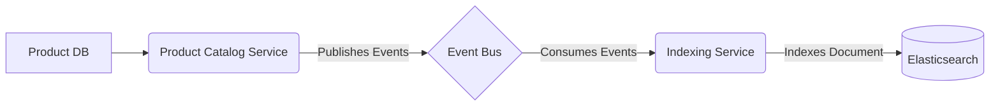
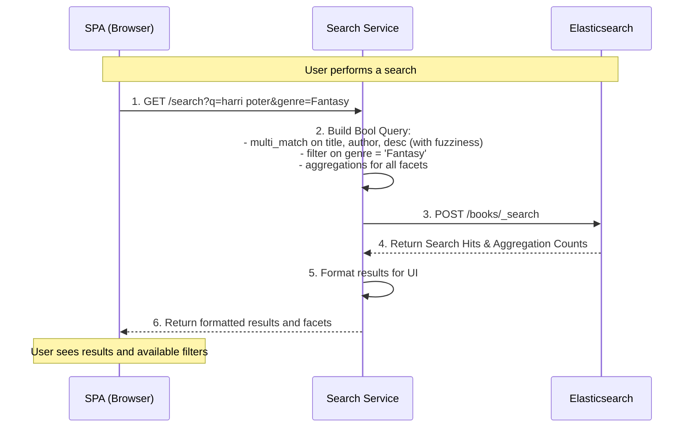
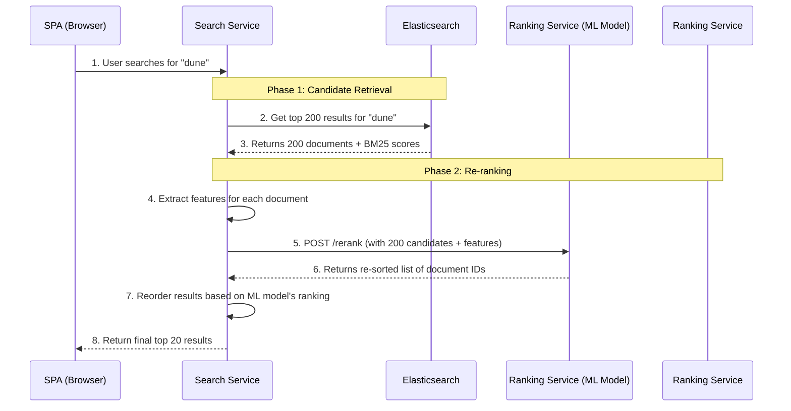

# Book Search 
A search experience is a critical part of an e-commerce platform. Using a dedicated search service like Elasticsearch is the standard, modern approach for building a fast, relevant, and feature-rich search.
We will define detailed requirements for the book search functionality and then providing a detailed technical design for its implementation using Elasticsearch.

- [Book Search](#book-search)
  - [Part 1: Detailed Search Requirements](#part-1-detailed-search-requirements)
    - [A. Functional Requirements](#a-functional-requirements)
    - [B. Non-Functional Requirements](#b-non-functional-requirements)
  - [Part 2: Detailed Design with Elasticsearch](#part-2-detailed-design-with-elasticsearch)
    - [A. Data Indexing Flow (Getting Data into Elasticsearch)](#a-data-indexing-flow-getting-data-into-elasticsearch)
    - [B. Elasticsearch Index Mapping](#b-elasticsearch-index-mapping)
    - [C. Indexed Documents](#c-indexed-documents)
    - [Elasticsearch Index API Request](#elasticsearch-index-api-request)
      - [Breakdown of the Indexed Document](#breakdown-of-the-indexed-document)
    - [D. Querying Strategy](#d-querying-strategy)
    - [E. Online Search Flow (Sequence Diagram)](#e-online-search-flow-sequence-diagram)
  - [Example Queries](#example-queries)
    - [1. Core Search with Relevance Boosting](#1-core-search-with-relevance-boosting)
    - [2. Typo Tolerance (Fuzzy Matching)](#2-typo-tolerance-fuzzy-matching)
    - [3. Autocomplete / Typeahead Suggestions](#3-autocomplete--typeahead-suggestions)
    - [4. Filtering and Faceted Navigation](#4-filtering-and-faceted-navigation)
      - [Example A: Initial Search with Aggregations (Generating Facets)](#example-a-initial-search-with-aggregations-generating-facets)
      - [Example B: Applying a Filter from a Facet](#example-b-applying-a-filter-from-a-facet)
    - [5. Sorting](#5-sorting)
  - [Model Different Formats as Sub Documents](#model-different-formats-as-sub-documents)
    - [The Problem with a "Flat" Model](#the-problem-with-a-flat-model)
    - [The Solution: The `nested` Data Type](#the-solution-the-nested-data-type)
      - [1. Updated Elasticsearch Mapping](#1-updated-elasticsearch-mapping)
      - [2. Updated Example of an Indexed Document](#2-updated-example-of-an-indexed-document)
      - [3. Example of a `nested` Query](#3-example-of-a-nested-query)
  - [Sematic Matching](#sematic-matching)
    - [What are Semantic Search and Text Embeddings?](#what-are-semantic-search-and-text-embeddings)
    - [Detailed Design for Semantic Search](#detailed-design-for-semantic-search)
      - [1. The Indexing Flow: Generating and Storing Embeddings](#1-the-indexing-flow-generating-and-storing-embeddings)
      - [2. The Querying Flow: Hybrid Search](#2-the-querying-flow-hybrid-search)
      - [Example Hybrid Search Query](#example-hybrid-search-query)
  - [Custom Ranking](#custom-ranking)
    - [The Core Concept: Two-Phase Search (Retrieve and Re-rank)](#the-core-concept-two-phase-search-retrieve-and-re-rank)
    - [Option 1: External Re-ranking Service (Microservice Approach)](#option-1-external-re-ranking-service-microservice-approach)
    - [Option 2: Elasticsearch LTR Plugin (Integrated Approach)](#option-2-elasticsearch-ltr-plugin-integrated-approach)

## Part 1: Detailed Search Requirements

Before designing the system, we must define what a great book search experience looks like for our users.

### A. Functional Requirements

1.  **Core Search Capabilities:**

      * Users must be able to perform a full-text search by entering keywords into a search bar.
      * The search must query across multiple key fields: **Book Title**, **Author(s) Name**, **Book Description/Synopsis**, and **ISBN**.
      * The search results must be ranked by **relevance**, with the best matches appearing first. Matches in the title should be considered more relevant than matches in the description.

2.  **Advanced Search Features:**

      * **Typo Tolerance (Fuzzy Matching):** The search must handle minor misspellings and typos. For example, a search for "harri poter" should still yield results for "Harry Potter".
      * **Autocomplete (Typeahead):** As the user types into the search bar, the system must provide a dropdown of suggested book titles in real-time to help them complete their query faster.
      * **Faceted Navigation (Filtering):** On the search results page, users must be able to refine their results by applying one or more filters. Available facets must include:
          * **Genre** (e.g., Fantasy, Science Fiction, History)
          * **Author**
          * **Publication Year** (by range or specific year)
          * **Average User Rating** (e.g., 4 stars & up)
      * **Sorting:** Users must be able to change the sort order of the results. Available sort options must include:
          * Best Match (Relevance)
          * Price: Low to High
          * Price: High to Low
          * Publication Date: Newest First
          * Average User Rating

3.  **Search Results Display:**

      * Each item in the search results list must display essential information: Book Cover Image, Title, Author(s), Price, and Average User Rating.

### B. Non-Functional Requirements

1.  **Performance:** The search experience must be extremely fast.
      * Autocomplete suggestions should appear in **under 100ms**.
      * Full search results should be delivered in **under 300ms**.
2.  **Data Synchronization:** The search index must be kept up-to-date with the master product database in near real-time. When a book's details are updated, a new review is added (changing the average rating), or the price changes, the search results should reflect this within seconds.

-----

## Part 2: Detailed Design with Elasticsearch

This design outlines how to use Elasticsearch to meet all the requirements defined above within our microservices architecture.

### A. Data Indexing Flow (Getting Data into Elasticsearch)

We'll use our event-driven architecture to keep Elasticsearch synchronized.

1.  **Source of Truth:** The `Product Catalog Service` and its database remain the source of truth for all book information.
2.  **Event Publishing:** Whenever book data is created or changed (e.g., `BookCreated`, `BookUpdated`, `ReviewAdded`), the `Product Catalog Service` publishes a detailed event onto the Event Bus (Kafka/RabbitMQ).
3.  **Indexing Service:** A dedicated **Indexing Service** (or a worker within the Product Catalog service) subscribes to these events.
4.  **Transform and Index:** Upon receiving an event, the Indexing Service is responsible for transforming the relational data into a flattened JSON "document" optimized for search and then sending it to Elasticsearch to be indexed.

<!-- end list -->



### B. Elasticsearch Index Mapping

The "mapping" is the schema for our search index. We will create an index named `books` with the following structure, which is carefully designed to enable our required features.

```json
{
  "mappings": {
    "properties": {
      "title": {
        "type": "text",
        "analyzer": "standard",
        "fields": {
          "edge_ngram": {
            "type": "text",
            "analyzer": "autocomplete_analyzer"
          }
        }
      },
      "authors": {
        "type": "text",
        "fields": {
          "keyword": {
            "type": "keyword"
          }
        }
      },
      "description": {
        "type": "text"
      },
      "isbn": {
        "type": "keyword"
      },
      "genre": {
        "type": "keyword"
      },
      "publication_year": {
        "type": "integer"
      },
      "average_rating": {
        "type": "half_float"
      },
      "price": {
        "type": "float"
      },
      "cover_image_url": {
        "type": "keyword",
        "index": false
      }
    }
  },
  "settings": {
    "analysis": {
      "analyzer": {
        "autocomplete_analyzer": {
          "tokenizer": "edge_ngram_tokenizer",
          "filter": [
            "lowercase"
          ]
        }
      },
      "tokenizer": {
        "edge_ngram_tokenizer": {
          "type": "edge_ngram",
          "min_gram": 2,
          "max_gram": 15,
          "token_chars": [
            "letter",
            "digit"
          ]
        }
      }
    }
  }
}
```

  * **`title`**: A `text` field for full-text search. It has a special sub-field `title.edge_ngram` that uses a custom `autocomplete_analyzer`. This breaks a title like "Harry" into "ha", "har", "harr", "harry", enabling instant prefix matching for typeahead.
  * **`authors` / `genre`**: `keyword` fields are used for exact matching, which is perfect for filtering/faceting. The `authors` field is also searchable as `text`.
  * **`isbn`**: A `keyword` as it's a unique identifier we won't be doing partial searches on.
  * **`publication_year` / `average_rating` / `price`**: Numeric types allow for efficient range filtering and sorting.

### C. Indexed Documents
Certainly. Here is a complete example of the API request that the **Indexing Service** would send to Elasticsearch.

This happens after the service has consumed an event (e.g., `BookUpdated`) and aggregated all the necessary data from the `Product Catalog Service`'s database (joining data from the `Books`, `Authors`, and `Reviews` tables) into a single, denormalized JSON document that is optimized for search.

### Elasticsearch Index API Request

The Indexing Service would send an HTTP `PUT` request to the Elasticsearch `_doc` endpoint. Using the ISBN as the document ID is a common and effective practice, as it ensures each unique book version has a unique record in the search index.

**Endpoint:** `PUT /books/_doc/9780441013593`

**Request Body (The JSON Document):**

```json
{
  "title": "Dune",
  "authors": [
    "Frank Herbert"
  ],
  "description": "Set on the desert planet Arrakis, Dune is the story of the boy Paul Atreides, heir to a noble family tasked with ruling an inhospitable world where the only thing of value is the 'spice' melange, a drug capable of extending life and enhancing consciousness.",
  "isbn": "9780441013593",
  "genre": "Science Fiction",
  "publication_year": 2019,
  "average_rating": 4.85,
  "price": 10.99,
  "cover_image_url": "/images/covers/9780441013593.jpg"
}
```
Note that we use the ISBN # as the document ID in the above API call, as it uniquely identify a book.

-----

#### Breakdown of the Indexed Document

This single JSON object is the "document" that Elasticsearch will store, analyze, and make searchable. Here’s how it relates back to our design:

  * **Denormalization:** Notice how data that lives in separate tables in the relational database is combined here. The author's name (`Frank Herbert`) is directly embedded in the document, and the `average_rating` (`4.85`) is a value calculated from the `Reviews` table. This pre-joining of data is what makes search queries so fast—there are no expensive joins to perform at query time.

  * **Optimized for Search:** When Elasticsearch receives this document, it will process each field according to the mapping we designed:

      * `title` will be analyzed as full-text *and* as edge-ngrams for autocomplete.
      * `authors` will be indexed as both full-text (for searching "Frank" or "Herbert") and as a single keyword (for faceting on "Frank Herbert").
      * `genre` will be indexed as an exact `keyword`, ready for filtering.
      * `publication_year`, `average_rating`, and `price` will be indexed as numbers, ready for fast sorting and range filtering.

This single document contains all the information needed to handle every search feature we required, from full-text search and filtering to sorting and autocomplete.

### D. Querying Strategy

A dedicated **Search Service** (or the Product Catalog Service) will be responsible for translating user requests into Elasticsearch queries.

  * **Core Search:** A `multi_match` query is used to search across `title`, `authors`, and `description`. We can `boost` the `title` field (`"title^3"`) to make matches there more heavily weighted in the relevance `_score`.
  * **Typo Tolerance:** This is enabled by adding the `fuzziness: "AUTO"` parameter to the `multi_match` query.
  * **Autocomplete:** These queries will specifically target the `title.edge_ngram` field. A simple `match` query on this field will return prefix-matched suggestions very quickly.
  * **Filtering (Facets):** When a user searches, the query will include an `aggregations` block to get the counts for each facet (e.g., "Fantasy (120)", "Sci-Fi (88)"). When a user clicks a filter like "Fantasy", the frontend re-submits the search request, and the Search Service adds a `filter` clause to the query. Filters are very fast as they don't affect scoring.
  * **Sorting:** Handled via the `sort` parameter in the search query, allowing sorting by fields like `price` or `publication_year`.

### E. Online Search Flow (Sequence Diagram)

This diagram shows how the components interact during a search.



## Example Queries

Each example includes the JSON request body that your **Search Service** would send to Elasticsearch.


### 1\. Core Search with Relevance Boosting

This query searches for a user's term across multiple fields. It uses a "boost" (`^3`) to make matches in the `title` field three times more important for the relevance score than matches in the `authors` or `description` fields.

  * **Scenario:** A user searches for "dune messiah".

<!-- end list -->

```json
POST /books/_search
{
  "query": {
    "multi_match": {
      "query": "dune messiah",
      "fields": [
        "title^3",
        "authors",
        "description"
      ]
    }
  }
}
```

### 2\. Typo Tolerance (Fuzzy Matching)

This is an enhancement of the core search. By adding the `fuzziness: "AUTO"` parameter, we tell Elasticsearch to allow for small mistakes (an edit distance of 1 or 2 characters, depending on the term length).

  * **Scenario:** A user searches for "frank herbrt" (a typo for "Frank Herbert").

<!-- end list -->

```json
POST /books/_search
{
  "query": {
    "multi_match": {
      "query": "frank herbrt",
      "fields": [
        "title^3",
        "authors",
        "description"
      ],
      "fuzziness": "AUTO"
    }
  }
}
```

### 3\. Autocomplete / Typeahead Suggestions

This query runs as a user is typing. It targets the special `title.edge_ngram` field we defined in our mapping, which is optimized for fast prefix matching. We also use `_source` to only return the `title` field, making the response payload very small and fast.

  * **Scenario:** A user has typed "foundat" into the search bar.

<!-- end list -->

```json
POST /books/_search
{
  "_source": ["title"],
  "query": {
    "match": {
      "title.edge_ngram": {
        "query": "foundat"
      }
    }
  }
}
```

### 4\. Filtering and Faceted Navigation

This is a two-step process. First, we run a search and get the facet counts. Then, when a user clicks a filter, we re-run the search with that filter applied.

#### Example A: Initial Search with Aggregations (Generating Facets)

This query not only searches for "robot" but also includes an `aggs` block. This tells Elasticsearch to return the search results *and* a bucketed count of all the genres and authors found within those results.

  * **Scenario:** A user searches for "robot".

<!-- end list -->

```json
POST /books/_search
{
  "query": {
    "multi_match": {
      "query": "robot",
      "fields": ["title^3", "authors", "description"]
    }
  },
  "aggs": {
    "all_genres": {
      "terms": {
        "field": "genre",
        "size": 10
      }
    },
    "all_authors": {
      "terms": {
        "field": "authors.keyword",
        "size": 10
      }
    }
  }
}
```

#### Example B: Applying a Filter from a Facet

After the first query, the user sees "Science Fiction (15)" as a genre option and clicks on it. The search is re-run with a `filter` clause. Filters are very fast because they don't affect relevance scores and are easily cached by Elasticsearch.

  * **Scenario:** A user has searched for "robot" and has now clicked the "Science Fiction" genre filter.

<!-- end list -->

```json
POST /books/_search
{
  "query": {
    "bool": {
      "must": [
        {
          "multi_match": {
            "query": "robot",
            "fields": ["title^3", "authors", "description"]
          }
        }
      ],
      "filter": [
        {
          "term": {
            "genre": "Science Fiction"
          }
        }
      ]
    }
  },
  "aggs": {
    "all_genres": {
      "terms": { "field": "genre", "size": 10 }
    },
    "all_authors": {
      "terms": { "field": "authors.keyword", "size": 10 }
    }
  }
}
```

### 5\. Sorting

This query allows the user to change the order of the results. Here, we're searching for books in the "fantasy" genre and sorting them by the newest `publication_year` first. We add `_score` as a secondary sort to maintain relevance-based ordering for books published in the same year.

  * **Scenario:** A user wants to see the newest fantasy books.

<!-- end list -->

```json
POST /books/_search
{
  "query": {
    "match": {
      "genre": "Fantasy"
    }
  },
  "sort": [
    {
      "publication_year": {
        "order": "desc"
      }
    },
    {
      "_score": {
        "order": "desc"
      }
    }
  ]
}
```

## Model Different Formats as Sub Documents

Modeling the different book formats as sub-documents using the `nested` data type is a popular approach.

Let's break down why this is so important and how to implement it.

### The Problem with a "Flat" Model

If we didn't use sub-documents, we'd have two poor choices:

1.  **Create Separate Documents:** We could have one document for "Dune - Hardcover" and another for "Dune - Paperback". This would be very bad for the user experience, as a search for "Dune" would return multiple, nearly identical results, polluting the search page.
2.  **Use Parallel Arrays:** We could have one document with fields like `format_types: ["Hardcover", "Paperback"]` and `prices: [24.99, 10.99]`. The problem here is that the link between "Hardcover" and "24.99" is lost. You couldn't reliably query for "Hardcovers that cost less than $25."

### The Solution: The `nested` Data Type

The `nested` data type solves this perfectly. It allows you to store an array of objects, and it indexes each object in the array as a separate, hidden document. This preserves the relationship between the fields within each object.

This means you can have **one primary document per book title** (solving the search pollution problem) while still being able to run precise queries against the individual formats.

#### 1\. Updated Elasticsearch Mapping

We would update our `books` index mapping to include a `formats` field of type `nested`.

```json
{
  "mappings": {
    "properties": {
      "title": { "type": "text", ... },
      "authors": { "type": "text", ... },
      "description": { "type": "text" },
      // ... other top-level fields ...
      "formats": {
        "type": "nested",
        "properties": {
          "format_type": { "type": "keyword" },
          "isbn": { "type": "keyword" },
          "price": { "type": "float" },
          "publication_year": { "type": "integer" }
        }
      }
    }
  }
}
```

#### 2\. Updated Example of an Indexed Document

Our "Dune" document would now contain an array of `formats`, with each format being a complete object.

**Endpoint:** `PUT /books/_doc/dune-main`
**(Note: The ID can no longer be a single ISBN, so we'd use a generic book ID).**

**Request Body:**

```json
{
  "title": "Dune",
  "authors": [ "Frank Herbert" ],
  "description": "Set on the desert planet Arrakis...",
  "genre": "Science Fiction",
  "average_rating": 4.85,
  "formats": [
    {
      "format_type": "Hardcover",
      "isbn": "9780441013593",
      "price": 24.99,
      "publication_year": 2019
    },
    {
      "format_type": "Paperback",
      "isbn": "9780441172719",
      "price": 10.99,
      "publication_year": 2020
    },
    {
      "format_type": "Ebook",
      "isbn": "9780593099322",
      "price": 9.99,
      "publication_year": 2020
    }
  ]
}
```

#### 3\. Example of a `nested` Query

Now, you can run powerful queries that target the specific formats. To do this, you use a `nested` query.

  * **Scenario:** Find all books that have a **Hardcover** format available for **less than $15**.

<!-- end list -->

```json
POST /books/_search
{
  "query": {
    "nested": {
      "path": "formats",
      "query": {
        "bool": {
          "must": [
            { "match": { "formats.format_type": "Hardcover" } },
            { "range": { "formats.price": { "lt": 15.00 } } }
          ]
        }
      }
    }
  }
}
```

**Explanation:**

  * `path: "formats"` tells Elasticsearch to run the query against the nested sub-documents.
  * The `bool` query inside operates on each sub-document individually. It will only return the top-level "Dune" book if at least one of its format objects matches *all* the conditions (is a Hardcover AND has a price less than 15).

## Sematic Matching

This is the next evolution of our search design, moving beyond simple keyword matching (lexical search) into understanding the user's intent (semantic search). This is how you find things that are conceptually related, not just textually similar.

**Text embeddings** are the core technology that powers **semantic search**. Let's break down what they are and then design how to integrate them into our bookstore.

### What are Semantic Search and Text Embeddings?

**Semantic Search** understands the meaning and context behind a query, not just the keywords.

  * **Keyword Search:** A search for "books about US presidents" would only find books with the exact words "US" and "presidents".
  * **Semantic Search:** The same search could find a book titled "A Biography of Abraham Lincoln" because the system understands that "Abraham Lincoln" is a concept closely related to "US presidents".

**Text Embeddings** are how we achieve this. An embedding is a numerical representation of text (a word, sentence, or paragraph) in the form of a list of numbers, called a **vector**. These vectors are generated by advanced AI models (like BERT or models from OpenAI/Google AI).

Their magic property is that **text with similar meaning will have vectors that are numerically close to each other in a high-dimensional space**.

  * The vector for "king" will be very close to the vector for "queen".
  * The vector for "spaceship" will be very close to the vector for "starship".
  * The vector for "king" will be very far from the vector for "cabbage".

By converting both our book descriptions and the user's query into these vector embeddings, we can search for the *closest vectors* instead of just matching keywords.

-----

### Detailed Design for Semantic Search

Here’s how we'll integrate this into our existing microservices architecture.

#### 1\. The Indexing Flow: Generating and Storing Embeddings

We need to generate an embedding for every book in our catalog and store it in Elasticsearch.

1.  **New Component: `Embedding Service`:** We will introduce a new microservice responsible for one thing: converting text into vector embeddings. This service will contain a pre-trained language model (e.g., Sentence-BERT) or will act as a client for an external AI platform API (e.g., OpenAI, Google AI Platform).

2.  **Event-Driven Generation:** This process fits perfectly into our existing event-driven flow.

      * When the `Product Catalog Service` creates or updates a book, it publishes a `BookUpdated` event.
      * Upon receiving the event, the `Indexer` calls `Embedding Service` with the relevant text (e.g., a combination of the book's title and its description).
      * `Embedding Service` then sends it to the language model to generate a vector embedding (e.g., an array of 768 numbers).

3.  **Storing in Elasticsearch:** The embedding needs to be added to our Elasticsearch document. The `Indexer`, after generating the vector, will call the Elasticsearch `_update` API to add the new vector to the correct book document.

4.  **Updated Elasticsearch Mapping:** We need to update our `books` index mapping to add a field for the new vector. The data type for this is `dense_vector`.

    ```json
    {
      "mappings": {
        "properties": {
          // ... all our existing fields like title, authors, etc. ...
          "book_embedding": {
            "type": "dense_vector",
            "dims": 768,
            "index": true,
            "similarity": "cosine"
          }
        }
      }
    }
    ```

      * `dims`: The number of dimensions in the vector, which is determined by the AI model you choose (768 is common).
      * `similarity`: The function used to compare vectors. `cosine` is the standard for text embeddings.

#### 2\. The Querying Flow: Hybrid Search

When a user searches, we don't want to abandon our fast and precise keyword search. The best approach is **Hybrid Search**, which combines the results of both keyword and semantic search to get the best of both worlds.

1.  **Generate Query Embedding:** The user's search query (e.g., "stories about royalty in old england") is sent to our `Search Service`. The `Search Service` first calls the `Embedding Service` to convert this query string into a vector using the *exact same model*.

2.  **Execute Hybrid Query:** The `Search Service` then sends a single, powerful query to Elasticsearch that performs two searches in parallel:

      * **Keyword Search:** Our existing `multi_match` query to find lexical matches.
      * **Vector Search (k-NN):** A `knn` (k-Nearest Neighbor) search to find the "k" most semantically similar book embeddings to the user's query embedding.

3.  **Combine Results (RRF):** Elasticsearch returns two lists of results with different scores. We then need to combine them into a single, superior ranking. The state-of-the-art method for this is **Reciprocal Rank Fusion (RRF)**, which is built into Elasticsearch's `rank` feature. RRF looks at the *rank* of each document in both result sets (not its raw score), making it highly effective at combining different search techniques.

#### Example Hybrid Search Query

  * **Scenario:** A user searches for "stories about royalty in old england".

<!-- end list -->

```json
POST /books/_search
{
  "query": {
    "multi_match": {
      "query": "stories about royalty in old england",
      "fields": ["title^3", "authors", "description"],
      "fuzziness": "AUTO"
    }
  },
  "knn": {
    "field": "book_embedding",
    "query_vector": [0.12, -0.45, 0.89, ...],
    "k": 10,
    "num_candidates": 50
  },
  "rank": {
    "rrf": {}
  }
}
```

**Explanation:**

  * `query`: The standard keyword search block.
  * `knn`: The vector search block. `query_vector` is the embedding of the user's search query generated by the `Embedding Service`. `k` is how many top results to find.
  * `rank: { "rrf": {} }`: This is the magic. It tells Elasticsearch to take the results from both the keyword query and the k-NN search and intelligently merge them into a single, highly relevant ranked list using the RRF algorithm.

By adding an `Embedding Service` and leveraging the `dense_vector` type and `knn` search in Elasticsearch, you can build a state-of-the-art semantic search engine that provides vastly more intelligent and relevant results to your users.

## Custom Ranking

**Learning to Rank (LTR)** is an idea that moves beyond the general-purpose BM25 algorithm and use a custom machine learning model, trained on your own data and business goals, to produce the most relevant final ranking.

You don't replace Elasticsearch's default ranking. Instead, you use it as the first step in a **multi-stage ranking process**, and your ML model acts as a second, more sophisticated ranking layer. This is often called a "retrieve and re-rank" architecture.

Here's how you can plug in your own ML-based ranker.

### The Core Concept: Two-Phase Search (Retrieve and Re-rank)

Because your ML model is likely more complex and computationally expensive than BM25, running it on millions of documents for every search would be far too slow. The standard LTR pattern solves this by splitting the search into two phases:

1.  **Phase 1: Candidate Retrieval (Recall-focused):**

      * Use a standard, fast Elasticsearch query (like the BM25 `multi_match` we've been using) to retrieve a reasonably large set of potentially relevant candidate documents. For example, you might retrieve the top 200-500 results.
      * The goal of this phase is **recall**: to quickly find every document that *might* be a good match, without worrying about perfect ordering. Elasticsearch is extremely good at this.

2.  **Phase 2: Sophisticated Re-ranking (Precision-focused):**

      * Take the smaller set of 200 candidate documents from Phase 1.
      * For each of these candidates, extract the features your ML model needs. This includes the BM25 `_score` from Elasticsearch, plus other document features (e.g., `average_rating`, `publication_year`, price).
      * Pass these features to your ML model to get a new, more intelligent "relevance score".
      * Re-sort the 200 candidates based on the new score from your model.
      * Return the final top 10-20 results to the user. The goal here is **precision**: ensuring the absolute best results are at the very top.

There are two primary architectural patterns to implement this.

-----

### Option 1: External Re-ranking Service (Microservice Approach)

This is the most flexible and common approach in a modern microservices architecture like the one we've designed. You create a new, dedicated microservice that hosts your ML model.

**How it Works:**

1.  The `Search Service` receives the user's query.
2.  It sends a query to Elasticsearch to retrieve the top 200 candidate documents.
3.  The `Search Service` takes this list of 200 documents. For each one, it gathers the features needed for the ML model (the BM25 `_score`, `average_rating`, `price`, etc.).
4.  It then makes an API call to a new **`Ranking Service`**, sending the list of candidate documents and their features.
5.  The `Ranking Service` (which can be written in Python and use frameworks like TensorFlow, PyTorch, or XGBoost) processes this list, applies the ML model to calculate a new score for each document, and returns a re-ranked list of document IDs.
6.  The `Search Service` reorders the results based on the response from the `Ranking Service` and sends the final, precisely ranked page of results to the user.

**Sequence Diagram:**



  * **Pros:** Extremely flexible (any model, any language), clear separation of concerns, can be scaled and updated independently.
  * **Cons:** Higher operational complexity (one more service), adds a network hop which can increase latency.

-----

### Option 2: Elasticsearch LTR Plugin (Integrated Approach)

Elasticsearch has a built-in Learning to Rank feature that allows you to manage this process within Elasticsearch itself.

**How it Works:**

1.  **Feature Engineering:** You define a "feature set" in Elasticsearch. Each feature is essentially a template for an Elasticsearch query. For example, one feature could be the raw BM25 score, another could be the value of the `average_rating` field.
2.  **Model Training (Offline):** You export a training dataset from Elasticsearch, use it to train your LTR model (typically a gradient-boosted tree model like LightGBM) outside of Elasticsearch.
3.  **Upload Model:** You upload the trained model definition to Elasticsearch.
4.  **Querying with `rescore`:** You issue a query that contains two parts:
      * The main `query` block to retrieve the initial set of candidates (Phase 1).
      * A `rescore` block that applies your uploaded LTR model to the top results from the main query (Phase 2).

<!-- end list -->

  * **Pros:** Contained within a single query to Elasticsearch, potentially lower latency than the external service approach.
  * **Cons:** Less flexible in terms of model types and ML frameworks, can be complex to manage feature sets and models within Elasticsearch.

For the flexible, scalable microservices architecture we've designed, the **External Re-ranking Service (Option 1)** is the most natural and powerful fit.