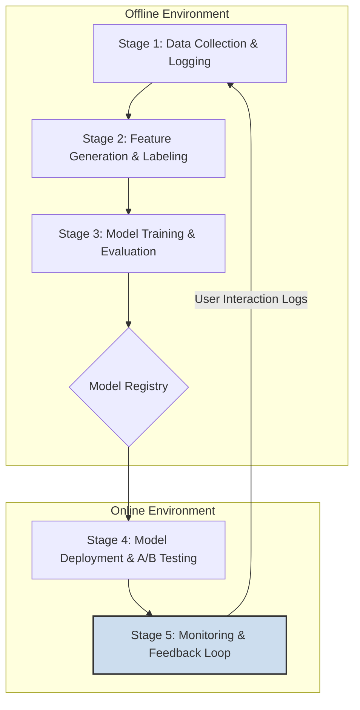
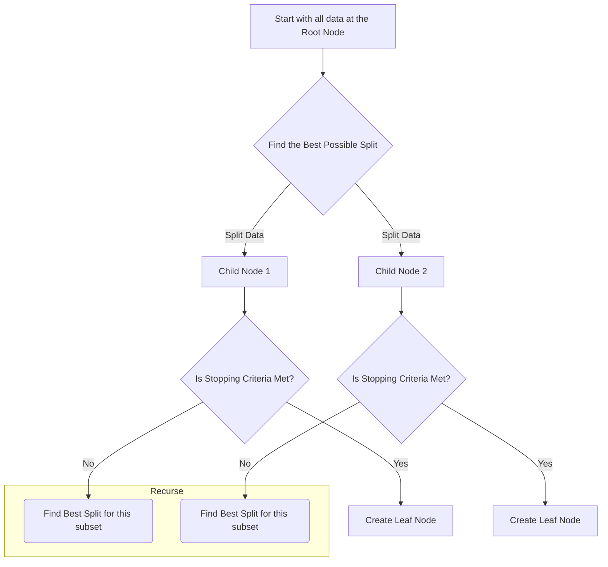

# Learn to Rank for Search

- [Learn to Rank for Search](#learn-to-rank-for-search)
  - [**Goals, Context, and Signals**](#goals-context-and-signals)
      - [**1. Overarching Business Goals**](#1-overarching-business-goals)
      - [**2. User Experience Goals \& Leading Indicators**](#2-user-experience-goals--leading-indicators)
      - [**3. Available Signals (Feature Sources)**](#3-available-signals-feature-sources)
      - [**4. The Ranking Problem Formulation**](#4-the-ranking-problem-formulation)
  - [**Overview of the LTR Lifecycle**](#overview-of-the-ltr-lifecycle)
      - [**Stage 1: Data Collection \& Logging (The Foundation)**](#stage-1-data-collection--logging-the-foundation)
      - [**Stage 2: Feature Generation \& Labeling (Creating the Training Data)**](#stage-2-feature-generation--labeling-creating-the-training-data)
      - [**Stage 3: Model Training \& Evaluation (The Machine Learning)**](#stage-3-model-training--evaluation-the-machine-learning)
      - [**Stage 4: Model Deployment \& A/B Testing**](#stage-4-model-deployment--ab-testing)
      - [**Stage 5: Monitoring \& The Feedback Loop**](#stage-5-monitoring--the-feedback-loop)
  - [LTR Models](#ltr-models)
    - [**1. Choosing a Model: XGBoost vs. LightGBM**](#1-choosing-a-model-xgboost-vs-lightgbm)
      - [**XGBoost (eXtreme Gradient Boosting)**](#xgboost-extreme-gradient-boosting)
      - [**LightGBM (Light Gradient Boosting Machine)**](#lightgbm-light-gradient-boosting-machine)
    - [**2. Practical Guide to Training \& Hyperparameter Tuning**](#2-practical-guide-to-training--hyperparameter-tuning)
      - [**Objective Function: LambdaMART**](#objective-function-lambdamart)
      - [**Data Preparation**](#data-preparation)
      - [**Key Hyperparameters to Tune**](#key-hyperparameters-to-tune)
    - [**3. Evaluation Metrics: nDCG and MAP**](#3-evaluation-metrics-ndcg-and-map)
      - [**Normalized Discounted Cumulative Gain (nDCG)**](#normalized-discounted-cumulative-gain-ndcg)
      - [**Mean Average Precision (MAP)**](#mean-average-precision-map)
    - [**4. Pointwise vs. Pairwise vs. Listwise Approaches**](#4-pointwise-vs-pairwise-vs-listwise-approaches)
  - [Appendix 1. Example of Training Data](#appendix-1-example-of-training-data)
    - [Context for the Example](#context-for-the-example)
    - [Example Training Dataset](#example-training-dataset)
    - [How to Read This Table](#how-to-read-this-table)
  - [Appendix 2. Explain Boosted Decision Trees](#appendix-2-explain-boosted-decision-trees)
    - [Training a Regression Tree](#training-a-regression-tree)
      - [The Goal: Minimizing Variance](#the-goal-minimizing-variance)
      - [How a Single Tree is Trained: Step-by-Step](#how-a-single-tree-is-trained-step-by-step)
      - [Making a Prediction](#making-a-prediction)
    - [How Boosted Tree Algorithms Work (The Intuitive Idea)](#how-boosted-tree-algorithms-work-the-intuitive-idea)
    - [How They Are Trained with Gradient Descent](#how-they-are-trained-with-gradient-descent)
      - [**A Quick Refresher on Gradient Descent**](#a-quick-refresher-on-gradient-descent)
      - [**The Leap to Gradient Boosting**](#the-leap-to-gradient-boosting)
    - [Listwise Ranking and LambdaMART](#listwise-ranking-and-lambdamart)
      - [The "Magic" of the LambdaMART Objective](#the-magic-of-the-lambdamart-objective)
      - [A Simple Analogy](#a-simple-analogy)

## **Goals, Context, and Signals**

#### **1. Overarching Business Goals**

The primary purpose of the LTR model is to go beyond simple text relevance and rank search results in a way that directly supports our business objectives.

* **Primary Goal: Maximize Revenue Per Search.** The model should learn to rank documents in an order that maximizes the probability of a user making a purchase. This is often measured as Gross Merchandise Value (GMV) originating from search.
* **Secondary Goal: Increase Customer Engagement & Retention.** A search experience that surfaces highly desirable items, even if they aren't perfect text matches, will lead to higher user satisfaction and encourage customers to return.
* **Tertiary Goal: Enable Strategic Merchandising.** The ranking model should have the flexibility to strategically boost certain items based on business needs, such as promoting high-margin books, new releases, or sponsored listings.

#### **2. User Experience Goals & Leading Indicators**

We will train and evaluate the model against a set of user interaction metrics. These are leading indicators that we believe correlate strongly with our primary business goals. The model should aim to improve:

* **Click-Through Rate (CTR):** The percentage of times a result is clicked after being shown. A higher CTR on top-ranked results is a sign of immediate relevance.
* **Add-to-Cart Rate (ATC Rate):** The percentage of searches that lead to an item being added to the cart. This is a much stronger signal of user intent than a simple click.
* **Conversion Rate:** The percentage of searches that ultimately lead to a purchase. This is the strongest engagement signal and is directly tied to our primary business goal.
* **Session Success Rate:** The percentage of search sessions (a user's series of related searches) that result in at least one add-to-cart or purchase.
* **Reduced "Zero Results" Rate:** While not a ranking problem, the signals gathered can help identify and correct searches that yield no results.

#### **3. Available Signals (Feature Sources)**

This is the raw data we will use to "teach" our model what a good result looks like. We can group these signals into three categories:

**A. Book Signals (Document Features)**
These are static or semi-static attributes of the books themselves.

* **Text Relevance Scores:**
    * The raw **BM25 score** from the initial keyword search.
    * The **cosine similarity score** from our semantic (vector) search.
* **Popularity & Quality Signals:**
    * All-time sales count.
    * Sales count over the last 30 days (a "trending" signal).
    * Number of times added-to-cart in the last 30 days.
    * Average user rating (e.g., 4.85).
    * Number of user reviews (a measure of social proof).
* **Content & Metadata Signals:**
    * `publication_year` (freshness).
    * `is_award_winner` (a boolean flag for quality).
    * Author popularity (e.g., total sales for all books by that author).
* **Business Signals:**
    * `price` (price itself can influence clicks and purchases).
    * `in_stock` (a boolean flag; out-of-stock items should be penalized).
    * `profit_margin` (a numerical value, for internal use).
    * `is_promoted` (a boolean flag for business-driven boosting).

**B. User & Query Signals**
These features describe the context of the search itself.

* **Query Features:**
    * Number of words in the query.
    * Presence of specific entities (e.g., author names, ISBNs, quotes).
    * Query category (determined via NLP: is the query *navigational* like "dune frank herbert" or *exploratory* like "sci-fi books about space travel"?).
* **User Features:**
    * User's historical preferred genres (based on past purchases).
    * New vs. returning user.
    * Device type (mobile vs. desktop).

**C. User Interaction Signals (The "Ground Truth")**
This is the most valuable data, collected by logging user behavior. It's how we know what users *actually* find relevant. For any given `(query, book)` pair, we can calculate:

* **Historical CTR:** Historically, what percentage of the time has this book been clicked when shown for this (or a similar) query?
* **Historical ATC Rate:** What percentage of the time has this book been added to the cart when shown for this query?
* **Historical Purchase Rate:** What percentage of the time has this book been purchased when shown for this query?

#### **4. The Ranking Problem Formulation**

Based on the goals and signals, we can now formally define our machine learning problem.

* **Objective:** To train a model that predicts the "relevance" of a book for a given query and user context.
* **Training Data:** Our training set will consist of millions of rows, where each row is a `(query, book)` pair that was shown to a user. Each row will contain all the calculated features (Book, User, and Interaction signals) for that pair.
* **The "Relevance Label":** The most critical part is defining what we're trying to predict. We will create a graded relevance label based on the user's action for that `(query, book)` pair. A common scale is:
    * **Score 0 (Irrelevant):** The book was shown, but the user did not click.
    * **Score 1 (Minimally Relevant):** The user clicked the book.
    * **Score 2 (Highly Relevant):** The user added the book to their cart.
    * **Score 3 (Perfectly Relevant):** The user purchased the book.

The task of the LTR model will be to predict this relevance score. At search time, we will calculate the predicted score for each candidate document and use it to create the final, optimized ranking.

The following is an overview of the five key stages in the LTR lifecycle.

-----

## **Overview of the LTR Lifecycle**

The lifecycle is a closed loop where the model's performance in production generates the data needed to train the next, better version of the model. This is not a one-time project but a continuous, iterative cycle designed to constantly improve search relevance based on real user feedback. This entire process is often referred to as MLOps 

-----

#### **Stage 1: Data Collection & Logging (The Foundation)**

The goal of this stage is to capture every user interaction with the search results. This is the raw material for our "ground truth".

  * **What Happens:** Our application (specifically the `Search Service` or the frontend SPA) logs detailed events for every search session.
  * **Key Events to Log:**
      * **Search Event:** The user's query, any filters applied, the user's ID, and the complete, ordered list of book IDs that were displayed.
      * **Click Event:** Which book the user clicked on, its position in the search results, and the corresponding search query.
      * **Add-to-Cart Event:** Which book was added to the cart from a search results page.
      * **Purchase Event:** Which book was ultimately purchased that originated from a search session.
  * **Data Destination:** These raw logs are streamed in near real-time to a central data lake (e.g., Amazon S3) or a messaging system like Apache Kafka to be processed offline.

#### **Stage 2: Feature Generation & Labeling (Creating the Training Data)**

This is an offline batch process that transforms the raw logs into a structured dataset suitable for machine learning.

  * **What Happens:** Using tools like Apache Spark or a data warehouse (e.g., BigQuery, Snowflake), we run a daily or weekly job that processes the collected logs.
  * **Key Steps:**
    1.  **Sessionization:** The raw events are stitched together into user sessions.
    2.  **Label Generation:** For each `(query, book)` pair that was shown to a user, we apply our predefined relevance logic to create a label. For example: `0` for ignored, `1` for click, `2` for add-to-cart, `3` for purchase.
    3.  **Feature Extraction:** We enrich each row with the rich set of signals we defined previously. This involves joining the log data with snapshots of other data sources (the product catalog for book features, the user database for user features, etc.).
  * **Output:** The result is a massive, structured table where each row contains a `query`, a `book_id`, a large vector of `features` (BM25 score, price, rating, etc.), and a `relevance_label`.

#### **Stage 3: Model Training & Evaluation (The Machine Learning)**

This is where we actually build the ranker.

  * **What Happens:** We use the dataset from Stage 2 to train a machine learning model. Gradient Boosted Decision Trees (using frameworks like **XGBoost** or **LightGBM**) are the industry standard for LTR.
  * **Key Steps:**
    1.  **Training:** The model learns the complex patterns between the feature set and the relevance labels.
    2.  **Offline Evaluation:** We evaluate the trained model on a holdout test dataset. We use ranking-specific metrics like **nDCG (Normalized Discounted Cumulative Gain)** and **MAP (Mean Average Precision)** to measure how well the model orders the results compared to the ground truth.
    3.  **Model Registry:** If the new model performs better than the current production model in offline tests, its trained artifact is versioned and stored in a **Model Registry** (like MLflow or Vertex AI Model Registry).

#### **Stage 4: Model Deployment & A/B Testing**

This stage involves getting the new, trained model into production to serve live traffic.

  * **What Happens:** The versioned model from the registry is deployed to our **`Ranking Service`** microservice.
  * **Key Steps:**
    1.  **Deployment:** The `Ranking Service` loads the new model file and exposes it via its API.
    2.  **A/B Testing (Online Evaluation):** We never switch 100% of traffic to a new model immediately. We conduct a controlled online experiment:
          * The `Search Service` is configured to send a small fraction of traffic (e.g., 5%) to the new LTR model (the "treatment" group).
          * The rest of the traffic continues to use the existing ranking logic (the "control" group).
          * We then compare the live business metrics (CTR, Add-to-Cart Rate, Conversion Rate) between the two groups.
    3.  **Rollout:** If the new model shows a statistically significant improvement in our key metrics, we gradually increase its traffic share until it serves 100% of users.

#### **Stage 5: Monitoring & The Feedback Loop**

This final stage makes the entire process a continuously improving cycle.

  * **What Happens:** We monitor the deployed model's performance and, most importantly, we collect the data generated by its predictions.
  * **Key Steps:**
    1.  **Performance Monitoring:** We track the technical performance of the `Ranking Service` (latency, error rate, etc.) and business metrics (is the conversion rate holding up?).
    2.  **The Feedback Loop:** The user interaction logs from traffic served by the **new model** are collected and fed back into our Data Lake. This data becomes the foundation for the next iteration of the entire lifecycle, allowing us to train an even better model in the future.

----

## LTR Models
Let's drill into the core machine learning components of Stage 3. This stage is where we transition from data engineering to data science, building the model that will power our new ranking logic.

---

### **1. Choosing a Model: XGBoost vs. LightGBM**

For LTR problems with structured, tabular feature data like ours, the industry standard is to use **Gradient Boosted Decision Tree (GBDT)** models. Two implementations are dominant: XGBoost and LightGBM.

Both work by building a series of decision trees, where each new tree tries to correct the errors of the previous ones. However, they differ in *how* they build these trees.

#### **XGBoost (eXtreme Gradient Boosting)**
* **How it Works:** XGBoost builds trees **level-wise** (or breadth-first). It splits one level of the tree completely before moving on to the next level down.
* **Pros:** It's known for being extremely robust, accurate, and has been the tool of choice in data science competitions for years. It's a battle-tested and highly reliable option.
* **Cons:** The level-wise growth can be inefficient for very large datasets, leading to longer training times and higher memory consumption compared to LightGBM.

#### **LightGBM (Light Gradient Boosting Machine)**
* **How it Works:** LightGBM's key innovation is that it builds trees **leaf-wise** (or depth-first). It finds the single leaf that will yield the largest reduction in error (loss) and splits it, continuing to grow the tree from that point.
* **Pros:** This approach often converges much faster, resulting in **significantly shorter training times** and **lower memory usage**. For large-scale LTR, this is a massive advantage. It's often just as accurate, if not more so, than XGBoost.
* **Cons:** The leaf-wise growth can sometimes lead to overly complex trees that overfit the training data, especially with smaller datasets. This can be managed with careful hyperparameter tuning.

**Recommendation:** For a large-scale e-commerce search problem, **LightGBM is generally the preferred choice** due to its superior speed and efficiency. However, both are excellent, state-of-the-art models for this task.

---

### **2. Practical Guide to Training & Hyperparameter Tuning**

#### **Objective Function: LambdaMART**
This is the most critical concept. We don't train the model using a standard regression objective (like Mean Squared Error). We use a specialized **listwise ranking objective**. The most famous and effective one is **LambdaMART**, which is the algorithm implemented in both XGBoost (as `rank:ndcg`) and LightGBM (as `lambdarank`).

LambdaMART's goal is to directly optimize the ranking metric we care about (**nDCG**) during the training process. It cleverly uses the graded relevance labels to learn the optimal ordering of documents for each query.

#### **Data Preparation**
The training data must be grouped by query. The libraries need to know which documents belong to which search so they can compare them. You'll typically provide your data with three key components: the feature vector (`X`), the relevance label (`y`), and a `group` array that specifies how many documents belong to each query.

#### **Key Hyperparameters to Tune**
Tuning is crucial for getting the best performance and avoiding overfitting.

* `n_estimators`: The number of trees to build. Too few will underfit; too many will overfit. This is usually managed with **early stopping**, where you stop training once performance on a validation set stops improving.
* `learning_rate` (or `eta`): Controls how much each new tree contributes. A smaller learning rate (e.g., `0.05`) is often more robust but requires more trees.
* `num_leaves` (LightGBM) or `max_depth` (XGBoost): Controls the complexity of each individual tree. This is the primary lever for controlling overfitting.
* `subsample` (or `bagging_fraction`): The fraction of data rows to be sampled for building each tree.
* `colsample_bytree` (or `feature_fraction`): The fraction of features to be sampled for building each tree.

**Tuning Strategy:** Instead of a manual or grid search, using a Bayesian optimization library like **Optuna** or **Hyperopt** is highly recommended. These tools intelligently search the hyperparameter space to find the best combination more efficiently.

---

### **3. Evaluation Metrics: nDCG and MAP**

Standard classification (accuracy) or regression (RMSE) metrics don't work for ranking because the **order** of the results is what matters.

#### **Normalized Discounted Cumulative Gain (nDCG)**
This is the **gold standard for evaluating search relevance**, especially when you have graded relevance labels (like our 0-4 scale).

1.  **Cumulative Gain (CG):** The simplest idea. Just sum the relevance scores of the top `k` results.
2.  **Discounted Cumulative Gain (DCG):** An improvement on CG. It rewards putting highly relevant documents at the top of the list. The relevance score of a document is "discounted" (reduced) the further down the list it appears. The formula is: $DCG_p = \sum_{i=1}^{p} \frac{rel_i}{\log_2(i+1)}$, where $rel_i$ is the relevance of the result at position $i$.
3.  **Normalized DCG (nDCG):** The problem with DCG is that its maximum value depends on the query. To fix this, we normalize it by dividing by the *Ideal* DCG (IDCG), which is the score of a perfectly sorted list. $nDCG_p = \frac{DCG_p}{IDCG_p}$. This gives a final score between 0.0 and 1.0, allowing for fair comparison across different queries.

#### **Mean Average Precision (MAP)**
MAP is another popular ranking metric, but it's designed for **binary relevance** (a document is either relevant or not). It averages the precision scores calculated after each relevant document is retrieved.

**nDCG vs. MAP:** For our problem, **nDCG is the superior metric**. We have rich, graded labels (click < add-to-cart < purchase). nDCG can leverage this nuanced information directly. To use MAP, we would have to throw away information by collapsing our labels into a binary "relevant" vs. "not relevant" scale.

---

### **4. Pointwise vs. Pairwise vs. Listwise Approaches**

You are correct that our approach of assigning a score (0, 1, 2, 3) to each document looks like a regression or classification problem. This is known as a **Pointwise** approach. Let's compare it.

* **Pointwise Approach:**
    * **How it Works:** The model looks at a single `(query, document)` pair and predicts its absolute relevance score (e.g., "this document scores a 2.8"). The final ranking is created by sorting these independent scores.
    * **Limitation:** It completely ignores the relationships between documents for the same query. It doesn't directly learn that `docA` is better than `docB`.

* **Pairwise Approach:**
    * **How it Works:** The model looks at a pair of documents, `(docA, docB)`, for a given query. Its goal is to predict which one is more relevant (a binary classification). It directly learns relative ordering.
    * **Limitation:** It only considers two documents at a time, not the overall structure of the ranked list. It can also lead to a massive explosion in the training dataset size.

* **Listwise Approach (The Best of All Worlds):**
    * **How it Works:** The model considers the entire list of documents for a given query *at once*. It directly learns to find the optimal ordering of the full list that will maximize a ranking metric like nDCG.
    * **This is what LambdaMART does.**

**Conclusion:** You are right that our *data labeling* is pointwise. However, by feeding this data into a model trained with a **LambdaMART objective function**, the algorithm is clever enough to use those pointwise scores to learn in a **listwise** fashion. It uses the gradients from the nDCG calculation (the "Lambdas") to directly optimize for the best possible ranked list. This gives us the best of both worlds: the simple and intuitive data format of the pointwise approach, combined with the superior ranking performance of the state-of-the-art listwise approach.

---

## Appendix 1. Example of Training Data

Here’s a simplified but representative example of what the final training dataset would look like after Stage 2 (Feature Generation & Labeling) is complete.

This is the structured table that would be fed directly into a model like LightGBM or XGBoost for training.

### Context for the Example

* **User's Search Query:** "sci-fi books about AI"
* **Internal Query ID:** `query_id = 123`
* **User Action Log:** The system displayed four books. The user scrolled past two, clicked one, and ultimately purchased another.

### Example Training Dataset

| query_id | doc_id | relevance_label | bm25_score | semantic_score | average_rating | publication_year | price | sales_last_30_days | historical_ctr_for_query_doc |
| :--- | :--- | :--- | :--- | :--- | :--- | :--- | :--- | :--- | :--- |
| 123 | B-1057 | **3** | 12.45 | 0.89 | 4.7 | 2018 | 14.99 | 1205 | 0.15 |
| 123 | B-0431 | **1** | 15.20 | 0.92 | 4.8 | 1950 | 9.99 | 850 | 0.22 |
| 123 | B-0998 | **0** | 14.80 | 0.91 | 4.6 | 1984 | 11.99 | 910 | 0.08 |
| 123 | B-0025 | **0** | 7.50 | 0.75 | 4.9 | 2019 | 10.99 | 2500 | 0.02 |

**Fictional Book IDs:**
* `B-1057`: "Hyperion" (contains a powerful AI character)
* `B-0431`: "I, Robot" (a direct topical match)
* `B-0998`: "Neuromancer" (a direct topical match)
* `B-0025`: "Dune" (less relevant, only tangential mentions of AI)

---

### How to Read This Table

This table is the result of our offline data processing pipeline and represents the "ground truth" for a single search query.

1.  **The Group (`query_id`):** This is the most important column for the LTR model. All rows with the same `query_id` (123) belong to the **same search result list**. The ranking algorithm (like LambdaMART) uses this to understand that it needs to learn the best relative ordering for these four specific documents.

2.  **The Target (`relevance_label`):** This is the "answer key" that the model learns from. It was generated by logging the user's actions:
    * **Label `3` (Purchase):** The user ultimately purchased `B-1057` after this search. This is the strongest positive signal.
    * **Label `1` (Click):** The user clicked on `B-0431` but didn't add it to the cart or buy it. This is a positive but weaker signal.
    * **Label `0` (No Interaction):** The user was shown `B-0998` and `B-0025` but scrolled past them without clicking. This is a strong negative signal.

3.  **The Predictors (Feature Columns):** These are the signals the model will use to make its predictions. Notice how they provide a multi-dimensional view of relevance:
    * **`bm25_score` & `semantic_score`:** These are the initial text relevance scores from Elasticsearch. Notice that the highest BM25 score (`15.20` for "I, Robot") did *not* lead to the purchase. Our LTR model will learn that a high text score alone isn't enough.
    * **`average_rating`, `publication_year`, `price`:** These are static features of the books.
    * **`sales_last_30_days`:** This is a popularity or "trending" feature. The model can learn if users tend to prefer popular items.
    * **`historical_ctr_for_query_doc`:** This is a powerful interaction feature. It tells the model how often this specific book has been clicked for this (or a very similar) query in the past. "I, Robot" has a high historical CTR, which makes sense as it's a great keyword match, even if it doesn't always convert to a sale.

The goal of the LTR model is to learn a function that takes all the feature columns as input and predicts the `relevance_label`. At search time, it will generate this predicted score for all candidate documents, and we will use that score to create the final, superior ranking for the user.

## Appendix 2. Explain Boosted Decision Trees

Let us start how a single tree in the group of boosted decision trees is trained. Then explain the gradient boosting algorithm. At last, we will cover the nuances of listwise ranking in the gradient boosting.

---

### Training a Regression Tree
The process is called **recursive partitioning**. The goal is to repeatedly split the data into smaller and smaller groups to make the data in each final group (a "leaf") as homogeneous or "pure" as possible.

For the regression trees used in gradient boosting, "pure" means that the target values (the residuals, in our case) within a group are very similar to each other.

-----

#### The Goal: Minimizing Variance

Imagine you have a bucket of data points. The goal of a regression tree is to split this bucket into two smaller buckets, and then split those, and so on, such that the numbers in each final bucket are as close to each other as possible. The metric used to measure this "closeness" is typically **Mean Squared Error (MSE)** or variance. A split is considered "good" if it results in a significant reduction in the overall MSE.

#### How a Single Tree is Trained: Step-by-Step

Let's walk through the training algorithm.

**Step 1: Start at the Root Node**
The process begins with the entire training dataset for that tree (all the features `X` and the target `y`, which are the residuals) in a single group, called the root node.

**Step 2: Find the "Best" Split**
This is the core of the algorithm. The tree needs to ask a simple question about one feature to split the data into two more homogeneous groups. To find the best question, it exhaustively checks every possibility:

  * It iterates through **every feature** (e.g., `average_rating`, `price`, `bm25_score`).
  * For each feature, it iterates through **every possible split point** (or a smart subset of them).

For each potential split (e.g., `price < 15.00?`, `average_rating < 4.5?`), the algorithm calculates the total MSE of the two resulting child groups. It then chooses the single split that results in the **greatest reduction in MSE** compared to the parent node's MSE.

**Step 3: Create Two Child Nodes**
Once the best split is found, the data is partitioned into two new child nodes. For example, all books with `average_rating < 4.5` go to the left node, and all others go to the right.

**Step 4: Recurse**
The algorithm now repeats Step 2 and Step 3 for *each* of the child nodes independently. It treats each node as a new, smaller dataset and tries to find the best split within it. This process continues, creating a branching tree structure.

**Step 5: Know When to Stop (Stopping Criteria)**
A tree cannot grow indefinitely, or it would perfectly memorize the training data and fail to generalize. The growth is halted by several hyperparameters (stopping criteria):

  * `max_depth`: The tree stops splitting once it reaches a certain number of levels.
  * `min_samples_split`: A node is not allowed to split if it contains fewer than this number of data points.
  * `min_samples_leaf`: A split is only considered valid if both resulting child nodes have at least this many data points.

**Step 6: Create Leaf Nodes and Assign Values**
When a node meets a stopping criterion (or no further split can reduce MSE), it becomes a **leaf node**.
The prediction value for this leaf is simply the **average of the target values** of all the training data points that ended up in that leaf.

#### Making a Prediction

Once the tree is fully trained, making a prediction for a new data point is simple and very fast. You start at the root and apply the series of questions to the new data point's features, following the branches down the tree until you land in a leaf node. The value stored in that leaf node is the prediction for that individual tree.

In the context of gradient boosting, this prediction is the "correction" that this specific tree contributes to the final ensemble prediction.

---

### How Boosted Tree Algorithms Work (The Intuitive Idea)

The core idea behind all boosting algorithms is to create a single, highly accurate model by combining a series of simpler, weaker models in a sequential fashion. Each new model's job is to correct the mistakes made by the models that came before it.

**The "Team of Specialists" Analogy:**

Imagine you're assembling a team of students to answer a very complex exam question (your dataset).

1.  **The First Student:** You start with one student (the first decision tree). They try to answer the whole question but, being a generalist, they make a lot of mistakes.

2.  **Focus on the Mistakes:** You look at their answer sheet and identify all the parts they got wrong (these are the **residuals** or errors).

3.  **Hire a Specialist:** You then hire a second student (the second decision tree). You don't ask them to answer the *whole* question again. Instead, you tell them, "Your only job is to study the mistakes the first student made and provide a new answer that specifically corrects those mistakes."

4.  **Combine the Answers:** Your final answer is now the answer from Student 1, plus the corrections from Student 2. This combined answer is already better than Student 1's alone.

5.  **Repeat with More Specialists:** You look at the combined answer and see there are still some, more subtle, mistakes. So, you hire a third student (the third tree) whose only job is to correct the *remaining* mistakes of the combined team.

You repeat this process, adding hundreds or thousands of "specialist" trees to the team. Each new tree is an expert at fixing the ever-more-subtle errors left by the ensemble, resulting in a final model that is incredibly accurate.

This sequential, error-correcting process is the essence of **boosting**.

---

### How They Are Trained with Gradient Descent

This is where we connect the intuitive idea of "correcting mistakes" to the formal mathematics of optimization. The "mistake" we are trying to correct is defined by a **loss function**, and the tool we use to minimize that loss is **gradient descent**.

#### **A Quick Refresher on Gradient Descent**
In simple machine learning models (like linear regression), gradient descent is an algorithm used to find the best model parameters (e.g., weights). It works by:
1.  Calculating the "loss" or "error" of the current model.
2.  Calculating the **gradient**, which is the direction of the steepest *increase* in the error.
3.  Taking a small step in the **opposite direction** (the negative gradient) to decrease the error.
4.  Repeating until the error is minimized.

#### **The Leap to Gradient Boosting**
In gradient boosting, we can't just tweak a few parameters in a decision tree. The brilliant insight is that we can treat the **entire model's output as a parameter** and use gradient descent to figure out how to build the *next tree*.

Let's walk through the process for a regression problem where our loss function is Mean Squared Error: $L(y, F(x)) = \frac{1}{2}(y_{actual} - F(x)_{predicted})^2$.

1.  **Start with a Simple Model:** Our first model ($F_0$) is very basic, often just the average of all the target values.

2.  **Calculate the "Gradient":** We calculate the negative gradient of the loss function with respect to our model's predictions. For the simple Mean Squared Error loss, this negative gradient turns out to be something very familiar:
    $$- \frac{\partial L}{\partial F(x)} = y_{actual} - F(x)_{predicted}$$
    This is the **residual**—the exact error of our current model for each data point!

    Note that the gradient is not a derivative on model parameters, but on the current tree model itself, or in other words, the prediction of the model. And the gradient is calculated on each data point to generate training data set for the next boosted tree.

3.  **Train a New Tree on the Gradients:** This is the key step. We train our next decision tree ($h_1$) not to predict the original target ($y_{actual}$), but to predict these **residuals** (the negative gradients). This new tree is literally a model that learns the mistakes of our current ensemble.

4.  **Update the Ensemble:** We add this new "error-correcting" tree to our main model. To avoid overfitting, we multiply its contribution by a small number called the **learning rate** ($\eta$).
    $$F_1(x) = F_0(x) + \eta \times h_1(x)$$

5.  **Repeat:** Now our ensemble is $F_1$. We repeat the process:
    * Calculate the new residuals (gradients): $y_{actual} - F_1(x)$.
    * Train a new tree ($h_2$) to predict these new, smaller residuals.
    * Update the ensemble: $F_2(x) = F_1(x) + \eta \times h_2(x)$.

We continue this process for hundreds or thousands of trees. Each new tree focuses on the remaining, ever-more-difficult-to-predict part of the error, making the overall model incredibly powerful.

While using "residuals" is the perfect way to understand gradient boosting for regression, the technique is far more general. For other tasks like classification or the **LambdaMART ranking** we discussed, the loss function is different, and the calculated gradient is a more complex value. However, the principle remains exactly the same: **each new tree is trained to predict the negative gradient of the loss function from the current ensemble.**

### Listwise Ranking and LambdaMART
First let us reconcile on the earlier statements.

* **Statement A:** "The goal of the LTR model is to learn a function that takes all the feature columns as input and predicts the `relevance_label`." (This sounds like a **pointwise** regression or classification task).
* **Statement B:** "...the goal is to optimize nDCG for a group of documents ranked for a single query." (This sounds like a **listwise** ranking task).

The contradiction is resolved by understanding the difference between the **model's output** and the **model's training objective function**.

#### The "Magic" of the LambdaMART Objective

While the final trained model *produces a score for each individual document* (making it look pointwise), the process it uses to learn is fundamentally **listwise**. The algorithm that bridges this gap is called **LambdaMART**, which is what LightGBM and XGBoost use when you set a ranking objective.

Here’s a simplified breakdown of how it works during training:

1.  **Prediction (Looks Pointwise):** For a single query, the current, partially-trained model looks at each document's features and predicts a raw score.
    * `Book A` -> `Predicted Score: 2.1`
    * `Book B` -> `Predicted Score: 3.5`
    * `Book C` -> `Predicted Score: 1.8`

2.  **List Formation:** Based on these scores, it creates a ranked list for that query: `[Book B, Book A, Book C]`.

3.  **Metric Calculation (The Goal):** The algorithm then compares this predicted list to the "ground truth" list (ranked by our true `relevance_label`s) and calculates the current **nDCG** for the list. Let's say the score is `0.85`. The goal is to get this number as close to `1.0` as possible.

4.  **Gradient Calculation (The Listwise Part):** This is the key step. Instead of calculating a simple error for each document (e.g., "Book A's true label was 3, you predicted 2.1, the error is 0.9"), the algorithm calculates a special gradient (the "Lambda") for each document. This gradient represents **how much the overall list's nDCG score would change if that document's rank were improved.**
    * A highly relevant document (label=3) that is currently ranked too low gets a **large positive gradient** (a strong "push" to move up).
    * An irrelevant document (label=0) that is currently ranked too high gets a **large negative gradient** (a strong "push" to move down).
    * The magnitude of the gradient is determined by its impact on the nDCG metric.

5.  **Learning from Gradients:** The next decision tree in the GBDT model is not trained to predict the original `relevance_label`s. Instead, it's trained to predict these **Lambda gradients**. It learns to adjust the scores of documents in a way that will most directly increase the nDCG of the entire list.

#### A Simple Analogy

* A **pointwise** approach is like a teacher grading individual student exams. Each student gets a score based only on their own work.
* A **listwise (LambdaMART)** approach is like a coach ranking players to form the best possible starting lineup for a team. The coach doesn't just look at each player's individual stats (their "score"). They consider how moving one player up or down the lineup will affect the *entire team's performance* (the nDCG). The coach's instructions ("you need to be more aggressive," "you need to pass more") are the gradients that optimize the team's overall success.
