# The Anatomy of a Data Clean Room: A Deep Dive into Privacy-Preserving Collaboration

Data clean rooms, offered by technology providers like Habu, Snowflake, and AWS, are rapidly becoming the cornerstone of responsible data collaboration in a privacy-first world. They function as a secure, neutral environment where multiple organizations can analyze their combined datasets without ever exposing or moving their raw, sensitive customer information. This allows for powerful insights into areas like advertising effectiveness, audience overlap, and customer journey mapping, all while upholding strict data privacy and governance standards.

At its core, a data clean room operates on a simple but powerful premise: **share insights, not raw data.** This document explores the technology, processes, and analytics involved, followed by a look into the architecture of a typical data clean room implementation.

### A Brief History: Origins in the Ad Tech Industry

The concept of the data clean room is a direct response to a fundamental shift in the digital advertising ecosystem, driven by the collision of data-driven marketing needs and a global movement towards stricter user privacy.

#### The Era of Third-Party Cookies

For years, the ad tech industry was powered by the free flow of third-party cookies and mobile ad identifiers (MAIDs). This allowed advertisers to track users across different websites and apps to measure campaign effectiveness. A classic example was **Google's conversion tracking**, which used cookies to connect a user's journey seamlessly across platforms. An advertiser could see that a user clicked on a Google Ad, later visited their website (an event captured by Google Analytics), and eventually made a purchase. This powerful cross-platform insight, while highly effective for measuring ROI, relied on tracking mechanisms that were opaque to users and created significant privacy risks.

#### The Tipping Point: Privacy Regulation and Browser Changes

Two major forces brought this era to an end:

1.  **Privacy Legislation:** Landmark regulations like Europe's **General Data Protection Regulation (GDPR)** and the **California Consumer Privacy Act (CCPA)** imposed strict rules on how personal data could be collected and used, mandating user consent and creating legal peril for indiscriminate tracking.
2.  **The "Cookiepocalypse":** In response to consumer demand for privacy, major web browsers like Apple's Safari and Mozilla's Firefox began aggressively blocking third-party cookies. Google's 2020 announcement that it would phase out third-party cookies in Chrome signaled the definitive end of this tracking mechanism.

This created a critical business problem: how could advertisers measure the return on investment (ROI) of their campaigns if they could no longer connect ad exposure on one platform to purchase behavior on another?

#### The Rise of "Walled Gardens" and Early Clean Rooms

The first iterations of clean rooms were developed by the largest players in the industry—the "walled gardens" with massive amounts of first-party user data. They needed a way to offer advertisers measurement capabilities without letting that sensitive data leave their secure environments.

*   **Google's Ads Data Hub (ADH)** allows advertisers to analyze their first-party data against Google's ad campaign data in a secure cloud environment.
*   **Amazon Marketing Cloud (AMC)** provides a similar privacy-safe space for brands to perform analytics across their Amazon Ads event data.
*   **Facebook's Advanced Analytics** (and subsequent offerings) also provided privacy-centric measurement tools.

These "walled garden" solutions established the core principle of a data clean room: **bring the advertiser's query to the data, not the other way around, and only return aggregated, anonymized insights.**

The success of this model quickly led to its adoption in other sectors, most notably retail media. **Walmart Luminate**, for example, functions as a data clean room that allows Walmart's suppliers to access aggregated, anonymized data about customer purchasing behavior. This extends the clean room concept beyond just ad measurement into deeper business intelligence, such as supply chain optimization and promotion planning, setting the stage for the broader, multi-party data collaboration platforms common today.

## The Scenario: A Retailer and a Publisher Collaborate

Imagine two companies:

1.  **"ShopGood,"** a direct-to-consumer retailer that sells a variety of lifestyle products. They have a rich first-party dataset of their customers and their purchase history.
2.  **"NewsNow,"** a popular online publisher that runs video ad campaigns. They have data on which users have been exposed to specific ad campaigns.

ShopGood wants to understand if their recent ad campaign on NewsNow's platform actually led to purchases. However, for privacy and competitive reasons, neither company can directly share their customer lists. This is a classic use case for a data clean room.

### Step 1: Data Preparation and Ingestion

Both parties first prepare their data. The key is to have a common, personally identifiable information (PII) field that can be used for matching, such as an email address or phone number. Crucially, this PII is never shared in its raw form.

**ShopGood's Customer & Sales Data:**

| customer\_id | email | purchase\_date | total\_spent |
| :--- | :--- | :--- | :--- |
| 789 | `alice@email.com` | 2025-10-12 | $75.50 |
| 790 | `bob@email.com` | 2025-10-14 | $120.00 |
| 791 | `carol@email.com` | 2025-10-15 | $32.25 |

**NewsNow's Ad Exposure Data:**

| user\_id | email | campaign\_id | exposure\_date |
| :--- | :--- | :--- | :--- |
| 101 | `david@email.com` | `sg_fall25` | 2025-10-05 |
| 102 | `alice@email.com` | `sg_fall25` | 2025-10-06 |
| 103 | `eve@email.com` | `sg_fall25` | 2025-10-07 |
| 104 | `carol@email.com` | `sg_fall25` | 2025-10-08 |

Before uploading this data to the clean room, the PII columns (`email`) are hashed and salted using a standardized cryptographic algorithm. This process transforms the readable email into an irreversible, pseudonymous string.

**After Hashing:**

  * `alice@email.com` -\> `0x5a1b...`
  * `bob@email.com` -\> `0x9f8c...`
  * `carol@email.com` -\> `0x2d3e...`

The hashed data is then uploaded into each company's secure, isolated partition within the data clean room environment. At no point can ShopGood see NewsNow's raw or even hashed data, and vice versa.

### Step 2: The Secure PII Join

This is a central feature of the clean room. The platform can now perform a "join" on the two datasets using the hashed email as the key, without revealing which specific individuals matched. The matching process happens within a secure compute environment (like a Trusted Execution Environment or using Secure Multi-Party Computation) where the underlying data is inaccessible to any party, including the clean room provider itself.

The result is a temporary, joined dataset that exists only for the duration of an approved query. It links ad exposure to purchase behavior for the users who exist in both datasets.

**Conceptual Joined Data (within the secure environment):**

| hashed\_email | campaign\_id | exposure\_date | purchase\_date | total\_spent |
| :--- | :--- | :--- | :--- | :--- |
| `0x5a1b...` | `sg_fall25` | 2025-10-06 | 2025-10-12 | $75.50 |
| `0x2d3e...` | `sg_fall25` | 2025-10-08 | 2025-10-15 | $32.25 |

Notice that Bob, David, and Eve are not in this joined table because they either didn't see the ad or didn't make a purchase.

### Step 3: Supported Analytics & Privacy Controls

Now, analysts can run pre-approved queries on this joined data. The clean room imposes strict rules on what kind of queries are allowed. A `SELECT *` command to view the raw joined data would be blocked. Similarly, queries cannot filter on raw Personally Identifiable Information (PII) like names or email addresses, as this data was pseudonymized before ingestion. Instead, only aggregate queries are permitted.

#### Example Analysis 1: Campaign Attribution

ShopGood wants to know the total sales generated from users who saw the `sg_fall25` campaign.

**Analyst's Query:**

```sql
SELECT
  campaign_id,
  COUNT(DISTINCT hashed_email) AS converted_users,
  SUM(total_spent) AS total_revenue
FROM
  joined_data
WHERE
  exposure_date < purchase_date
GROUP BY
  campaign_id;
```

**Result Before Privacy Controls:**

| campaign\_id | converted\_users | total\_revenue |
| :--- | :--- | :--- |
| `sg_fall25` | 2 | $107.75 |

This is already a powerful insight. ShopGood can now calculate their return on ad spend without ever seeing NewsNow's user list.

#### Example Analysis 2: Audience Overlap

Before running a new campaign, ShopGood wants to know how many of their high-value customers (those who have spent over $100) are also active on NewsNow.

**Analyst's Query:**

```sql
SELECT
  COUNT(DISTINCT hashed_email) AS overlap_count
FROM
  joined_data
WHERE
  total_spent > 100.00;
```

**Result Before Privacy Controls:**
Because no users in the matched set spent over $100, the initial result would be 0. This insight alone is valuable, suggesting a different audience targeting strategy might be needed.

### Step 4: Layered Privacy with K-Anonymity and Differential Privacy

While basic aggregation provides a first layer of defense, it is not sufficient on its own. A sophisticated attacker could still potentially re-identify individuals. To create a robustly private environment, data clean rooms layer two crucial privacy-enhancing technologies.

#### Layer 1: K-Anonymity (Aggregation Thresholds)

As a baseline, the clean room enforces a **k-anonymity** rule. This means that no query result will be returned if it is based on data from fewer than 'k' individuals (e.g., k=10). If a query to count users who bought a specific product only matches 2 individuals, the platform blocks the result entirely and returns `NULL`. This prevents direct observation of small groups.

However, k-anonymity alone is vulnerable to **differencing attacks**.

#### Layer 2: Differential Privacy

**Differential privacy** is a stricter, mathematical definition of privacy that defends against differencing attacks. It ensures that the output of a query remains almost the same, whether or not any single individual's data is included in the calculation. This is achieved by adding a small, carefully calibrated amount of statistical "noise" to the aggregate result *after* it has passed the k-anonymity check.

**Illustrating a Differencing Attack (and how DP stops it):**

Imagine an attacker knows their target, "Alice," is the only 35-year-old Data Scientist living in zip code 98109.

The attacker runs two seemingly innocent aggregate queries, both of which return results well above the k-anonymity threshold of `k=10`:

1.  **Query A:** "How many users in zip code 98109 purchased Product X?"
    *   True Result: **15**. This is greater than 10, so the query is allowed.
2.  **Query B:** "How many users in zip code 98109, who are *not* 35-year-old Data Scientists, purchased Product X?"
    *   True Result: **14**. This is also greater than 10, so this query is also allowed.

Without differential privacy, the attacker simply subtracts the results: `15 - 14 = 1`. They can now deduce with certainty that the one remaining person—the 35-year-old Data Scientist, Alice—purchased Product X.

**How Differential Privacy Prevents This:**

Now, let's see what happens when differential privacy adds random noise to each result *before* returning it:

1.  **Query A Result (with noise):** The true result of 15 might be returned as **16**.
2.  **Query B Result (with noise):** The true result of 14 might be returned as **13**.

When the attacker subtracts the noisy results (`16 - 13 = 3`), the answer is meaningless. The noise makes it impossible to know if the real difference was 0, 1, or something else entirely, thus protecting Alice's privacy. This layered approach ensures that results are both safe and useful.

In conclusion, data clean room technology provides a robust framework for extracting valuable, collaborative insights in a way that fundamentally respects user privacy. By combining cryptographic techniques like hashing, secure computation for joins, and strict analytical controls like aggregation thresholds and differential privacy, it allows businesses to learn from combined data without the immense risk and compliance burden of sharing it.

-----

## High Level Architecture and Data Flow

This is a high-level description of the architecture and data flow of a data clean room. The core principle is that datasets are not joined first in a persistent ETL (Extract, Transform, Load) step. Instead, the join happens ephemerally and on-the-fly at the moment an analytical query is executed, ensuring that sensitive data is never permanently merged.

Here is a high-level diagram illustrating this secure, on-the-fly workflow:

```mermaid
graph TD
    subgraph "Data Sources"
        direction LR
        partyA["<strong>Party A (e.g., ShopGood)</strong><br/><em>Hashed Customer Data</em>"]
        partyB["<strong>Party B (e.g., NewsNow)</strong><br/><em>Hashed Ad Exposure Data</em>"]
    end

    subgraph "Data Clean Room (Neutral Environment)"
        direction TB
        Compute["⚙️ <strong>Secure Computation Environment</strong><br/><em>Performs Join, Aggregation, & Privacy Checks</em>"]
        storageA["Segregated Storage A"]
        storageB["Segregated Storage B"]        
    end

    analyst["👩‍💻 <strong>Analyst</strong>"]

    partyA -- "1\. Import data" --> storageA
    partyB -- "1\. Import data" --> storageB
    analyst -- "2\. Submits Query" --> Compute
    storageA -- "3\. Pull data" --> Compute
    storageB -- "3\. Pull data" --> Compute
    Compute -- "4\. Returns Vetted<br/>Aggregate Insight" --> analyst

    style partyA fill:#cde4ff,stroke:#333,stroke-width:2px
    style partyB fill:#cde4ff,stroke:#333,stroke-width:2px
    style analyst fill:#d2ffd2,stroke:#333,stroke-width:2px

```



Here is a more accurate breakdown of the process shown in the diagram:

1.  **Data Preparation and Hashing:** Before any data enters the clean room, each participant independently processes their dataset. The most critical step is to transform any raw **Personally Identifiable Information (PII)**—such as email addresses or phone numbers—into a secure, irreversible cryptographic hash. This ensures no raw PII is ever exposed or shared.

2.  **Segregated Storage:** The now-pseudonymized datasets are loaded into the clean room, where they are kept in completely separate and secure storage partitions. Party A cannot see Party B's data, and vice versa.

3.  **Analyst Submits a Query:** An analyst writes and submits an *aggregate query* (e.g., `COUNT` users, `SUM` sales).

4.  **Static Query Validation (Pre-Execution):** Before the query touches sensitive data, the clean room platform performs a "sanity check" on the query's structure. It vets the *question* itself, checking for:

      * **Allowed Functions:** Is it an approved aggregate query, not `SELECT *`?
      * **Syntax & Permissions:** Is the query well-formed and is the user authorized?

5.  **Secure & Ephemeral Computation:** If the query passes the static checks, the secure computation environment executes it. During this execution:

      * The join is performed **in-memory** on the hashed identifiers.
      * A **preliminary result** is calculated (e.g., the raw count or sum).
      * The temporary joined data is immediately wiped.

6.  **Runtime Privacy Enforcement:** This is the most critical step. The computation environment vets the *answer* by applying layers of privacy controls to the preliminary result:

      * **K-Anonymity Check:** First, it checks if the result meets the minimum aggregation threshold (e.g., is the count of users `> 50`?). If this check fails, the query is rejected, and the result is discarded.
      * **Differential Privacy:** If the threshold is met, the system then adds a carefully calibrated amount of statistical "noise" to the aggregate result. This provides a mathematical guarantee that the output doesn't reveal whether any single individual was part of the computation.

7.  **Result Release:** Only if the preliminary result passes the runtime enforcement will the platform release the final, vetted answer to the analyst. Otherwise, it returns `NULL` or an error, ensuring no sensitive information is leaked.
  
Of course. Here is a chapter on Secure Computation, created by synthesizing all the information we've discussed about TEEs and enclaves.

-----

## Secure Computation: The Engine of Trust

### The Fundamental Challenge: Data in Use

At the heart of any data clean room lies a fundamental security challenge: to perform any computation, data must eventually be decrypted. Data can be encrypted while stored on disk (**at rest**) and while being sent over a network (**in transit**), but the moment it's loaded into a CPU's memory for a calculation, it becomes vulnerable. How can you trust the code processing this decrypted data, especially when it's running on a third-party's server?

This is the "data in use" problem. Without a solution, all parties must simply trust the clean room provider's promise not to peek at the data. Secure computation technology replaces this promise with **verifiable, cryptographic proof**.

-----

### The Solution: Trusted Execution Environments (TEEs)

The most common and robust solution to the "data in use" problem is a hardware-based technology called a **Trusted Execution Environment (TEE)**, often referred to as a **secure enclave**.

A TEE is not the whole computer. It is a small, protected area *within* the main CPU and system memory, acting like a secure vault. Its power comes from its deliberate isolation *from* the rest of the computer.


The enclave creates a locked black box that nobody outside of it—not the other applications, not the operating system, not even a cloud administrator with physical access to the server—can look inside. This trust is built on two technological pillars: **isolation** and **attestation**.

  * **Isolation:** The CPU enforces at a hardware level that memory allocated to the enclave is encrypted and cannot be read or modified by any external process.

  * **Attestation:** This is the most critical feature. Attestation is the process by which the enclave proves its identity and integrity to a remote user. It uses a unique cryptographic key burned into the CPU to produce a signed report that proves two things:

    1.  It is a genuine TEE running on a legitimate chip.
    2.  It is running the *exact* code that was intended. This is done by providing a **measurement**—a cryptographic hash of the entire initial state of the program's code and data loaded into the enclave.

If even a single bit of the trusted code is tampered with, the measurement hash will be completely different, and the attestation will fail. This provides a verifiable, mathematical guarantee that the correct code is running in a secure environment.

-----

### The Split Architecture: A Practical Design

In a clean room, you don't run the entire application inside the enclave. That would be inefficient and would create a large "attack surface." Instead, the system uses a **split architecture**.

  * **The Untrusted Host:** A normal application that acts as the "query planner" or "coordinator." It handles user interaction, parses queries, and prepares data, but it never touches the combined, sensitive information.

  * **The Trusted Enclave:** A very small, specialized application that acts as the "secure finalizer." Its only job is to perform the most sensitive operations: securely joining the datasets, calculating the aggregate result, and enforcing the privacy rules.

The communication between these two parts is strictly controlled by a predefined contract (an Enclave Definition Language file) that defines the exact functions the host is allowed to call into the enclave (**ECALLs**). This creates a secure, hardware-enforced bridge between the untrusted and trusted worlds.

-----

### The Complete Chain of Trust: A Step-by-Step Workflow ⛓️

By combining these concepts, we can create a complete, end-to-end trusted workflow that prevents any party—including the host application—from cheating.

```mermaid
sequenceDiagram
    participant Client as 👩‍💻 Analyst/Client
    participant Host as 🖥️ Untrusted Host
    box "Hardware-Secured CPU"
        participant Enclave as 🔒 Trusted Enclave
    end
    
    Note over Client, Host: "Phase 1: Policy Agreement"
    Client->>Client: 1. Parties agree on & sign a "Policy Packet"

    Note over Client, Enclave: "Phase 2: Enclave Verification"
    Client->>Host: 2. Initiate session with signed policy
    Host->>Enclave: 3. Load enclave & policy
    Enclave-->>Host: 4. Generate Attestation Report
    Host-->>Client: 5. Forward Report
    Client->>Client: 6. ✅ Verify Enclave's code hash & identity

    Note over Client, Enclave: "Phase 3: Secure Execution & Signing"
    Host->>Enclave: 7. ECALL: Execute Query
    Enclave->>Enclave: 8. Verify signatures on the policy packet
    Enclave->>Enclave: 9. Perform secure join, aggregation, & privacy checks
    Enclave->>Enclave: 10. Sign the final, vetted result
    Enclave-->>Host: 11. Return signed result
    Host-->>Client: 12. Forward signed result
    Client->>Client: 13. ✅ Verify signature on the result
```



1.  **Policy Agreement:** The collaborating parties first agree on the rules for a query (schema, join keys, privacy thresholds) and create a **policy packet**, which they all digitally sign.

2.  **Attestation:** The client initiates a session. The enclave is loaded, and it provides an attestation report to the client. The client verifies the enclave is the correct, untampered version before proceeding.

3.  **Secure Execution:** The untrusted host passes the signed